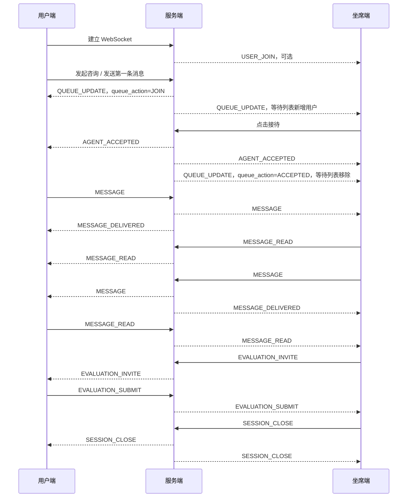

# 客服系统 ChatEventType 事件流程说明

## 1. 文档说明

本文档基于当前最终版 `ChatEventType` 设计，整理客服系统从用户打开客服页面、进入等待列表、坐席主动接待、双方聊天、转接、评价、关闭会话的完整事件流程。

当前业务特点：

- 不是系统自动分配客服。
- 用户进入等待服务列表。
- 坐席在后台等待服务列表中主动选择接待。
- 不单独使用 `SESSION_START`。
- 会话开始由 `QUEUE_UPDATE` 和 `AGENT_ACCEPTED` 表示。
- 输入状态只保留 `TYPING`，不使用 `STOP_TYPING`。
- `TYPING`、`HEARTBEAT` 一般只做实时推送，不建议入库为聊天记录。

---

## 2. 最终版 ChatEventType

```proto
/**
 * 聊天事件类型
 * 表示：这条消息 / 推送 / WebSocket 数据是什么事件
 *
 * 注意：
 * 1. MESSAGE 表示普通聊天消息。
 * 2. MESSAGE 里的内容类型用 ChatMessageType 表示。
 * 3. TYPING、HEARTBEAT 一般只做实时推送，不建议入库为聊天记录。
 * 4. 会话开始不单独使用 SESSION_START，使用 QUEUE_UPDATE + AGENT_ACCEPTED 表示流程。
 */
enum ChatEventType {
  // proto 默认占位，不作为业务事件使用
  CHAT_EVENT_TYPE_UNSPECIFIED = 0;

  // 普通聊天消息
  CHAT_EVENT_TYPE_MESSAGE = 1;

  // 通用系统通知
  // 例如：系统维护、风险提示、暂无客服在线、普通提示
  CHAT_EVENT_TYPE_SYSTEM_NOTICE = 2;

  // 用户进入客服页面 / 建立 WebSocket 连接
  CHAT_EVENT_TYPE_USER_JOIN = 3;

  // 用户离开客服页面 / 断开 WebSocket 连接
  CHAT_EVENT_TYPE_USER_LEAVE = 4;

  // 等待服务列表信息更新
  // 例如：进入等待列表、取消等待、等待人数变化、预计等待时间变化
  CHAT_EVENT_TYPE_QUEUE_UPDATE = 5;

  // 坐席主动接待会话
  // 例如：坐席 小王 已接待本次会话
  CHAT_EVENT_TYPE_AGENT_ACCEPTED = 6;

  // 坐席离开会话
  CHAT_EVENT_TYPE_AGENT_LEAVE = 7;

  // 会话转接发起
  // 例如：坐席 小王 发起转接给坐席 小李
  CHAT_EVENT_TYPE_TRANSFER_REQUEST = 8;

  // 会话转接接受
  // 例如：坐席 小李 接受转接
  CHAT_EVENT_TYPE_TRANSFER_ACCEPT = 9;

  // 会话转接拒绝
  // 例如：坐席 小李 拒绝转接
  CHAT_EVENT_TYPE_TRANSFER_REJECT = 10;

  // 会话关闭 / 会话结束
  // 具体关闭原因用 ChatSessionCloseReason 表示
  CHAT_EVENT_TYPE_SESSION_CLOSE = 11;

  // 邀请用户评价
  CHAT_EVENT_TYPE_EVALUATION_INVITE = 12;

  // 用户提交评价
  CHAT_EVENT_TYPE_EVALUATION_SUBMIT = 13;

  // 正在输入
  // 建议发送方每隔 1~2 秒节流发送一次
  // 接收方 3~5 秒内没有继续收到 TYPING，则自动隐藏“正在输入”
  CHAT_EVENT_TYPE_TYPING = 14;

  // 消息已送达
  CHAT_EVENT_TYPE_MESSAGE_DELIVERED = 15;

  // 消息已读
  CHAT_EVENT_TYPE_MESSAGE_READ = 16;

  // 消息撤回
  CHAT_EVENT_TYPE_MESSAGE_RECALL = 17;

  // 消息删除
  CHAT_EVENT_TYPE_MESSAGE_DELETE = 18;

  // 心跳
  CHAT_EVENT_TYPE_HEARTBEAT = 19;

  // 错误事件
  // 例如：发送失败、会话不存在、权限不足
  CHAT_EVENT_TYPE_ERROR = 20;
}
```

---

## 3. 事件目标说明

事件目标表示服务端应该把事件推送给谁。

| 目标 | 含义 |
|---|---|
| 用户端 | APP / H5 / Web 用户客服页面 chat-ui |
| 坐席端 | 客服后台坐席工作台 chat-admin-ui |
| 双方 | 用户端 + 当前服务坐席端 |
| 对方 | 谁触发事件，就推给另一方 |
| 发送方 | 推给原消息发送人 |
| 管理端 | 商户后台 chat-admin-ui |

---

## 4. 事件总表

| 事件类型 | 主要含义 | 主要触发方 | 推送目标 | 是否建议入库 |
|---|---|---|---|---|
| `CHAT_EVENT_TYPE_MESSAGE` | 普通聊天消息 | 用户 / 坐席 / 系统 / 机器人 | 对方，必要时回推自己 | 是 |
| `CHAT_EVENT_TYPE_SYSTEM_NOTICE` | 系统通知 | 服务端 | 用户端 / 坐席端 / 双方，按场景 | 可选 |
| `CHAT_EVENT_TYPE_USER_JOIN` | 用户进入客服页面或连接会话 | 用户端 | 坐席端 / 管理端，可选 | 可选 |
| `CHAT_EVENT_TYPE_USER_LEAVE` | 用户离开客服页面或断开连接 | 用户端 / 服务端 | 坐席端 / 管理端，可选 | 可选 |
| `CHAT_EVENT_TYPE_QUEUE_UPDATE` | 等待服务列表变化 | 服务端 | 用户端 + 坐席端等待列表 | 是 |
| `CHAT_EVENT_TYPE_AGENT_ACCEPTED` | 坐席主动接待会话 | 坐席端 | 用户端 + 当前坐席端 + 管理端可选 | 是 |
| `CHAT_EVENT_TYPE_AGENT_LEAVE` | 坐席离开会话 | 坐席端 / 服务端 | 用户端 / 管理端，可选 | 是 |
| `CHAT_EVENT_TYPE_TRANSFER_REQUEST` | 发起转接 | 当前坐席 | 目标坐席 / 管理端，可选 | 是 |
| `CHAT_EVENT_TYPE_TRANSFER_ACCEPT` | 接受转接 | 目标坐席 | 原坐席 + 新坐席，用户端可选 | 是 |
| `CHAT_EVENT_TYPE_TRANSFER_REJECT` | 拒绝转接 | 目标坐席 | 原坐席 | 是 |
| `CHAT_EVENT_TYPE_SESSION_CLOSE` | 会话关闭 | 用户 / 坐席 / 服务端 | 双方 | 是 |
| `CHAT_EVENT_TYPE_EVALUATION_INVITE` | 邀请用户评价 | 坐席 / 服务端 | 用户端 | 是 |
| `CHAT_EVENT_TYPE_EVALUATION_SUBMIT` | 用户提交评价 | 用户端 | 坐席端 / 管理端 | 是 |
| `CHAT_EVENT_TYPE_TYPING` | 正在输入 | 用户 / 坐席 | 对方 | 否 |
| `CHAT_EVENT_TYPE_MESSAGE_DELIVERED` | 消息已送达 | 接收方客户端 / 服务端 | 消息发送方 | 可选 |
| `CHAT_EVENT_TYPE_MESSAGE_READ` | 消息已读 | 接收方客户端 | 消息发送方 | 可选 |
| `CHAT_EVENT_TYPE_MESSAGE_RECALL` | 消息撤回 | 消息发送方 / 管理端 | 双方 | 是 |
| `CHAT_EVENT_TYPE_MESSAGE_DELETE` | 消息删除 | 用户 / 坐席 / 管理端 | 视删除类型决定 | 可选 |
| `CHAT_EVENT_TYPE_HEARTBEAT` | 心跳 | 客户端 / 服务端 | 当前连接自己 | 否 |
| `CHAT_EVENT_TYPE_ERROR` | 错误事件 | 服务端 | 出错的一方 | 否 |

---

## 5. 完整主流程

### 5.1 用户打开客服页面

用户打开 APP / H5 客服页面，客户端建立 WebSocket 连接。

```text
用户打开客服页面
↓
建立 WebSocket 连接
↓
CHAT_EVENT_TYPE_USER_JOIN
```

事件说明：

| 事件 | 触发方 | 推送目标 | 说明 |
|---|---|---|---|
| `USER_JOIN` | 用户端 | 坐席端 / 管理端，可选 | 表示用户进入客服页面或连接成功 |

是否必须推给坐席端，取决于你后台是否需要显示“用户已进入页面”。如果只是用户打开页面，还没有发起咨询，可以不推给具体坐席，只在服务端记录连接状态。

---

### 5.2 用户发起咨询，进入等待服务列表

用户点击“联系客服”或发送第一条咨询后，服务端创建等待会话，并加入等待服务列表。

```text
用户点击联系客服 / 发送第一条咨询
↓
CHAT_EVENT_TYPE_QUEUE_UPDATE
queue_action = JOIN
```

事件说明：

| 事件 | 触发方 | 推送目标 | 说明 |
|---|---|---|---|
| `QUEUE_UPDATE` | 服务端 | 用户端 + 坐席端等待列表 | 表示用户已经进入等待服务列表 |

建议配合 `queue_action` 使用：

```proto
enum ChatQueueAction {
  CHAT_QUEUE_ACTION_UNKNOWN = 0;

  // 进入等待列表
  CHAT_QUEUE_ACTION_JOIN = 1;

  // 等待信息更新
  CHAT_QUEUE_ACTION_UPDATE = 2;

  // 用户取消等待
  CHAT_QUEUE_ACTION_CANCEL = 3;

  // 已被坐席接待，从等待列表移除
  CHAT_QUEUE_ACTION_ACCEPTED = 4;
}
```

示例：

```text
event_type = QUEUE_UPDATE
queue_action = JOIN
session_status = WAITING
```

用户端显示：

```text
正在为您接入客服，请稍候
```

坐席端等待列表显示：

```text
有新的用户等待接待
```

---

### 5.3 等待列表变化

当等待人数、排队位置、预计等待时间变化时，服务端继续推送 `QUEUE_UPDATE`。

```text
等待人数变化
↓
CHAT_EVENT_TYPE_QUEUE_UPDATE
queue_action = UPDATE
```

事件说明：

| 事件 | 触发方 | 推送目标 | 说明 |
|---|---|---|---|
| `QUEUE_UPDATE` | 服务端 | 用户端 + 坐席端等待列表 | 更新等待人数、排队位置、预计等待时间 |

示例：

```text
event_type = QUEUE_UPDATE
queue_action = UPDATE
queue_position = 3
waiting_count = 5
estimated_wait_seconds = 120
```

用户端显示：

```text
您前面还有 3 人，预计等待 2 分钟
```

---

### 5.4 坐席主动接待会话

坐席在后台等待服务列表中点击“接待”。

```text
坐席点击接待
↓
服务端锁定会话，绑定坐席
↓
CHAT_EVENT_TYPE_AGENT_ACCEPTED
```

事件说明：

| 事件 | 触发方 | 推送目标 | 说明 |
|---|---|---|---|
| `AGENT_ACCEPTED` | 坐席端 | 用户端 + 当前坐席端 + 管理端可选 | 表示坐席主动接待该会话 |

示例：

```text
event_type = AGENT_ACCEPTED
agent_id = A1001
agent_name = 小王
session_status = SERVING
```

用户端显示：

```text
客服 小王 已接待本次会话
```

坐席端显示：

```text
已成功接待该用户
```

同时服务端可以再推一次：

```text
event_type = QUEUE_UPDATE
queue_action = ACCEPTED
```

用于通知其他坐席端把该用户从等待服务列表中移除。

---

### 5.5 双方开始聊天

用户或坐席发送消息。

```text
用户 / 坐席发送消息
↓
CHAT_EVENT_TYPE_MESSAGE
↓
CHAT_EVENT_TYPE_MESSAGE_DELIVERED
↓
CHAT_EVENT_TYPE_MESSAGE_READ
```

#### 用户发送消息

| 事件 | 触发方 | 推送目标 | 说明 |
|---|---|---|---|
| `MESSAGE` | 用户端 | 坐席端，必要时回推用户端 | 用户发送普通聊天消息 |
| `MESSAGE_DELIVERED` | 服务端 / 坐席端 | 用户端 | 表示消息已送达坐席端 |
| `MESSAGE_READ` | 坐席端 | 用户端 | 表示坐席已读 |

#### 坐席发送消息

| 事件 | 触发方 | 推送目标 | 说明 |
|---|---|---|---|
| `MESSAGE` | 坐席端 | 用户端，必要时回推坐席端 | 坐席发送普通聊天消息 |
| `MESSAGE_DELIVERED` | 服务端 / 用户端 | 坐席端 | 表示消息已送达用户端 |
| `MESSAGE_READ` | 用户端 | 坐席端 | 表示用户已读 |

说明：

- `MESSAGE` 建议入库。
- `MESSAGE_DELIVERED`、`MESSAGE_READ` 是否入库看业务要求。
- 如果只是展示消息状态，可以只更新消息表状态。
- 如果要保留已读轨迹，可以记录事件日志。

---

### 5.6 正在输入

用户或坐席正在输入时，客户端发送 `TYPING`。

```text
输入框内容变化
↓
节流发送 TYPING
↓
对方显示“正在输入...”
```

事件说明：

| 事件 | 触发方 | 推送目标 | 说明 |
|---|---|---|---|
| `TYPING` | 用户端 / 坐席端 | 对方 | 表示当前发送方正在输入 |

推荐规则：

- 发送方每 1 到 2 秒最多发送一次 `TYPING`。
- 接收方收到后显示“对方正在输入...”。
- 接收方 3 到 5 秒内没有再次收到 `TYPING`，自动隐藏。
- 收到对方 `MESSAGE` 后立即隐藏“正在输入”。

不需要 `STOP_TYPING`。

---

### 5.7 消息撤回

用户或坐席撤回自己发送的消息。

```text
发送方点击撤回
↓
CHAT_EVENT_TYPE_MESSAGE_RECALL
```

事件说明：

| 事件 | 触发方 | 推送目标 | 说明 |
|---|---|---|---|
| `MESSAGE_RECALL` | 消息发送方 / 管理端 | 双方 | 双方同步该消息已撤回 |

示例：

```text
event_type = MESSAGE_RECALL
message_id = M10001
```

用户端 / 坐席端显示：

```text
对方撤回了一条消息
```

或者：

```text
你撤回了一条消息
```

---

### 5.8 消息删除

消息删除要区分两种业务。

#### 本地删除

只删除当前操作者自己这边的聊天记录。

| 事件 | 触发方 | 推送目标 | 说明 |
|---|---|---|---|
| `MESSAGE_DELETE` | 用户端 / 坐席端 | 操作者自己 | 只影响当前操作者本地视图 |

#### 双边删除

双方都看不到该消息。

| 事件 | 触发方 | 推送目标 | 说明 |
|---|---|---|---|
| `MESSAGE_DELETE` | 管理端 / 有权限的一方 | 双方 | 双方同步删除该消息 |

建议：

- `MESSAGE_RECALL` 表示发送方撤回，双方都看到“已撤回”。
- `MESSAGE_DELETE` 表示删除记录，是否双边删除由业务字段控制。

可以增加字段：

```text
delete_scope = SELF / BOTH
```

---

### 5.9 会话转接

当前坐席将会话转接给其他坐席。

#### 发起转接

```text
当前坐席发起转接
↓
CHAT_EVENT_TYPE_TRANSFER_REQUEST
```

| 事件 | 触发方 | 推送目标 | 说明 |
|---|---|---|---|
| `TRANSFER_REQUEST` | 当前坐席 | 目标坐席 / 管理端可选 | 请求目标坐席接手会话 |

用户端一般不需要收到该事件。

#### 目标坐席接受转接

```text
目标坐席接受转接
↓
CHAT_EVENT_TYPE_TRANSFER_ACCEPT
↓
CHAT_EVENT_TYPE_AGENT_ACCEPTED
```

| 事件 | 触发方 | 推送目标 | 说明 |
|---|---|---|---|
| `TRANSFER_ACCEPT` | 目标坐席 | 原坐席 + 新坐席 | 表示目标坐席接受转接 |
| `AGENT_ACCEPTED` | 服务端 | 用户端 + 新坐席 | 表示新坐席正式接待该会话 |

用户端可以不看 `TRANSFER_ACCEPT`，只看 `AGENT_ACCEPTED`：

```text
客服 小李 已接待本次会话
```

#### 目标坐席拒绝转接

```text
目标坐席拒绝转接
↓
CHAT_EVENT_TYPE_TRANSFER_REJECT
```

| 事件 | 触发方 | 推送目标 | 说明 |
|---|---|---|---|
| `TRANSFER_REJECT` | 目标坐席 | 原坐席 | 表示目标坐席拒绝接手 |

用户端一般不需要收到该事件。

---

### 5.10 坐席离开会话

坐席主动离开，或因为下线、异常断开导致离开。

```text
坐席离开
↓
CHAT_EVENT_TYPE_AGENT_LEAVE
```

事件说明：

| 事件 | 触发方 | 推送目标 | 说明 |
|---|---|---|---|
| `AGENT_LEAVE` | 坐席端 / 服务端 | 用户端 / 管理端可选 | 当前坐席离开会话 |

是否自动关闭会话取决于业务：

- 如果允许重新接待，可以把会话放回等待服务列表。
- 如果不允许继续服务，可以直接 `SESSION_CLOSE`。
- 如果坐席离开但马上有新坐席接待，可以走转接流程。

---

### 5.11 会话关闭

用户、坐席或系统关闭会话。

```text
用户 / 坐席 / 系统关闭会话
↓
CHAT_EVENT_TYPE_SESSION_CLOSE
```

事件说明：

| 事件 | 触发方 | 推送目标 | 说明 |
|---|---|---|---|
| `SESSION_CLOSE` | 用户端 / 坐席端 / 服务端 | 双方 | 表示会话结束 |

建议配合 `ChatSessionCloseReason`：

```proto
enum ChatSessionCloseReason {
  CHAT_SESSION_CLOSE_REASON_UNKNOWN = 0;

  // 用户主动关闭
  CHAT_SESSION_CLOSE_REASON_USER = 1;

  // 坐席主动关闭
  CHAT_SESSION_CLOSE_REASON_AGENT = 2;

  // 系统自动关闭
  CHAT_SESSION_CLOSE_REASON_SYSTEM = 3;

  // 超时关闭
  CHAT_SESSION_CLOSE_REASON_TIMEOUT = 4;

  // 暂无坐席在线关闭
  CHAT_SESSION_CLOSE_REASON_NO_AGENT = 5;

  // 转接失败关闭
  CHAT_SESSION_CLOSE_REASON_TRANSFER_FAILED = 6;
}
```

示例：

```text
event_type = SESSION_CLOSE
close_reason = TIMEOUT
```

用户端显示：

```text
由于长时间未回复，会话已自动关闭
```

---

### 5.12 邀请评价

会话结束前或结束后，服务端邀请用户评价。

```text
会话即将结束 / 已结束
↓
CHAT_EVENT_TYPE_EVALUATION_INVITE
```

事件说明：

| 事件 | 触发方 | 推送目标 | 说明 |
|---|---|---|---|
| `EVALUATION_INVITE` | 坐席端 / 服务端 | 用户端 | 邀请用户评价本次服务 |

用户端显示：

```text
请您对本次服务进行评价
```

---

### 5.13 用户提交评价

用户提交满意度、星级、标签、文字评价。

```text
用户提交评价
↓
CHAT_EVENT_TYPE_EVALUATION_SUBMIT
```

事件说明：

| 事件 | 触发方 | 推送目标 | 说明 |
|---|---|---|---|
| `EVALUATION_SUBMIT` | 用户端 | 坐席端 / 管理端 | 通知评价已提交 |

示例：

```text
event_type = EVALUATION_SUBMIT
rating = 5
comment = 服务很好
```

坐席端 / 管理端显示：

```text
用户已提交评价
```

---

### 5.14 心跳

客户端和服务端之间定时心跳，用于判断连接是否存活。

```text
客户端定时发送 HEARTBEAT
↓
服务端响应 HEARTBEAT
```

事件说明：

| 事件 | 触发方 | 推送目标 | 说明 |
|---|---|---|---|
| `HEARTBEAT` | 客户端 / 服务端 | 当前连接自己 | 保活，不转发给聊天对方 |

建议：

- 不入库。
- 不展示在聊天记录。
- 客户端 20 到 30 秒发一次。
- 服务端超过一定时间未收到心跳，可以认为连接断开。

---

### 5.15 错误事件

发生业务错误时，服务端返回错误事件。

```text
发生错误
↓
CHAT_EVENT_TYPE_ERROR
```

事件说明：

| 事件 | 触发方 | 推送目标 | 说明 |
|---|---|---|---|
| `ERROR` | 服务端 | 出错的一方 | 通知业务错误 |

示例错误：

- 发送失败
- 会话不存在
- 会话已关闭
- 没有权限接待
- 该会话已被其他坐席接待
- 消息内容非法

建议配合字段：

```text
error_code
error_message
```

示例：

```text
event_type = ERROR
error_code = 1001
error_message = 该会话已被其他坐席接待
```

---

## 6. 主流程时序图



---

## 7. 常见分支流程

### 7.1 暂无坐席在线

```text
用户发起咨询
↓
QUEUE_UPDATE，queue_action = JOIN
↓
SYSTEM_NOTICE，提示暂无坐席在线
↓
用户留言，MESSAGE
↓
SESSION_CLOSE，close_reason = NO_AGENT
```

事件目标：

| 事件 | 推送目标 |
|---|---|
| `QUEUE_UPDATE` | 用户端 |
| `SYSTEM_NOTICE` | 用户端 |
| `MESSAGE` | 服务端入库，后台可见 |
| `SESSION_CLOSE` | 用户端，管理端可选 |

---

### 7.2 用户取消等待

```text
用户进入等待列表
↓
QUEUE_UPDATE，queue_action = JOIN
↓
用户取消等待
↓
QUEUE_UPDATE，queue_action = CANCEL
↓
SESSION_CLOSE，close_reason = USER
```

事件目标：

| 事件 | 推送目标 |
|---|---|
| `QUEUE_UPDATE JOIN` | 用户端 + 坐席端等待列表 |
| `QUEUE_UPDATE CANCEL` | 用户端 + 坐席端等待列表 |
| `SESSION_CLOSE` | 用户端，管理端可选 |

---

### 7.3 坐席接待竞争

多个坐席同时点击同一个等待会话时，只允许一个坐席成功。

```text
坐席 A 点击接待
坐席 B 同时点击接待
↓
服务端加锁 / 原子更新
↓
坐席 A 成功
↓
坐席 B 失败，返回 ERROR
```

事件目标：

| 事件 | 推送目标 |
|---|---|
| `AGENT_ACCEPTED` | 用户端 + 坐席 A |
| `QUEUE_UPDATE ACCEPTED` | 所有坐席端等待列表 |
| `ERROR` | 坐席 B |

错误示例：

```text
event_type = ERROR
error_code = 1001
error_message = 该会话已被其他坐席接待
```

---

### 7.4 转接成功

```text
当前坐席发起转接
↓
TRANSFER_REQUEST
↓
目标坐席接受
↓
TRANSFER_ACCEPT
↓
AGENT_ACCEPTED
```

事件目标：

| 事件 | 推送目标 |
|---|---|
| `TRANSFER_REQUEST` | 目标坐席 |
| `TRANSFER_ACCEPT` | 原坐席 + 新坐席 |
| `AGENT_ACCEPTED` | 用户端 + 新坐席 |

---

### 7.5 转接拒绝

```text
当前坐席发起转接
↓
TRANSFER_REQUEST
↓
目标坐席拒绝
↓
TRANSFER_REJECT
```

事件目标：

| 事件 | 推送目标 |
|---|---|
| `TRANSFER_REQUEST` | 目标坐席 |
| `TRANSFER_REJECT` | 原坐席 |

用户端不需要知道转接被拒绝。

---

### 7.6 用户长时间不回复，系统关闭

```text
会话服务中
↓
用户长时间不回复
↓
SYSTEM_NOTICE
↓
SESSION_CLOSE，close_reason = TIMEOUT
```

事件目标：

| 事件 | 推送目标 |
|---|---|
| `SYSTEM_NOTICE` | 用户端 + 坐席端可选 |
| `SESSION_CLOSE` | 双方 |

---

## 8. 推荐字段设计

为了支撑上面的事件流，`ChatEvent` 建议至少包含这些字段：

```proto
message ChatEvent {
  // 事件 ID，全局唯一
  string event_id = 1;

  // 会话 ID
  string session_id = 2;

  // 事件类型
  ChatEventType event_type = 3;

  // 消息内容类型，仅 MESSAGE 时使用
  ChatMessageType message_type = 4;

  // 发送方类型
  ChatSenderType sender_type = 5;

  // 发送方 ID
  string sender_id = 6;

  // 接收方 ID，可选
  string receiver_id = 7;

  // 文本内容 / 系统提示内容
  string content = 8;

  // 消息 ID，消息类事件使用
  string message_id = 9;

  // 消息状态
  ChatMessageStatus message_status = 10;

  // 会话状态
  ChatSessionStatus session_status = 11;

  // 会话关闭原因，仅 SESSION_CLOSE 使用
  ChatSessionCloseReason close_reason = 12;

  // 事件时间戳，毫秒
  int64 timestamp = 13;

  // 排队信息
  ChatQueueInfo queue_info = 14;

  // 转接信息
  ChatTransferInfo transfer_info = 15;

  // 错误码，仅 ERROR 使用
  int32 error_code = 16;

  // 错误信息，仅 ERROR 使用
  string error_message = 17;
}
```

排队信息：

```proto
message ChatQueueInfo {
  ChatQueueAction queue_action = 1;

  // 当前排队位置
  int32 queue_position = 2;

  // 当前等待人数
  int32 waiting_count = 3;

  // 预计等待秒数
  int32 estimated_wait_seconds = 4;
}
```

转接信息：

```proto
message ChatTransferInfo {
  // 原坐席 ID
  string from_agent_id = 1;

  // 目标坐席 ID
  string to_agent_id = 2;

  // 转接原因
  string reason = 3;
}
```

---

## 9. 事件入库建议

| 事件类型 | 是否入库 | 原因 |
|---|---|---|
| `MESSAGE` | 是 | 聊天记录核心数据 |
| `SYSTEM_NOTICE` | 可选 | 重要通知可入库，普通提示可不入库 |
| `USER_JOIN` | 可选 | 更多是在线状态 |
| `USER_LEAVE` | 可选 | 更多是在线状态 |
| `QUEUE_UPDATE` | 是 | 可用于排队记录、客服绩效分析 |
| `AGENT_ACCEPTED` | 是 | 记录谁接待了用户 |
| `AGENT_LEAVE` | 是 | 记录坐席离开 |
| `TRANSFER_REQUEST` | 是 | 转接审计 |
| `TRANSFER_ACCEPT` | 是 | 转接审计 |
| `TRANSFER_REJECT` | 是 | 转接审计 |
| `SESSION_CLOSE` | 是 | 会话生命周期核心事件 |
| `EVALUATION_INVITE` | 是 | 评价流程记录 |
| `EVALUATION_SUBMIT` | 是 | 评价数据 |
| `TYPING` | 否 | 高频实时状态 |
| `MESSAGE_DELIVERED` | 可选 | 可只更新消息状态 |
| `MESSAGE_READ` | 可选 | 可只更新消息状态 |
| `MESSAGE_RECALL` | 是 | 消息操作记录 |
| `MESSAGE_DELETE` | 可选 | 看是否需要审计 |
| `HEARTBEAT` | 否 | 高频连接保活 |
| `ERROR` | 否 / 可选 | 可进入错误日志，不建议进聊天记录 |

---

## 10. 推荐服务端处理规则

### 10.1 用户进入等待列表

服务端应该：

1. 创建或查询当前未关闭会话。
2. 设置会话状态为 `WAITING`。
3. 推送 `QUEUE_UPDATE` 给用户端。
4. 推送 `QUEUE_UPDATE` 给坐席端等待列表。
5. 如果没有坐席在线，可以推 `SYSTEM_NOTICE` 给用户。

---

### 10.2 坐席接待

服务端应该：

1. 校验坐席在线状态。
2. 校验会话是否仍在等待中。
3. 使用数据库事务或分布式锁，避免多个坐席同时接待同一个会话。
4. 绑定 `agent_id`。
5. 设置会话状态为 `SERVING`。
6. 推送 `AGENT_ACCEPTED` 给用户端和当前坐席端。
7. 推送 `QUEUE_UPDATE ACCEPTED` 给其他坐席端，刷新等待列表。

---

### 10.3 消息发送

服务端应该：

1. 校验会话是否存在。
2. 校验会话是否未关闭。
3. 校验发送方是否有权限发送。
4. 消息入库。
5. 推送 `MESSAGE` 给接收方。
6. 回推发送成功状态给发送方。
7. 根据接收方在线情况推送或更新 `MESSAGE_DELIVERED`。

---

### 10.4 已读处理

服务端应该：

1. 接收方打开会话或消息进入可视区域时上报已读。
2. 服务端更新消息状态为 `READ`。
3. 推送 `MESSAGE_READ` 给消息发送方。
4. 可以按会话维度批量已读，避免每条消息都推一次。

---

### 10.5 会话关闭

服务端应该：

1. 设置会话状态为 `CLOSED`。
2. 写入关闭原因 `close_reason`。
3. 推送 `SESSION_CLOSE` 给用户端和坐席端。
4. 如果需要评价，推送 `EVALUATION_INVITE` 给用户端。
5. 禁止该会话继续发送普通消息。

---

## 11. 总结

当前事件设计的核心流程是：

```text
USER_JOIN
↓
QUEUE_UPDATE
↓
AGENT_ACCEPTED
↓
MESSAGE / MESSAGE_DELIVERED / MESSAGE_READ
↓
TRANSFER_REQUEST / TRANSFER_ACCEPT / TRANSFER_REJECT，可选
↓
EVALUATION_INVITE / EVALUATION_SUBMIT
↓
SESSION_CLOSE
↓
USER_LEAVE
```

最重要的几个事件：

| 事件 | 核心作用 |
|---|---|
| `QUEUE_UPDATE` | 表示用户进入或更新等待服务列表 |
| `AGENT_ACCEPTED` | 表示坐席主动接待用户 |
| `MESSAGE` | 表示普通聊天消息 |
| `SESSION_CLOSE` | 表示会话结束 |
| `EVALUATION_INVITE` | 邀请用户评价 |
| `EVALUATION_SUBMIT` | 用户提交评价 |

不需要的事件：

| 事件 | 替代方式 |
|---|---|
| `SESSION_START` | 用 `QUEUE_UPDATE JOIN` + `AGENT_ACCEPTED` 表示 |
| `STOP_TYPING` | 前端用 `TYPING` 超时自动隐藏 |
| `NO_AGENT_ONLINE` | 用 `SYSTEM_NOTICE` 或 `SESSION_CLOSE close_reason = NO_AGENT` 表示 |
| `SESSION_TIMEOUT` | 用 `SESSION_CLOSE close_reason = TIMEOUT` 表示 |
