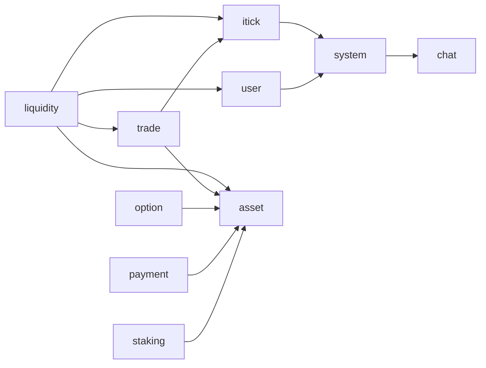

# Services RPC 依赖关系检查

## 1. 检查范围

- 检查日期：2026-07-26
- 检查目录：`services/*/internal/svc/servicecontext.go`
- 检查方式：根据 `ServiceContext` 中创建和注入的 RPC client，建立服务间有向依赖图
- 依赖方向：`A -> B` 表示服务 A 通过 RPC 调用服务 B

本次检查只反映 `servicecontext.go` 中显式声明的 RPC client 依赖，不包含：

- HTTP、消息队列、Redis 和数据库依赖
- 未注入到 `ServiceContext` 的临时 RPC client
- RPC 方法内部继续调用其他服务所形成的实际运行时链路
- 管理后台、App API 等 `services` 目录以外的调用方

## 2. 检查结论

当前 `services` 内没有发现 RPC 循环依赖。

依赖图可以完成拓扑排序，不存在任何服务能够沿 RPC 依赖路径重新回到自身。

不过，当前结构存在几个值得关注的风险：

1. `itick -> option` 已整改为 Kafka 权威行情事件，不再构成 RPC 依赖。
2. `system -> chat` 存在基础服务依赖业务服务的分层耦合。
3. `liquidity` 的直接依赖较多，故障面和维护复杂度较高。
4. 最长静态依赖链较长，需要防范同步调用链上的超时和重试放大。
5. RPC client 在 `ServiceContext` 中集中、无条件构造，可选功能与核心启动流程存在配置耦合。

## 3. 当前 RPC 依赖关系



按服务整理如下：

| 调用方 | RPC 依赖 |
| --- | --- |
| `asset` | 无 |
| `chat` | 无 |
| `itick` | `system` |
| `liquidity` | `trade`、`itick`、`user`、`asset` |
| `option` | `asset` |
| `payment` | `asset` |
| `staking` | `asset` |
| `system` | `chat` |
| `trade` | `asset`、`itick` |
| `user` | `system` |

其中，`liquidity` 的 `InternalMarketMaker` 复用了 `trade` RPC client，不算作新的服务依赖边。

## 4. 风险分析

### 4.1 `itick -> option` 已改为 Kafka 事件

原关系：

```text
itick -> option
```

已调整为：

```text
itick Outbox -> Kafka market.authoritative-snapshot.v1 -> option
```

`itick` 不再持有 Option RPC client 或配置；Option 通过独立 consumer group 消费服务中立的权威行情事件。消费端使用 `snapshot_id + contract_id` 去重，支持 Kafka 至少一次投递。

状态：**已整改。**

### 4.2 `system -> chat` 存在分层耦合

当前相关链路：

```text
user -> system -> chat
itick -> system -> chat
```

`system` 通常承担公共配置、租户或系统级能力，而 `chat` 属于具体业务域。公共基础服务反向依赖业务服务，会让依赖层次变得不清晰。

可能影响：

- `chat` 的故障可能影响 `system` 中使用聊天 RPC 的功能。
- 上游的 `user`、`itick` 可能通过 `system` 间接受到影响。
- 未来 `chat` 如果需要调用 `system` 获取租户或配置数据，会形成：

```text
system -> chat -> system
```

建议：

- 明确 `system` 调用 `chat` 的用途和调用入口。
- 如果用途是聊天商户初始化、配置同步或通知，优先考虑由 `chat` 主动消费系统事件。
- 如果必须同步调用，建议将相关编排放到 API/BFF 或独立编排服务中，避免放在基础服务内部。
- 在重构前，禁止新增 `chat -> system` RPC 依赖，并为现有调用设置明确的超时、降级和隔离策略。

风险等级：**中高。**

### 4.3 `liquidity` 依赖面较大

`liquidity` 直接依赖：

```text
trade
itick
user
asset
```

它还通过 `trade` 间接依赖 `itick` 和 `asset`：

```text
liquidity -> trade -> itick
liquidity -> trade -> asset
```

这不是循环依赖，但说明部分能力存在直接和间接两条访问路径。

可能影响：

- 服务可用性受到多个下游共同影响。
- 同一数据可能从不同路径获取，产生口径或一致性问题。
- 职责边界不清晰，后续新增依赖时更容易产生环。
- 集成测试和故障排查范围扩大。

建议：

- 梳理 `liquidity` 直接调用 `asset`、`itick` 与通过 `trade` 获取相关能力的边界。
- 同一种数据或操作尽量只保留一个权威调用路径。
- 区分强依赖与可降级依赖，为行情、用户信息等读取型依赖增加缓存或降级策略。
- 新增 RPC 依赖前进行依赖图检查。

风险等级：**中。**

### 4.4 静态依赖链较长

当前较长的静态路径包括：

```text
liquidity -> trade -> itick -> system -> chat
liquidity -> trade -> itick -> option -> asset
liquidity -> user -> system -> chat
```

静态依赖路径不代表一次请求一定会完整经过这些服务，但如果业务代码中存在对应的连续同步调用，可能产生：

- 总延迟逐层累加。
- 上游超时早于下游超时，造成无效工作。
- 多层自动重试形成重试风暴。
- 任一末端服务故障影响整条链路。

建议：

- 结合具体 RPC 方法和链路追踪确认是否存在完整同步调用链。
- 统一超时预算，下游超时必须小于上游剩余超时。
- 避免每一层都进行自动重试；只在明确幂等且有剩余时间预算时重试。
- 对非实时强一致操作优先使用消息队列解耦。

风险等级：**中，需要结合运行时调用确认。**

### 4.5 RPC client 与服务启动配置耦合

多个服务在 `NewServiceContext` 中通过 `zrpc.MustNewClient(...)` 无条件构造所有 RPC client。

可能影响：

- 即使某个 RPC 只用于可选功能，也必须提供有效配置。
- 配置无效时可能在初始化阶段直接失败。
- 核心能力与可选能力难以分别降级。

需要注意，创建 RPC client 不一定意味着启动时必须成功连接下游；实际行为还取决于 go-zero 客户端配置和连接策略。因此这里主要关注的是配置及初始化耦合，而不是断言下游不可用一定导致启动失败。

建议：

- 将核心依赖和可选依赖明确分类。
- 可选功能使用显式开关，并在开启时才构造对应 client。
- 避免在业务请求中临时重复创建 RPC client。
- 对必需依赖配置增加启动前校验和清晰的错误信息。

风险等级：**低到中。**

## 5. 建议优先级

### P0：防止形成新的循环

- 保持 Itick 与 Option 之间使用行情事件解耦，不重新引入双向同步 RPC。
- 禁止新增 `chat -> system` RPC，除非先处理现有的 `system -> chat`。
- 在代码评审或 CI 中维护并检查 RPC 依赖图。

### P1：确认并调整依赖方向

- 分析 `system -> chat`，尽量将业务编排移出 `system`。

### P2：降低调用链和故障面

- 梳理 `liquidity` 对 `trade`、`itick`、`user`、`asset` 的职责边界。
- 通过链路追踪确认是否真的存在最长同步调用链。
- 完善超时、重试、熔断和降级策略。

## 6. 总结

当前 RPC 依赖图是无环图。`itick -> option` 已改为 Kafka 事件，剩余需要优先关注的潜在反向依赖是：

```text
system -> chat
```

建议继续处理 `system -> chat` 的业务合理性，并整理 `liquidity` 的多下游依赖和运行时同步调用链。
