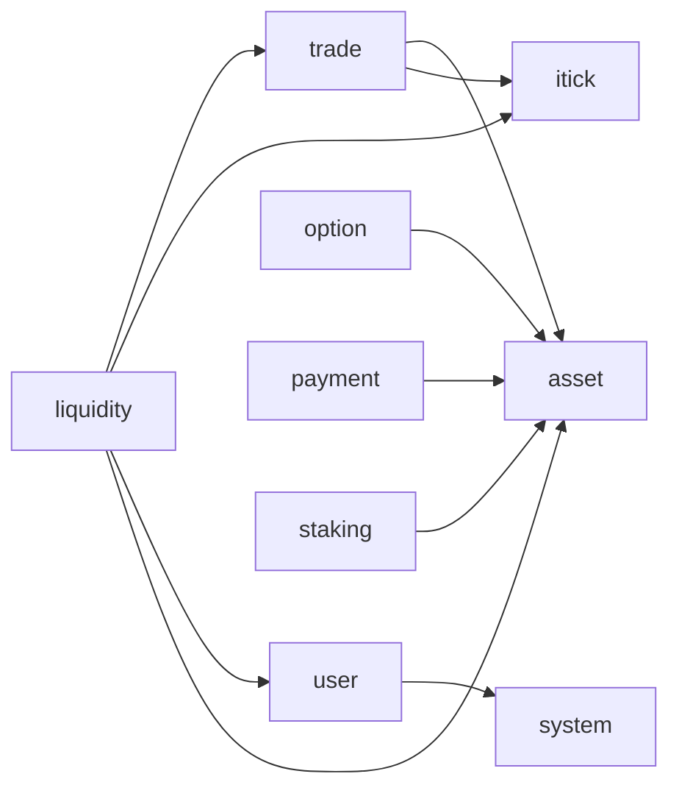

# Services RPC 依赖关系检查

## 1. 检查范围

- 检查日期：2026-07-26
- 检查目录：`services/*/internal/svc/servicecontext.go`
- 检查方式：根据 `ServiceContext` 中创建和注入的 RPC client，建立服务间有向依赖图
- 补充检查：全仓扫描业务代码中的 `zrpc.MustNewClient`，确认没有绕过
  `ServiceContext` 临时创建的跨服务 RPC client
- 依赖方向：`A -> B` 表示服务 A 通过 RPC 调用服务 B

本次检查只反映 `servicecontext.go` 中显式声明的 RPC client 依赖，不包含：

- HTTP、消息队列、Redis 和数据库依赖
- RPC 方法内部继续调用其他服务所形成的实际运行时链路
- 管理后台、App API 等 `services` 目录以外的调用方

## 2. 检查结论

当前共检查 10 个服务、10 条服务间 RPC 依赖边，没有发现 RPC 循环依赖。

依赖图可以完成拓扑排序，不存在任何服务能够沿 RPC 依赖路径重新回到自身。
当前最长路径为 2 条依赖边。

不过，当前结构存在几个值得关注的风险：

1. `itick -> option` 已整改为 Kafka 权威行情事件，不再构成 RPC 依赖。
2. `system -> chat` 已移除，客服商户主数据归属 Chat。
3. `itick -> system` 已移除，租户信息改由 Admin API / App API 编排并传入。
4. `liquidity` 的直接依赖较多，故障面和维护复杂度较高。
5. RPC client 在 `ServiceContext` 中集中、无条件构造，可选功能与核心启动流程存在配置耦合。
6. Asset 仍残留未使用的 `ItickRpc` 配置声明，虽然不形成实际依赖，但应清理以避免误判。

## 3. 当前 RPC 依赖关系



按服务整理如下：

| 调用方 | RPC 依赖 |
| --- | --- |
| `asset` | 无 |
| `chat` | 无 |
| `itick` | 无 |
| `liquidity` | `trade`、`itick`、`user`、`asset` |
| `option` | `asset` |
| `payment` | `asset` |
| `staking` | `asset` |
| `system` | 无 |
| `trade` | `asset`、`itick` |
| `user` | `system` |

其中，`liquidity` 的 `InternalMarketMaker` 复用了 `trade` RPC client，不算作新的服务依赖边。

## 4. 风险分析

### 4.1 `itick -> option` 已改为 Kafka 事件

原关系：

```text
itick -> option
```

已调整为：

```text
itick Outbox -> Kafka market.authoritative-snapshot.v1 -> option
```

`itick` 不再持有 Option RPC client 或配置；Option 通过独立 consumer group 消费服务中立的权威行情事件。消费端使用 `snapshot_id + contract_id` 去重，支持 Kafka 至少一次投递。

状态：**已整改。**

### 4.2 `system -> chat` 分层耦合

原相关链路：

```text
user -> system -> chat
```

`system` 通常承担公共配置、租户或系统级能力，而 `chat` 属于具体业务域。公共基础服务反向依赖业务服务，会让依赖层次变得不清晰。

该依赖已经按以下方式整改：

- 平台管理员认证和 RBAC 继续归属 System。
- 客服商户主档、主账号和商户配置统一归属 Chat。
- `admin-api` 完成 System 鉴权后直接调用 Chat Platform RPC。
- Chat 在一个本地数据库事务内维护 `t_chat_merchant`、`t_chat_user` 和
  `t_chat_merchant_info`，不再使用跨服务同步补偿。
- System 已移除 Chat RPC client 和客服商户 RPC 接口。

状态：**已整改。** 历史数据上线前仍需按 Chat 迁移文档导入。

### 4.3 `itick -> system` 已由 API 层编排移除

原关系：

```text
itick -> system
```

该调用主要服务于 Itick 的 Admin/App 接口补充租户信息，不属于 Itick 行情领域
本身的职责。现已按调用入口调整：

- Itick RPC 不再持有 System RPC client 或配置。
- Itick 返回 `tenant_id` 等自身持有的业务数据，不再查询租户名称。
- Admin API 通过 System 批量查询租户信息，并在 API 层组装 `tenant_name`。
- App API 从认证上下文取得租户信息，通过请求或 metadata 传入 Itick。
- Itick 自身运行所需的非租户业务配置已迁入 Itick 配置，不再借 System
  作为运行时配置来源。
- `itick.proto` 中仅用于服务内补充的 `tenant_name` 已移除并保留字段号，
  防止后续误复用。

这使 Itick 保持为独立行情域服务，同时避免为展示字段形成
`itick -> system` 的服务层依赖。

状态：**已整改。**

### 4.4 `liquidity` 依赖面较大

`liquidity` 直接依赖：

```text
trade
itick
user
asset
```

它还通过 `trade` 间接依赖 `itick` 和 `asset`：

```text
liquidity -> trade -> itick
liquidity -> trade -> asset
```

这不是循环依赖，但说明部分能力存在直接和间接两条访问路径。

可能影响：

- 服务可用性受到多个下游共同影响。
- 同一数据可能从不同路径获取，产生口径或一致性问题。
- 职责边界不清晰，后续新增依赖时更容易产生环。
- 集成测试和故障排查范围扩大。

建议：

- 梳理 `liquidity` 直接调用 `asset`、`itick` 与通过 `trade` 获取相关能力的边界。
- 同一种数据或操作尽量只保留一个权威调用路径。
- 区分强依赖与可降级依赖，为行情、用户信息等读取型依赖增加缓存或降级策略。
- 新增 RPC 依赖前进行依赖图检查。

风险等级：**中。**

整改结论：

- `trade` 是下单与交易对元数据的权威入口，`itick` 是参考价格的权威入口；
  两者均为运行时强依赖，不通过其他服务转发。
- `user`、`asset` 只承担内部做市账户开通与初始化资金，属于管理面依赖。
  开通请求先持久化请求摘要和步骤状态；用户以禁用状态创建，资金初始化使用稳定
  `biz_no`，Provider 始终在最后创建并保持停用，全部完成后才启用内部用户。
  中断后允许安全重试，同一 Provider 编码的请求参数发生变化时直接拒绝。
- 配置选项查询允许部分成功，并明确返回不可用分区；管理端在交易对或 Provider
  分区不可用时阻止提交，避免把故障误判为空数据。下游原始错误只写服务日志；
  所有分区均不可用时整体返回失败。
- 行情无有效权威快照时继续停止报价，不使用超出有效期的缓存价格。
- `.github/workflows/rpc-dependencies.yml` 在 CI 中执行
  `scripts/check-rpc-dependencies.sh`，校验 RPC 边白名单及有向图无环。

状态：**已按职责边界整改，不合并语义不同的直接与间接调用路径。**

### 4.5 两跳静态依赖链

当前最长静态路径为两跳，包括：

```text
liquidity -> trade -> itick
liquidity -> trade -> asset
liquidity -> user -> system
```

静态依赖路径不代表一次请求一定会完整经过这些服务，但如果业务代码中存在对应的连续同步调用，可能产生：

- 总延迟逐层累加。
- 上游超时早于下游超时，造成无效工作。
- 多层自动重试形成重试风暴。
- 任一末端服务故障影响整条链路。

建议：

- 结合具体 RPC 方法和链路追踪确认是否存在完整同步调用链。
- 统一超时预算，下游超时必须小于上游剩余超时。
- 避免每一层都进行自动重试；只在明确幂等且有剩余时间预算时重试。
- 对非实时强一致操作优先使用消息队列解耦。

风险等级：**低到中，需要结合运行时调用确认。**

### 4.6 RPC client 与服务启动配置耦合

多个服务在 `NewServiceContext` 中通过 `zrpc.MustNewClient(...)` 无条件构造所有 RPC client。

可能影响：

- 即使某个 RPC 只用于可选功能，也必须提供有效配置。
- 配置无效时可能在初始化阶段直接失败。
- 核心能力与可选能力难以分别降级。

需要注意，创建 RPC client 不一定意味着启动时必须成功连接下游；实际行为还取决于 go-zero 客户端配置和连接策略。因此这里主要关注的是配置及初始化耦合，而不是断言下游不可用一定导致启动失败。

建议：

- 将核心依赖和可选依赖明确分类。
- 可选功能使用显式开关，并在开启时才构造对应 client。
- 避免在业务请求中临时重复创建 RPC client。
- 对必需依赖配置增加启动前校验和清晰的错误信息。

风险等级：**低到中。**

### 4.7 Asset 存在未使用的 Itick RPC 配置

`services/asset/internal/config/config.go` 仍声明了：

```go
ItickRpc zrpc.RpcClientConf
```

但 Asset 的 `servicecontext.go` 没有构造或注入 Itick client，因此当前依赖图中
不存在 `asset -> itick`。这属于无效配置残留，不是循环依赖。

建议同步删除配置结构及 YAML 中对应配置，避免：

- 运维误以为 Asset 依赖 Itick。
- 后续代码直接复用残留配置，重新引入未经评审的依赖。
- 配置模板和实际运行依赖长期不一致。

风险等级：**低，建议清理。**

## 5. 建议优先级

### P0：防止形成新的循环

- 保持 Itick 与 Option 之间使用行情事件解耦，不重新引入双向同步 RPC。
- 保持 System 与 Chat 业务数据边界，不重新引入双向同步 RPC。
- 保持 Itick 与 System 通过 API 层编排，不把租户展示信息查询重新下沉到 Itick。
- 在代码评审或 CI 中维护并检查 RPC 依赖图。

### P1：确认并调整依赖方向

- `system -> chat` 已整改；上线前完成历史客服商户主数据迁移。
- `itick -> system` 已整改；保持租户信息由 Admin API / App API 获取和组装。

### P2：降低调用链和故障面

- 清理 Asset 中未使用的 `ItickRpc` 配置声明及 YAML 配置。
- 梳理 `liquidity` 对 `trade`、`itick`、`user`、`asset` 的职责边界。
- 通过链路追踪确认两跳静态路径是否形成连续同步调用链。
- 完善超时、重试、熔断和降级策略。

## 6. 总结

当前 RPC 依赖图是无环图。`itick -> option` 已改为 Kafka 事件，
`system -> chat` 已通过调整数据归属和 API 编排移除，`itick -> system`
也已通过 API 层租户信息编排移除。目前没有发现绕过 `ServiceContext`
临时创建的服务间 RPC client。后续重点是清理 Asset 的无效 Itick 配置，
并整理 `liquidity` 的多下游依赖和运行时同步调用链。
