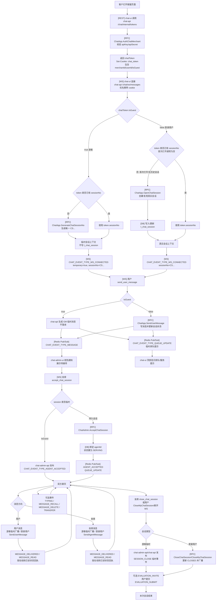
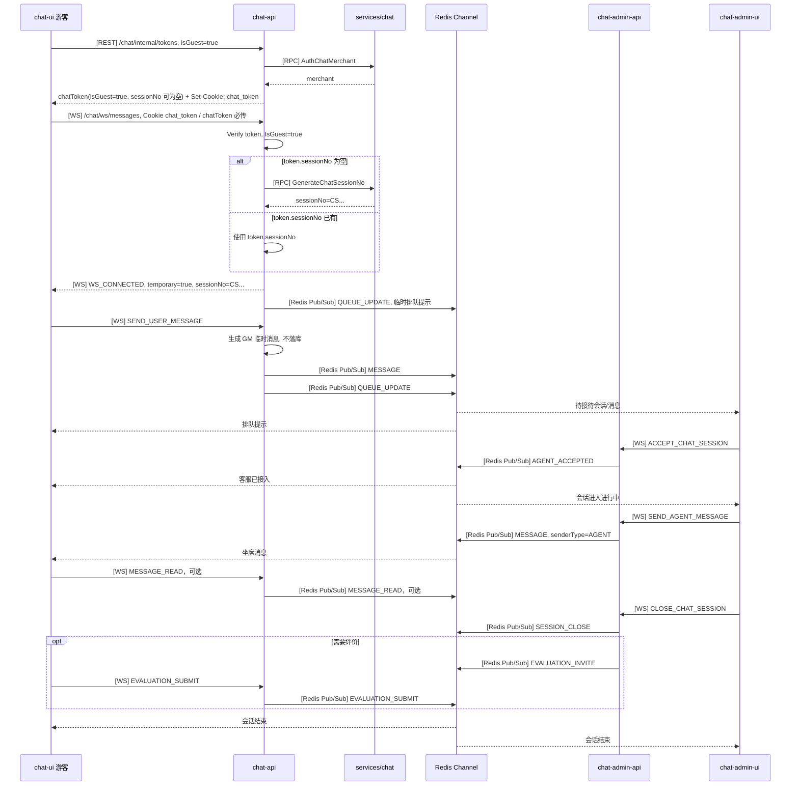
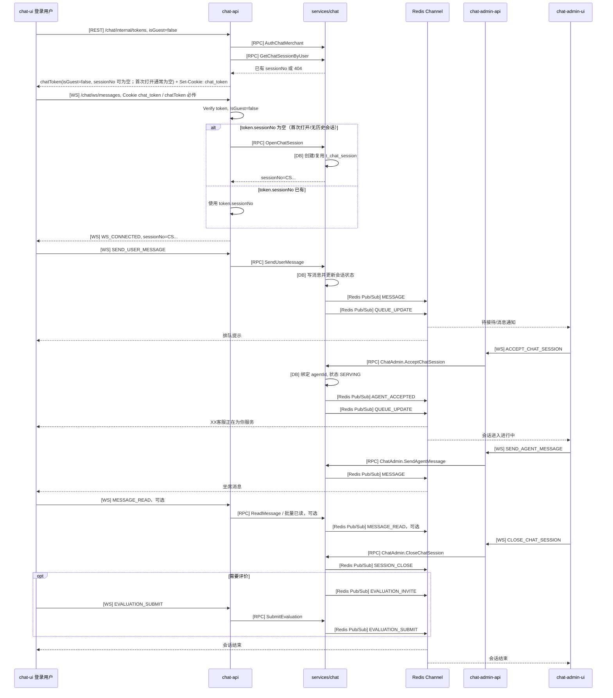
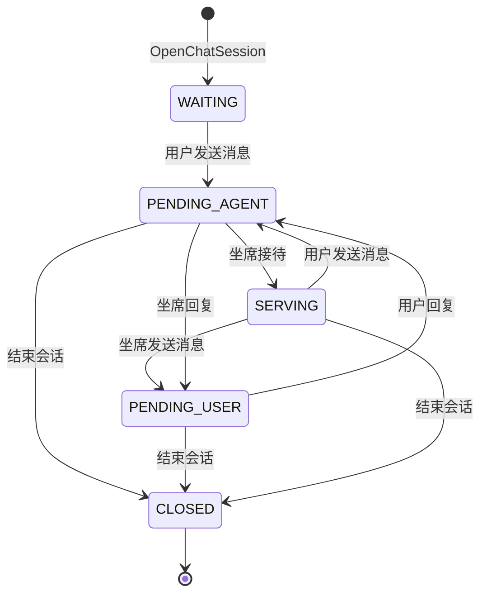

# 客服会话流程

本文按当前代码描述客户进入客服页、进入队列、坐席接待、双方聊天和结束会话的完整链路。当前链路通过 `chatToken` 区分游客和登录用户，而不是通过 WebSocket 是否带 token 区分。

## 关键约定

- 用户侧入口先调用 `[REST] chat-api /chat/internal/tokens`，入参为 `apiKey`、`apiSecret`、`userId`、`nickname`、`avatarUrl`、`isGuest`。
- `CreateChatToken` 内部先调用 `[RPC] ChatApp.AuthChatMerchant` 校验商户，再签发 `chatToken`，并在成功响应里设置 `Set-Cookie: chat_token=...`。
- `chat_token` cookie 属性为 `Path=/chat`、`HttpOnly`、`Secure`、`SameSite=None`，过期时间与 `chatToken.expireAt` 对齐。
- 如果前端已经拿到 `chatToken` 但需要补写 cookie，可以调用 `[REST] chat-api /chat/internal/token-cookie`，服务端校验 token 后同样返回 `Set-Cookie`。
- WebSocket 用户端必须带 `chatToken` 连接 `[WS] chat-api /chat/ws/messages`；优先通过 `chat_token` cookie 自动携带，也可通过 query `chatToken`、`Authorization Bearer`、`x-chat-token` 或 `Sec-WebSocket-Protocol token.*` 兜底传递。
- `merchantId` 不再单独传，`chat-api` 从 token 中解析 `merchantId`、`userId`、`nickname`、`avatarUrl`、`isGuest`、`sessionNo`。
- `IsGuest=true` 表示临时游客链路。若 token 中没有 `sessionNo`，`chat-api` 调用 `[RPC] ChatApp.GenerateChatSessionNo` 获取唯一 `CS...` 编号。该编号只作为临时会话 key，不写入 `t_chat_session`。
- `IsGuest=false` 表示登录用户链路。登录用户第一次打开客服时通常也没有 `sessionNo`；若 token 中没有 `sessionNo`，`chat-api` 在 WS logic 中调用 `[RPC] ChatApp.OpenChatSession` 创建或复用真实会话，并写入 `t_chat_session`。
- 当前游客和登录用户的 `sessionNo` 都是 `CS...` 形式；是否临时会话以 `chatToken.isGuest` / WS 连接上下文判断，不再依赖 `GS...` 前缀。
- 游客消息使用 `GM...` 临时消息号，通过 Redis Pub/Sub 推送，不写 MySQL/MongoDB。
- 登录用户消息调用 `[RPC] ChatApp.SendUserMessage`，由 `services/chat` 写消息、更新会话状态并发布事件。
- 用户侧接待前显示排队提示；坐席必须点击“接待”后，会话才进入进行中。
- 实时事件统一使用 `ChatMessageEvent`，事件类型为 `ChatEventType` enum，不再使用字符串事件名解析。

## 用户身份和 SessionNo

```text
1. chat-ui 调用 [REST] chat-api /chat/internal/tokens
   - 入参: apiKey, apiSecret, userId, nickname, avatarUrl, isGuest
   - 出参: chatToken, expireAt, sessionNo
   - 响应头: Set-Cookie: chat_token=...; Path=/chat; HttpOnly; Secure; SameSite=None
   - 如需单独补写 cookie，可调用 [REST] chat-api /chat/internal/token-cookie，入参为 chatToken
   - 非游客会尝试查询已有会话；第一次打开没有历史会话时，token 中的 sessionNo 为空
   - 游客 token 通常不带 sessionNo

2. chat-ui 建立 [WS] chat-api /chat/ws/messages
   - chatToken 必传，缺失或校验失败会直接拒绝连接
   - token 来源优先级: Cookie chat_token、query chatToken、Authorization Bearer、x-chat-token、Sec-WebSocket-Protocol token.*
   - merchantId 不作为 WS 入参传递，由 chatToken 承载
   - chat-api 校验 token，组装 ChatWSMessagesReq

3. chat-api 根据 IsGuest 处理 sessionNo
   - IsGuest=true 且 sessionNo 为空: 调 ChatApp.GenerateChatSessionNo，生成临时 CS...
   - IsGuest=false 且 sessionNo 为空: 调 ChatApp.OpenChatSession，创建/复用落库 CS...
   - IsGuest=false 且 sessionNo 不为空: 直接使用 token 中已有会话
```

## 总流程



## 游客流程



## 登录用户流程



## 会话状态流转

状态名与 `proto/chat/enum.proto` 的 `ChatSessionStatus` 对齐。

| 状态 | 值 | 含义 |
| --- | --- | --- |
| `CHAT_SESSION_STATUS_WAITING` | 1 | 已创建，等待用户消息或等待进入队列 |
| `CHAT_SESSION_STATUS_SERVING` | 2 | 服务中，坐席已确认接待 |
| `CHAT_SESSION_STATUS_PENDING_USER` | 3 | 等待用户回复，最后一条消息来自坐席 |
| `CHAT_SESSION_STATUS_PENDING_AGENT` | 4 | 等待客服回复，待接待列表主要状态 |
| `CHAT_SESSION_STATUS_CLOSED` | 5 | 已结束 |



说明: 游客临时会话不写 `t_chat_session`，没有数据库状态流转；admin-ui 根据 Redis/WS 临时事件维护待接待、进行中、已结束视图。

## 主要接口和事件

| 场景 | 游客 `IsGuest=true` | 登录用户 `IsGuest=false` |
| --- | --- | --- |
| 获取 chatToken | `/chat/internal/tokens`，返回 `chatToken` 并 `Set-Cookie: chat_token` | 同游客，且会尝试 `GetChatSessionByUser` 带回已有 `sessionNo` |
| 补写 cookie | `/chat/internal/token-cookie`，入参 `chatToken`，校验后 `Set-Cookie: chat_token` | 同游客 |
| WS 建连 | `/chat/ws/messages` 必须携带 `chatToken`，优先用 `chat_token` cookie，不单独传 `merchantId` | 同游客 |
| 获取 sessionNo | `GenerateChatSessionNo` 生成临时 `CS...`，不落库 | `OpenChatSession` 创建/复用 `CS...`，落库 |
| 用户发送消息 | `SEND_USER_MESSAGE`，chat-api 生成 `GM...` 临时消息并广播 | `SEND_USER_MESSAGE`，chat-api 调 `ChatApp.SendUserMessage` |
| 排队信息 | chat-api 发布临时 `QUEUE_UPDATE` | services/chat 发布 `QUEUE_UPDATE`，也可 `GetMyChatQueueInfo` 查询 |
| 坐席接待 | chat-admin-api 临时发布 `AGENT_ACCEPTED` | chat-admin-api 调 `ChatAdmin.AcceptChatSession` |
| 坐席回复 | chat-admin-api 临时发布 `MESSAGE` | chat-admin-api 调 `ChatAdmin.SendAgentMessage` |
| 结束会话 | 临时发布 `SESSION_CLOSE`；用户 WS 断开发布 `USER_LEAVE` | `CloseChatSession` 或 `CloseMyChatSession` 更新数据库并广播 |

## 事件动作和 payload 对照

`CHAT_FLOW.md` 描述当前服务调用链路，完整事件语义以 `proto/chat/chat_event_flow.md` 为准。以下补齐服务链路中需要落到实现或前端处理的事件动作。

| 事件 | 主要 payload | 典型来源 | 推送目标 | 处理要点 |
| --- | --- | --- | --- | --- |
| `WS_CONNECTED` | `connected` | chat-api WS 建连成功 | 当前连接 | 只确认连接和返回 `sessionNo` / 用户信息，不代表进入等待列表 |
| `USER_JOIN` | `user_state` | 用户进入客服页或重连恢复 | 坐席端 / 管理端可选 | 用于在线状态，不等同于会话开始 |
| `USER_LEAVE` | `user_state` | WS 断开或心跳超时 | 坐席端 / 管理端可选 | 只表示离线；异常断开时不直接关闭会话 |
| `QUEUE_UPDATE` | `queue` | 发起咨询、等待信息变化、取消等待、被接待 | 用户端 + 坐席等待列表 | 配合 `queue_action` 区分 `JOIN`、`UPDATE`、`CANCEL`、`ACCEPTED` |
| `AGENT_ACCEPTED` | `agent` | 坐席点击接待或转接后新坐席接手 | 用户端 + 当前坐席端 | 会话进入 `SERVING`，同时刷新等待列表 |
| `AGENT_LEAVE` | `agent` | 坐席主动离开、下线或异常断开 | 用户端 / 管理端可选 | 是否回到等待列表或关闭会话由业务决定 |
| `MESSAGE` | `message` | 用户 / 坐席 / 系统 / 机器人发消息 | 对方，必要时回推自己 | 普通聊天记录核心事件 |
| `MESSAGE_DELIVERED` | `receipt` | 服务端或接收端确认送达 | 消息发送方 | 可只更新消息状态，不必作为聊天记录展示 |
| `MESSAGE_READ` | `receipt` | 接收方打开会话或消息进入可视区域 | 消息发送方 | 建议按会话批量已读，减少逐条推送 |
| `TYPING` | `typing` | 用户或坐席正在输入 | 对方 | 高频实时事件，不入库；前端超时隐藏 |
| `MESSAGE_RECALL` | `message_operate` | 发送方撤回消息 | 双方 | 双方同步“已撤回”状态 |
| `MESSAGE_DELETE` | `message_operate` | 用户 / 坐席 / 管理端删除消息 | 按删除范围决定 | 区分本地删除和双边删除 |
| `TRANSFER_REQUEST` | `transfer` | 当前坐席发起转接 | 目标坐席 / 管理端可选 | 用户端一般不需要感知 |
| `TRANSFER_ACCEPT` | `transfer` | 目标坐席接受转接 | 原坐席 + 新坐席 | 随后推 `AGENT_ACCEPTED` 给用户和新坐席 |
| `TRANSFER_REJECT` | `transfer` | 目标坐席拒绝转接 | 原坐席 | 用户端一般不需要感知 |
| `SESSION_CLOSE` | `session` | 用户、坐席或服务端关闭会话 | 双方 | 配合 `close_reason`，会话关闭后禁止继续发普通消息 |
| `EVALUATION_INVITE` | `evaluation` | 坐席或服务端邀请评价 | 用户端 | 通常在关闭前后触发 |
| `EVALUATION_SUBMIT` | `evaluation` | 用户提交评价 | 坐席端 / 管理端 | 评价数据需要入库 |
| `HEARTBEAT` | `heartbeat` | 客户端或服务端保活 | 当前连接 | 不转发给聊天对方，不入库 |
| `ERROR` | `error` | 服务端业务校验失败 | 出错的一方 | 例如会话不存在、无权限、已被其他坐席接待 |

`ChatQueueAction` 建议统一使用：

| action | 场景 | 效果 |
| --- | --- | --- |
| `JOIN` | 用户发起咨询或发送第一条消息 | 加入等待列表 |
| `UPDATE` | 排队位置、等待人数、预计等待时间变化 | 更新用户提示和坐席等待列表 |
| `CANCEL` | 用户取消等待 | 从等待列表移除并可关闭会话 |
| `ACCEPTED` | 坐席已接待 | 从其他坐席等待列表移除 |

## 完整分支流程补充

### 暂无坐席在线

```text
用户发起咨询
↓
QUEUE_UPDATE，queue_action = JOIN
↓
SYSTEM_NOTICE，提示暂无坐席在线
↓
用户留言，MESSAGE
↓
SESSION_CLOSE，close_reason = NO_AGENT
```

### 用户取消等待

```text
用户进入等待列表
↓
QUEUE_UPDATE，queue_action = JOIN
↓
用户取消等待
↓
QUEUE_UPDATE，queue_action = CANCEL
↓
SESSION_CLOSE，close_reason = USER
```

### 坐席接待竞争

多个坐席同时点击同一个等待会话时，服务端需要通过事务、分布式锁或原子更新保证只有一个坐席成功。

```text
坐席 A / 坐席 B 同时点击接待
↓
坐席 A 成功，AGENT_ACCEPTED
↓
QUEUE_UPDATE，queue_action = ACCEPTED
↓
坐席 B 失败，ERROR
```

### 转接

```text
当前坐席发起转接
↓
TRANSFER_REQUEST
↓
目标坐席接受
↓
TRANSFER_ACCEPT
↓
AGENT_ACCEPTED，新坐席正式接待
```

目标坐席拒绝时只推 `TRANSFER_REJECT` 给原坐席，用户端通常不需要感知。

### 坐席离开

```text
坐席主动离开 / 下线 / 异常断开
↓
AGENT_LEAVE
↓
按业务决定 QUEUE_UPDATE 重新入队、TRANSFER 或 SESSION_CLOSE
```

### 网络异常断开与恢复

用户 WebSocket 异常断开或心跳超时时，只表示连接离线，不等同于会话关闭。

```text
会话服务中
↓
用户网络异常断开 / HEARTBEAT 超时
↓
USER_LEAVE，session_status = INTERNET_ERROR
↓
会话保留，等待用户重连
↓
用户重新建立 WebSocket
↓
WS_CONNECTED
↓
USER_JOIN，恢复断线前会话状态
```

如果超过业务允许的等待时间仍未重连，再推：

```text
SESSION_CLOSE，close_reason = INTERNET_ERROR
```

### 超时关闭

```text
会话服务中
↓
用户长时间不回复
↓
SYSTEM_NOTICE
↓
SESSION_CLOSE，close_reason = TIMEOUT
```

### 输入、撤回和删除

- `TYPING` 每 1 到 2 秒节流发送；接收方 3 到 5 秒没有再次收到后自动隐藏，不需要 `STOP_TYPING`。
- `MESSAGE_RECALL` 表示发送方撤回，双方都看到“已撤回”。
- `MESSAGE_DELETE` 表示删除记录，需用业务字段区分 `SELF` 本地删除和 `BOTH` 双边删除。

## 事件入库建议

| 事件 | 建议 | 说明 |
| --- | --- | --- |
| `MESSAGE` | 入库 | 聊天记录核心数据 |
| `QUEUE_UPDATE` | 入库 | 可用于排队记录和客服绩效分析 |
| `AGENT_ACCEPTED` / `AGENT_LEAVE` | 入库 | 记录接待和离开 |
| `TRANSFER_REQUEST` / `TRANSFER_ACCEPT` / `TRANSFER_REJECT` | 入库 | 转接审计 |
| `SESSION_CLOSE` | 入库 | 会话生命周期核心事件 |
| `EVALUATION_INVITE` / `EVALUATION_SUBMIT` | 入库 | 评价流程和评价数据 |
| `MESSAGE_RECALL` | 入库 | 消息操作记录 |
| `SYSTEM_NOTICE` / `MESSAGE_DELIVERED` / `MESSAGE_READ` / `MESSAGE_DELETE` | 可选 | 可只更新状态或按审计要求记录 |
| `WS_CONNECTED` / `USER_JOIN` / `USER_LEAVE` / `TYPING` / `HEARTBEAT` / `ERROR` | 通常不入聊天记录 | 连接、在线状态、高频实时状态和错误日志分开处理 |

## 服务端处理规则

1. 用户进入等待列表时，创建或查询未关闭会话，设置 `WAITING`，推 `QUEUE_UPDATE JOIN` 给用户端和坐席等待列表；无坐席在线时可追加 `SYSTEM_NOTICE`。
2. 坐席接待时，校验坐席在线和会话仍可接待，通过事务或锁防止并发接待，绑定 `agent_id`，设置 `SERVING`，推 `AGENT_ACCEPTED` 和 `QUEUE_UPDATE ACCEPTED`。
3. 发送消息时，校验会话存在、未关闭、发送方有权限；消息入库后推 `MESSAGE` 给接收方，并按在线情况更新或推 `MESSAGE_DELIVERED`。
4. 已读处理可由接收方打开会话或消息进入可视区域触发，服务端更新消息状态为 `READ`，再推 `MESSAGE_READ` 给消息发送方。
5. 关闭会话时，设置 `CLOSED`，写入 `close_reason`，推 `SESSION_CLOSE` 给双方；需要评价时再推 `EVALUATION_INVITE`，并禁止继续发送普通消息。
6. 网络异常断开时，先推 `USER_LEAVE` 表示离线并保留会话；重连后先回 `WS_CONNECTED`，再推 `USER_JOIN` 恢复业务在线状态；超时仍未重连才 `SESSION_CLOSE close_reason = INTERNET_ERROR`。

事件类型使用 `ChatEventType`:

| enum | 值 | 方向 |
| --- | --- | --- |
| `CHAT_EVENT_TYPE_WS_CONNECTED` | 1 | WS 连接确认，推给当前连接 |
| `CHAT_EVENT_TYPE_MESSAGE` | 2 | Redis/WS 普通消息事件 |
| `CHAT_EVENT_TYPE_SYSTEM_NOTICE` | 3 | 系统通知 |
| `CHAT_EVENT_TYPE_USER_JOIN` | 4 | 用户进入客服页或恢复业务在线状态，通知坐席/管理端可选 |
| `CHAT_EVENT_TYPE_USER_LEAVE` | 5 | 用户离开客服页或连接离线，通知坐席/管理端可选 |
| `CHAT_EVENT_TYPE_QUEUE_UPDATE` | 6 | 排队信息变化，通知用户和坐席等待列表 |
| `CHAT_EVENT_TYPE_AGENT_ACCEPTED` | 7 | 坐席接待会话，通知用户和当前坐席 |
| `CHAT_EVENT_TYPE_AGENT_LEAVE` | 8 | 坐席离开会话 |
| `CHAT_EVENT_TYPE_TRANSFER_REQUEST` | 9 | 会话转接发起 |
| `CHAT_EVENT_TYPE_TRANSFER_ACCEPT` | 10 | 会话转接接受 |
| `CHAT_EVENT_TYPE_TRANSFER_REJECT` | 11 | 会话转接拒绝 |
| `CHAT_EVENT_TYPE_SESSION_CLOSE` | 12 | 会话关闭 |
| `CHAT_EVENT_TYPE_EVALUATION_INVITE` | 13 | 邀请用户评价 |
| `CHAT_EVENT_TYPE_EVALUATION_SUBMIT` | 14 | 用户提交评价 |
| `CHAT_EVENT_TYPE_TYPING` | 15 | 正在输入 |
| `CHAT_EVENT_TYPE_MESSAGE_DELIVERED` | 16 | 消息已送达 |
| `CHAT_EVENT_TYPE_MESSAGE_READ` | 17 | 消息已读 |
| `CHAT_EVENT_TYPE_MESSAGE_RECALL` | 18 | 消息撤回 |
| `CHAT_EVENT_TYPE_MESSAGE_DELETE` | 19 | 消息删除 |
| `CHAT_EVENT_TYPE_HEARTBEAT` | 20 | 心跳 |
| `CHAT_EVENT_TYPE_ERROR` | 21 | 错误事件 |

## Proto 契约

| 类型/RPC | 位置 | 用途 |
| --- | --- | --- |
| `ChatEventType` | `proto/chat/enum.proto` | WS/Redis 统一事件枚举 |
| `ChatMessageEvent` | `proto/chat/model.proto` | Redis/WS 推送 envelope，包含 `code`、`msg`、`event_type`、`created_at` 和 `oneof payload` |
| `ChatQueuePayload` | `proto/chat/model.proto` | `QUEUE_UPDATE` 推送 payload |
| `ChatQueueInfo` | `proto/chat/model.proto` | 排队信息查询结构 |
| `WsConnectedPayload` | `proto/chat/model.proto` | WS connected 结构 |
| `ChatWsUserMessageReq` | `proto/chat/model.proto` | 用户侧消息请求结构 |
| `ChatWsAgentMessageReq` | `proto/chat/model.proto` | 坐席侧消息请求结构 |
| `ChatWsAcceptSessionReq` | `proto/chat/model.proto` | 坐席接待请求结构 |
| `ChatWsCloseSessionReq` | `proto/chat/model.proto` | 坐席关闭请求结构 |
| `ChatApp.GenerateChatSessionNo` | `proto/chat/chat_app.proto` | 为游客临时会话生成唯一 `sessionNo` |
| `ChatApp.OpenChatSession` | `proto/chat/chat_app.proto` | 登录用户创建/复用持久会话 |
| `ChatApp.SendUserMessage` | `proto/chat/chat_app.proto` | 登录用户发送消息 |
| `ChatAdmin.AcceptChatSession` | `proto/chat/chat_admin.proto` | 坐席接待持久会话 |

## 当前实现注意点

- 当前游客临时会话也使用 `CS...`，因此不能再通过前缀判断游客；用户侧以 `chatToken.isGuest` 进入临时链路，坐席侧临时逻辑目前仍有 `GS` 前缀判断历史代码，后续需要统一成显式临时标记或 Redis 临时会话状态。
- `chat-api` 的 `handleClose` 会在用户 WS 断开时发布 `USER_LEAVE` 风格的“用户已离开客服页面”事件；这和用户主动结束持久会话的 `SESSION_CLOSE` 不是同一个语义，UI 需要区分。
- `chat-admin-api` 对临时会话主要依赖进程内 transient registry 和 Redis Pub/Sub 事件；跨实例接待锁、重启恢复仍需要 Redis 状态补齐。
- `CreateChatToken` 的 token TTL 默认 5 分钟，最大 30 分钟；WS 建连后是否继续存活由 WebSocket 心跳控制。
- `chat_token` cookie 只覆盖 `/chat` 路径，且为 `HttpOnly`；前端不能直接读取该 cookie，需要依赖浏览器在同站/跨站允许凭证时自动带上，跨域请求需开启 credentials。
- `QUEUE_UPDATE`、`AGENT_ACCEPTED` 这类状态提示在 chat-ui 中展示为顶部状态条，不作为普通聊天消息插入消息流。
