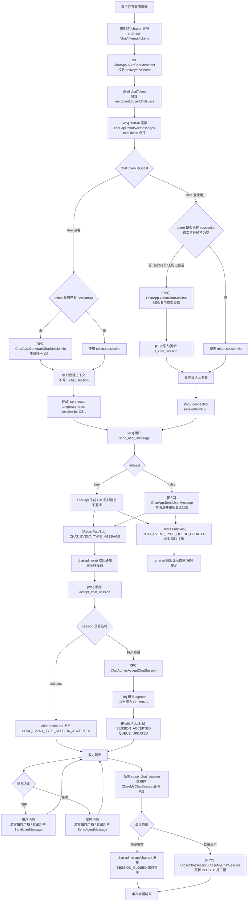
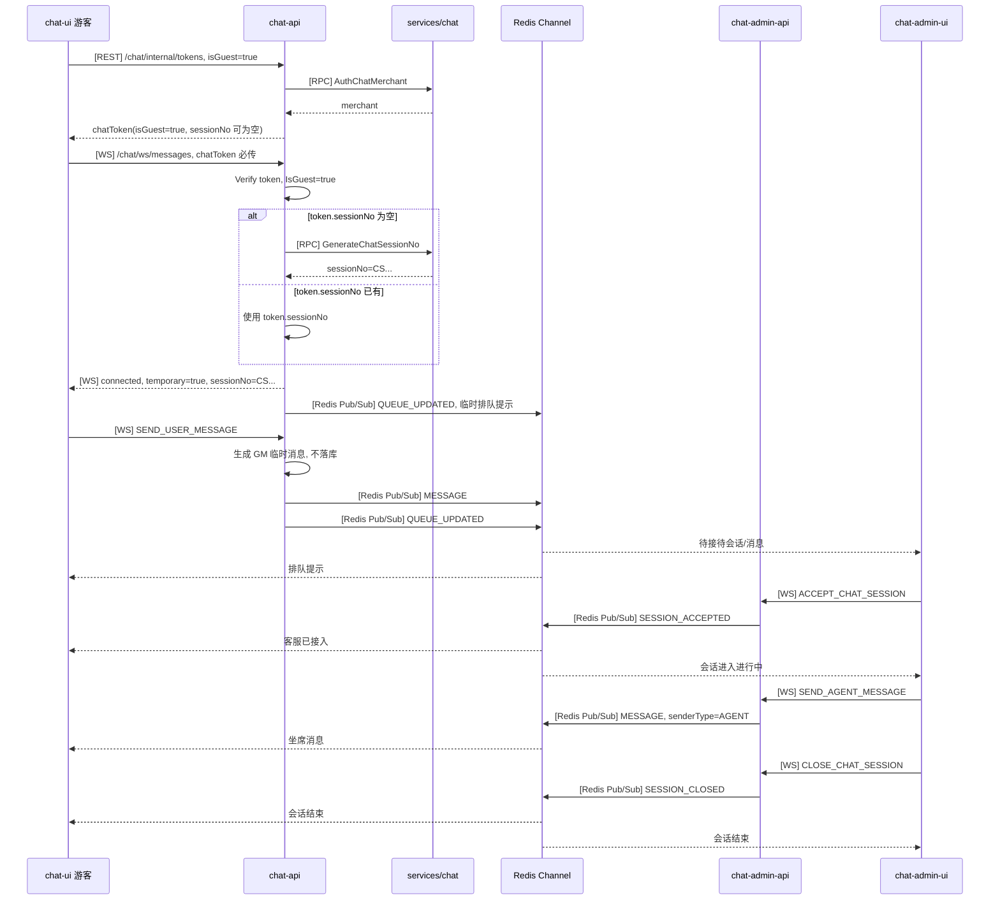
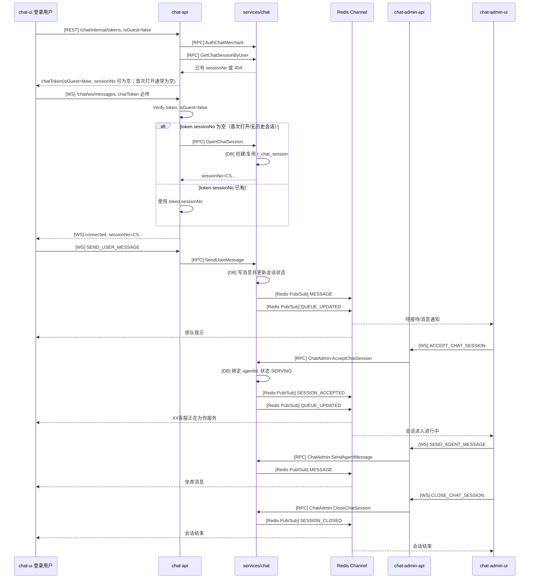
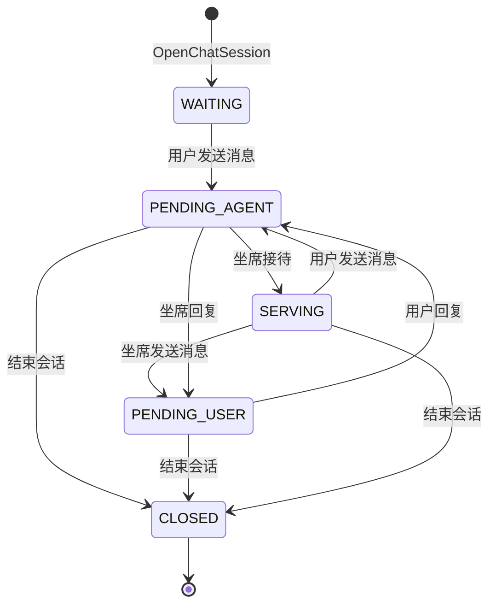

# 客服会话流程

本文按当前代码描述客户进入客服页、进入队列、坐席接待、双方聊天和结束会话的完整链路。当前链路通过 `chatToken` 区分游客和登录用户，而不是通过 WebSocket 是否带 token 区分。

## 关键约定

- 用户侧入口先调用 `[REST] chat-api /chat/internal/tokens`，入参为 `apiKey`、`apiSecret`、`userId`、`nickname`、`avatarUrl`、`isGuest`。
- `CreateChatToken` 内部先调用 `[RPC] ChatApp.AuthChatMerchant` 校验商户，再签发 `chatToken`。
- WebSocket 用户端必须带 `chatToken` 连接 `[WS] chat-api /chat/ws/messages`；`merchantId` 不再单独传，`chat-api` 从 token 中解析 `merchantId`、`userId`、`nickname`、`avatarUrl`、`isGuest`、`sessionNo`。
- `IsGuest=true` 表示临时游客链路。若 token 中没有 `sessionNo`，`chat-api` 调用 `[RPC] ChatApp.GenerateChatSessionNo` 获取唯一 `CS...` 编号。该编号只作为临时会话 key，不写入 `t_chat_session`。
- `IsGuest=false` 表示登录用户链路。登录用户第一次打开客服时通常也没有 `sessionNo`；若 token 中没有 `sessionNo`，`chat-api` 在 WS logic 中调用 `[RPC] ChatApp.OpenChatSession` 创建或复用真实会话，并写入 `t_chat_session`。
- 当前游客和登录用户的 `sessionNo` 都是 `CS...` 形式；是否临时会话以 `chatToken.isGuest` / WS 连接上下文判断，不再依赖 `GS...` 前缀。
- 游客消息使用 `GM...` 临时消息号，通过 Redis Pub/Sub 推送，不写 MySQL/MongoDB。
- 登录用户消息调用 `[RPC] ChatApp.SendUserMessage`，由 `services/chat` 写消息、更新会话状态并发布事件。
- 用户侧接待前显示排队提示；坐席必须点击“接待”后，会话才进入进行中。
- 实时事件统一使用 `ChatMessageEvent`，事件类型为 `ChatEventType` enum，不再使用字符串事件名解析。

## 用户身份和 SessionNo

```text
1. chat-ui 调用 [REST] chat-api /chat/internal/tokens
   - 入参: apiKey, apiSecret, userId, nickname, avatarUrl, isGuest
   - 出参: chatToken, expireAt, sessionNo
   - 非游客会尝试查询已有会话；第一次打开没有历史会话时，token 中的 sessionNo 为空
   - 游客 token 通常不带 sessionNo

2. chat-ui 建立 [WS] chat-api /chat/ws/messages
   - chatToken 必传，缺失或校验失败会直接拒绝连接
   - token 来源: query chatToken、Authorization Bearer、x-chat-token 或 Sec-WebSocket-Protocol token.*
   - merchantId 不作为 WS 入参传递，由 chatToken 承载
   - chat-api 校验 token，组装 ChatWSMessagesReq

3. chat-api 根据 IsGuest 处理 sessionNo
   - IsGuest=true 且 sessionNo 为空: 调 ChatApp.GenerateChatSessionNo，生成临时 CS...
   - IsGuest=false 且 sessionNo 为空: 调 ChatApp.OpenChatSession，创建/复用落库 CS...
   - IsGuest=false 且 sessionNo 不为空: 直接使用 token 中已有会话
```

## 总流程



## 游客流程



## 登录用户流程



## 会话状态流转

状态名与 `proto/chat/enum.proto` 的 `ChatSessionStatus` 对齐。

| 状态 | 值 | 含义 |
| --- | --- | --- |
| `CHAT_SESSION_STATUS_WAITING` | 1 | 已创建，等待用户消息或等待进入队列 |
| `CHAT_SESSION_STATUS_SERVING` | 2 | 服务中，坐席已确认接待 |
| `CHAT_SESSION_STATUS_PENDING_USER` | 3 | 等待用户回复，最后一条消息来自坐席 |
| `CHAT_SESSION_STATUS_PENDING_AGENT` | 4 | 等待客服回复，待接待列表主要状态 |
| `CHAT_SESSION_STATUS_CLOSED` | 5 | 已结束 |



说明: 游客临时会话不写 `t_chat_session`，没有数据库状态流转；admin-ui 根据 Redis/WS 临时事件维护待接待、进行中、已结束视图。

## 主要接口和事件

| 场景 | 游客 `IsGuest=true` | 登录用户 `IsGuest=false` |
| --- | --- | --- |
| 获取 chatToken | `/chat/internal/tokens`，返回 `chatToken` | 同游客，且会尝试 `GetChatSessionByUser` 带回已有 `sessionNo` |
| WS 建连 | `/chat/ws/messages` 必须携带 `chatToken`，不单独传 `merchantId` | 同游客 |
| 获取 sessionNo | `GenerateChatSessionNo` 生成临时 `CS...`，不落库 | `OpenChatSession` 创建/复用 `CS...`，落库 |
| 用户发送消息 | `SEND_USER_MESSAGE`，chat-api 生成 `GM...` 临时消息并广播 | `SEND_USER_MESSAGE`，chat-api 调 `ChatApp.SendUserMessage` |
| 排队信息 | chat-api 发布临时 `QUEUE_UPDATED` | services/chat 发布 `QUEUE_UPDATED`，也可 `GetMyChatQueueInfo` 查询 |
| 坐席接待 | chat-admin-api 临时发布 `SESSION_ACCEPTED` | chat-admin-api 调 `ChatAdmin.AcceptChatSession` |
| 坐席回复 | chat-admin-api 临时发布 `MESSAGE` | chat-admin-api 调 `ChatAdmin.SendAgentMessage` |
| 结束会话 | 临时发布 `SESSION_CLOSED`；用户 WS 断开也会发布用户离开事件 | `CloseChatSession` 或 `CloseMyChatSession` 更新数据库并广播 |

事件类型使用 `ChatEventType`:

| enum | 值 | 方向 |
| --- | --- | --- |
| `CHAT_EVENT_TYPE_MESSAGE` | 1 | Redis/WS 消息事件 |
| `CHAT_EVENT_TYPE_SESSION_ACCEPTED` | 2 | 会话被接待 |
| `CHAT_EVENT_TYPE_SESSION_CLOSED` | 3 | 会话关闭/用户离开 |
| `CHAT_EVENT_TYPE_QUEUE_UPDATED` | 4 | 排队信息更新 |
| `CHAT_EVENT_TYPE_CONNECTED` | 6 | WS connected |
| `CHAT_EVENT_TYPE_SEND_USER_MESSAGE` | 8 | 用户发消息请求 |
| `CHAT_EVENT_TYPE_SEND_USER_MESSAGE_RESULT` | 9 | 用户发消息结果 |
| `CHAT_EVENT_TYPE_SEND_AGENT_MESSAGE` | 10 | 坐席发消息请求 |
| `CHAT_EVENT_TYPE_SEND_AGENT_MESSAGE_RESULT` | 11 | 坐席发消息结果 |
| `CHAT_EVENT_TYPE_ACCEPT_CHAT_SESSION` | 12 | 坐席接待请求 |
| `CHAT_EVENT_TYPE_ACCEPT_CHAT_SESSION_RESULT` | 13 | 坐席接待结果 |
| `CHAT_EVENT_TYPE_CLOSE_CHAT_SESSION` | 14 | 坐席关闭请求 |
| `CHAT_EVENT_TYPE_CLOSE_CHAT_SESSION_RESULT` | 15 | 坐席关闭结果 |

## Proto 契约

| 类型/RPC | 位置 | 用途 |
| --- | --- | --- |
| `ChatEventType` | `proto/chat/enum.proto` | WS/Redis 统一事件枚举 |
| `ChatMessageEvent` | `proto/chat/model.proto` | Redis/WS 推送 envelope，包含 `type`、`data`、`session`、`queue` 等 |
| `ChatQueueInfo` | `proto/chat/model.proto` | 排队信息 |
| `ChatWsConnected` | `proto/chat/model.proto` | WS connected 结构 |
| `ChatWsUserMessageReq` | `proto/chat/model.proto` | 用户侧消息请求结构 |
| `ChatWsAgentMessageReq` | `proto/chat/model.proto` | 坐席侧消息请求结构 |
| `ChatWsAcceptSessionReq` | `proto/chat/model.proto` | 坐席接待请求结构 |
| `ChatWsCloseSessionReq` | `proto/chat/model.proto` | 坐席关闭请求结构 |
| `ChatApp.GenerateChatSessionNo` | `proto/chat/chat_app.proto` | 为游客临时会话生成唯一 `sessionNo` |
| `ChatApp.OpenChatSession` | `proto/chat/chat_app.proto` | 登录用户创建/复用持久会话 |
| `ChatApp.SendUserMessage` | `proto/chat/chat_app.proto` | 登录用户发送消息 |
| `ChatAdmin.AcceptChatSession` | `proto/chat/chat_admin.proto` | 坐席接待持久会话 |

## 当前实现注意点

- 当前游客临时会话也使用 `CS...`，因此不能再通过前缀判断游客；用户侧以 `chatToken.isGuest` 进入临时链路，坐席侧临时逻辑目前仍有 `GS` 前缀判断历史代码，后续需要统一成显式临时标记或 Redis 临时会话状态。
- `chat-api` 的 `handleClose` 会在用户 WS 断开时发布 `SESSION_CLOSED` 风格的“用户已离开客服页面”事件；这和用户主动结束持久会话不是同一个语义，UI 需要区分。
- `chat-admin-api` 对临时会话主要依赖进程内 transient registry 和 Redis Pub/Sub 事件；跨实例接待锁、重启恢复仍需要 Redis 状态补齐。
- `CreateChatToken` 的 token TTL 默认 5 分钟，最大 30 分钟；WS 建连后是否继续存活由 WebSocket 心跳控制。
- `QUEUE_UPDATED`、`SESSION_ACCEPTED` 这类状态提示在 chat-ui 中展示为顶部状态条，不作为普通聊天消息插入消息流。
