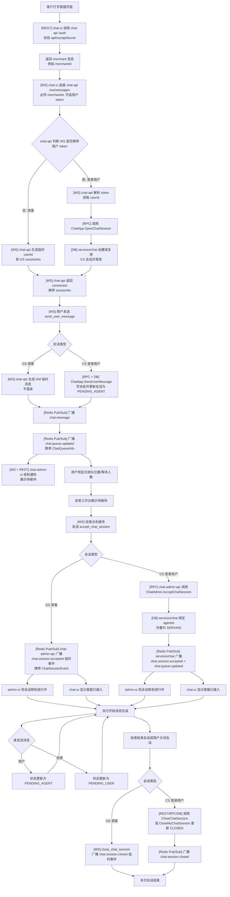
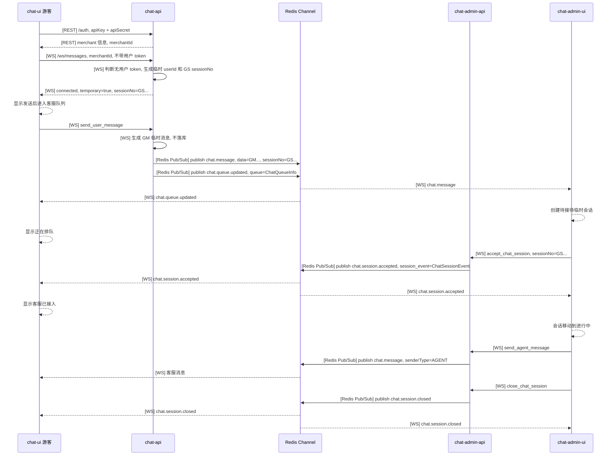
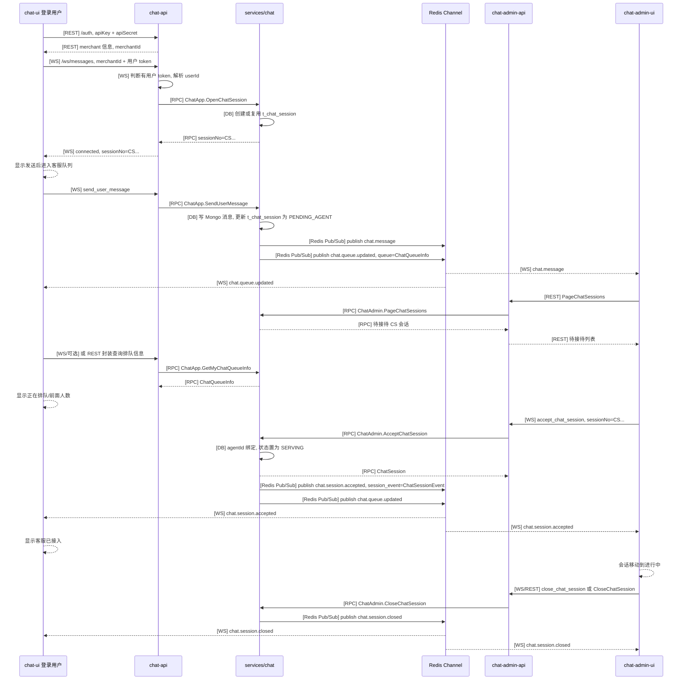
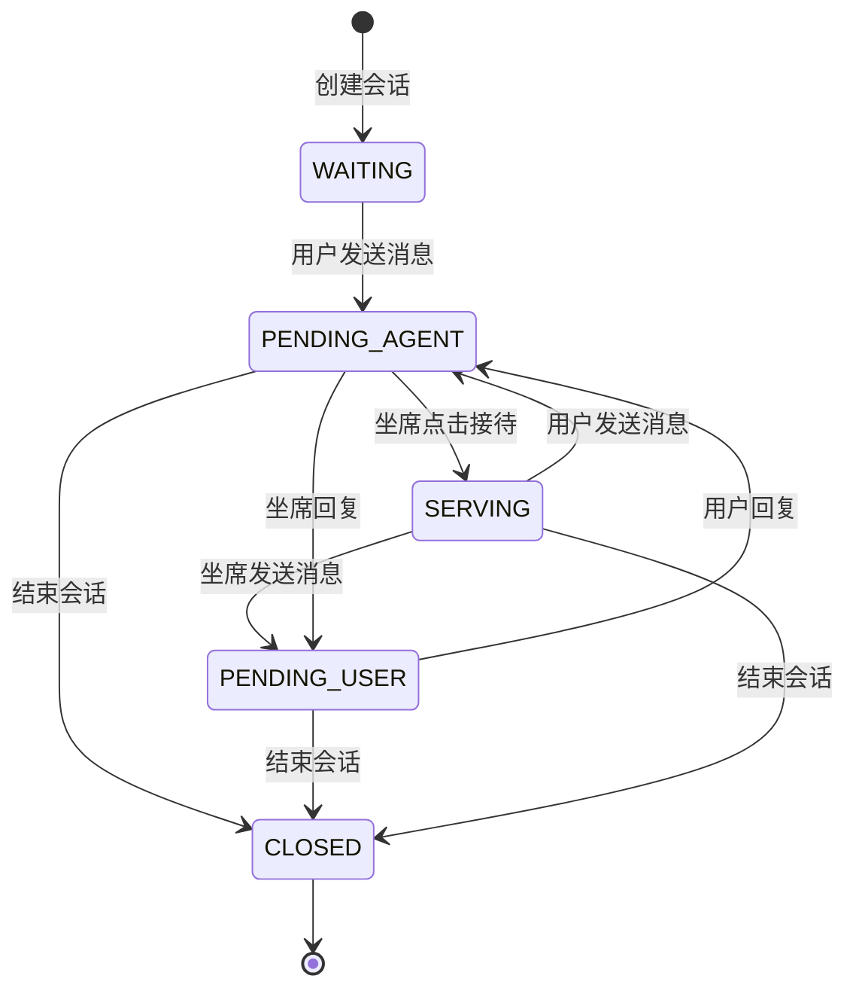

# 客服会话流程

本文描述从客户打开客服页面到本次会话结束的完整链路，并区分游客会话和登录用户会话。

## 关键约定

- 第一个接口是 `[REST] chat-api /auth`，请求只包含 `apiKey` 和 `apiSecret`，返回客服商户信息，例如 `merchantId`、`apiKey`、启用状态等。
- 第二步不是 REST 接口，而是用户侧建立 `[WS] chat-api /ws/messages` 连接；`chat-api` 根据 WS 建连时是否携带“用户登录 token”区分游客和登录用户。
- `/auth` 只认证商户接入资格，不认证业务用户身份；业务用户身份由 `/ws/messages` 连接时可选携带的用户 token 决定。
- `sessionNo` 由 `chat-api` 在 WS 建连阶段统一拿到: 游客由 `chat-api` 直接生成 `GS...`，登录用户由 `chat-api` 调用 `[RPC] ChatApp.OpenChatSession` 创建或复用 `CS...`。
- 拿到 `sessionNo` 后，用户发送消息、进入待接待、坐席确认接待、双方聊天的主流程保持一致；区别只是游客会话/消息不落库，登录用户会话/消息落库。
- 游客会话使用 `GS` 前缀，例如 `GS178...`，只存在于 WebSocket 临时链路，不落库。
- 登录用户会话使用 `CS` 前缀，例如 `CS178...`，由 `services/chat` 写入 `t_chat_session`。
- 游客消息使用 `GM` 前缀，登录用户消息走 MongoDB `chat_message`。
- 用户消息进入队列后，客服工作台必须点击“接待”，会话才进入进行中。
- 用户侧在接待前显示排队提示，收到 `chat.queue.updated` 更新排队信息，收到 `chat.session.accepted` 后显示客服已接入。
- 实时事件统一使用 `ChatMessageEvent` 承载，新增的结构包括 `ChatQueueInfo`、`ChatSessionEvent` 和 WS 契约 `ChatWsMessage`。

## 用户身份判断

```text
1. chat-ui 先调用 [REST] chat-api /auth
   - 入参: apiKey, apiSecret
   - 出参: merchant 信息
   - 作用: 确认这个页面可以接入哪个客服商户

2. chat-ui 再建立 [WS] chat-api /ws/messages
   - 必传: merchantId
   - 可选: 用户登录 token
   - 不带用户 token: 游客，chat-api 生成临时 userId 和 GS sessionNo
   - 带用户 token: 登录用户，chat-api 解析 userId，并调用 ChatApp.OpenChatSession 创建/复用 CS sessionNo

3. chat-api 拿到 sessionNo 后，后续用户侧都通过同一个 WS 事件发送消息
   - 事件: send_user_message
   - 游客: chat-api 生成临时消息并广播，不写 MySQL/MongoDB
   - 登录用户: chat-api 调用 ChatApp.SendUserMessage，services/chat 写 Mongo 消息并更新 MySQL 会话
   - 排队信息: 登录用户可通过 ChatApp.GetMyChatQueueInfo 查询，状态变化通过 chat.queue.updated 推送
```

## 总流程

图中标记说明:

- `[REST]`: HTTP REST 接口。
- `[WS]`: WebSocket 连接或 WebSocket 事件。
- `[RPC]`: gRPC 调用 `services/chat`。
- `[Redis Pub/Sub]`: 通过 Redis channel 广播实时事件。
- `[DB]`: MySQL/MongoDB 状态或消息落库。



## 游客流程



## 登录用户流程



## 会话状态流转

状态名与 `proto/chat/enum.proto` 的 `ChatSessionStatus` 对齐:

| 流程图状态 | enum | 值 | 含义 |
| --- | --- | --- | --- |
| `WAITING` | `CHAT_SESSION_STATUS_WAITING` | 1 | 等待接入，已创建但还没有用户消息 |
| `SERVING` | `CHAT_SESSION_STATUS_SERVING` | 2 | 服务中，坐席已确认接待 |
| `PENDING_USER` | `CHAT_SESSION_STATUS_PENDING_USER` | 3 | 等待用户回复，最后一条消息来自坐席 |
| `PENDING_AGENT` | `CHAT_SESSION_STATUS_PENDING_AGENT` | 4 | 等待客服回复，最后一条消息来自用户，也是待接待列表的主要状态 |
| `CLOSED` | `CHAT_SESSION_STATUS_CLOSED` | 5 | 已结束 |



## 主要接口和事件

| 场景 | 游客 | 登录用户 |
| --- | --- | --- |
| 商户认证 | `[REST] chat-api /auth`，入参 `apiKey/apiSecret`，返回商户信息 | 同游客 |
| 获取 sessionNo | `[WS] chat-api /ws/messages` 不带用户 token，`chat-api` 生成 `GS...` | `[WS] chat-api /ws/messages` 带用户 token，`chat-api` 调用 `ChatApp.OpenChatSession` 得到 `CS...` |
| 发送用户消息 | 统一走 `[WS] send_user_message`，`chat-api` 生成临时 `GM...` 并广播，不落库 | 统一走 `[WS] send_user_message`，`chat-api` 调用 `ChatApp.SendUserMessage`，写消息并广播 |
| 排队信息 | `chat-api` 广播临时 `chat.queue.updated`，携带 `ChatQueueInfo` | `services/chat` 计算队列位置，`ChatApp.GetMyChatQueueInfo` 可查询，状态变化广播 `chat.queue.updated` |
| 进入待接待 | admin-api transient registry 从 WS 事件维护 `GS...` 临时会话，REST 列表合并返回 | admin-ui 通过 WS 通知 + REST 列表获取 |
| 坐席接待 | `[WS] accept_chat_session` 广播 `chat.session.accepted` | `[WS] accept_chat_session` 调用 `ChatAdmin.AcceptChatSession`，成功后广播 `chat.session.accepted` |
| 坐席回复 | admin WS `send_agent_message` 临时广播 | `ChatAdmin.SendAgentMessage` 写消息并广播 |
| 结束会话 | `[WS] close_chat_session` 广播临时 `chat.session.closed` | `CloseChatSession` 或 `CloseMyChatSession`，并广播 `chat.session.closed` |

## 新增 Proto 契约

| 类型 | 位置 | 用途 |
| --- | --- | --- |
| `ChatQueueInfo` | `proto/chat/model.proto` | 描述排队信息，包括 `position`、`waiting_count`、`estimate_wait_seconds` 和展示文案 |
| `ChatSessionEvent` | `proto/chat/model.proto` | 描述会话事件，包括接待、关闭后的会话快照、坐席、操作者和排队信息 |
| `ChatMessageEvent.session/session_event/queue/base` | `proto/chat/model.proto` | 扩展 Redis/WS 推送载荷，避免所有事件都只能塞进 `data` 消息 |
| `ChatWsConnected` | `proto/chat/model.proto` | WS connected 事件结构，包含 `session_no`、`temporary`、`session` 和 `queue` |
| `ChatWsUserMessageReq` | `proto/chat/model.proto` | 用户侧 `send_user_message` 请求结构 |
| `ChatWsAgentMessageReq` | `proto/chat/model.proto` | 坐席侧 `send_agent_message` 请求结构 |
| `ChatWsAcceptSessionReq` | `proto/chat/model.proto` | 坐席侧 `accept_chat_session` 请求结构 |
| `ChatWsCloseSessionReq` | `proto/chat/model.proto` | 坐席侧 `close_chat_session` 请求结构 |
| `ChatWsMessage` | `proto/chat/model.proto` | WS 统一 envelope，使用 `type` 区分事件，按事件填充 `connected/user_message/agent_message/accept_session/close_session/message/session/session_event/queue` |
| `ChatApp.GetMyChatQueueInfo` | `proto/chat/chat_app.proto` | 登录用户查询自己的排队信息 |
| `ChatAdmin.AcceptChatSession` | `proto/chat/chat_admin.proto` | 坐席确认接待持久化会话 |
| `chat.queue.updated` | `proto/chat/notify.go` | 排队信息变化事件 |
| `chat.session.accepted` | `proto/chat/notify.go` | 会话被坐席接待事件 |
| `chat.session.closed` | `proto/chat/notify.go` | 会话关闭事件 |

## 当前实现注意点

- `GS...` 不落库，chat-admin-api 通过 transient registry 维护临时会话快照；REST 查询待接待/进行中/已结束列表时会合并这些临时会话。
- `CS...` 落库，因此刷新页面后仍可以通过 REST 恢复待接待/进行中/已结束列表。
- `chat.session.accepted`、`chat.session.closed`、`chat.queue.updated` 都复用 `ChatMessageEvent` envelope，并通过 `session_event`、`queue`、`session` 字段携带结构化信息；`data` 可兼容系统消息形态。
- 登录用户排队位置由 `services/chat` 基于待接待会话计算；游客排队信息目前是临时提示，跨实例精确排队仍需要 Redis 持久队列。

## 完整性检查和整改项

当前流程主链路已经覆盖:

- 商户认证: `[REST] chat-api /auth`。
- 用户身份判断: `[WS] chat-api /ws/messages` 是否携带用户 token。
- sessionNo 获取: 游客 `GS...` 由 `chat-api` 生成，登录用户 `CS...` 由 `ChatApp.OpenChatSession` 返回。
- 统一用户发消息: `[WS] send_user_message`。
- 待接待通知: `chat.message` 通过 Redis Pub/Sub 推送到 admin-ui。
- 坐席确认接待: `[WS] accept_chat_session`。
- 接待成功通知: `chat.session.accepted` 推送到用户侧和坐席侧。
- 排队更新通知: `chat.queue.updated` 推送到用户侧和坐席侧。
- 结束会话通知: `chat.session.closed` 推送到用户侧和坐席侧。

仍需要整改或补齐:

1. admin-ui 的“结束会话”按钮还没有完全绑定接口。
   - 现状: 页面上有按钮，但没有调用 `CloseChatSession` 或临时关闭逻辑。
   - 建议: `CS...` 调 `[REST] chat-admin-api /sessions/:sessionNo/close`；`GS...` 发 WS 临时关闭事件并移除临时会话。

2. chat-ui 的“断开”只关闭 WebSocket，不等于结束会话。
   - 现状: 登录用户 `CS...` 断开后，会话仍然是未关闭状态。
   - 建议: UI 区分“断开连接”和“结束会话”；结束会话时调用 `CloseMyChatSession`。

3. 游客 `GS...` 会话缺少跨实例接待锁。
   - 现状: `GS...` 不落库，chat-admin-api 只在本进程内维护 transient registry。
   - 影响: 可能出现多个坐席抢同一个游客会话。
   - 建议: 为 `GS...` 在 Redis 维护短期会话状态和 `agentId`，`accept_chat_session` 使用 SETNX/事务保证只能一个坐席接待。

4. 游客 `GS...` 会话跨实例/重启恢复能力有限。
   - 现状: chat-admin-api 内存 registry 可覆盖当前进程的 REST 列表合并，但进程重启后丢失。
   - 建议: 如果游客会话也要可恢复，应在 Redis 存短期会话和消息摘要。

5. 登录用户 token 的来源需要明确。
   - 现状: `chat-api` 用自己的 JWT secret 解析用户 token。
   - 影响: 如果接入方是 `app-mobile`，它传来的 token 必须和 `chat-api` 可解析的规则一致。
   - 建议: 明确 token 契约；要么共享 JWT 规则，要么增加一个用户 token 校验/换取接口。
