# 交易订单全生命周期设计

> 本文是目标业务设计，不描述或约束于当前代码实现。
>
> 本文将“现价单”理解为“限价单”。如产品定义中的“现价”另有所指，需要单独补充订单类型。

## 1. 设计边界

### 1.1 服务职责

| 服务 | 职责 |
| --- | --- |
| Trade | 接单、交易规则校验、风控编排、订单状态机、撮合、成交、持仓与盈亏计算 |
| Asset | 余额校验、资金冻结、解冻、扣减、入账、保证金账户记账 |
| Market/Quote | 最新价、标记价、指数价、订单簿行情 |
| Risk | 交易权限、价格保护、数量/名义价值限制、仓位与保证金风险 |
| Event/Outbox | 保证订单、成交、资产结算事件可靠投递和幂等消费 |

Trade 不直接修改用户余额；Asset 不决定成交价格。行情服务不修改订单。

### 1.2 产品分类模型

合约期限、价值计算方式和保证金/结算币种是相互独立的维度，禁止用“U 本位/币本位”代替“永续/交割”。

| 维度 | 可选值 | 含义 |
| --- | --- | --- |
| `product_type` | `SPOT / DERIVATIVE / SECONDS` | 产品大类 |
| `contract_type` | `PERPETUAL / DELIVERY` | 合约是否到期交割 |
| `contract_value_type` | `LINEAR / INVERSE` | 线性或反向合约公式 |
| `margin_asset` | USDT、USDC、BTC 等 | 保证金币种 |
| `settlement_asset` | USDT、USDC、BTC 等 | 盈亏、资金费和交割结算币种 |

典型组合如下：

| 合约期限 | 价值类型 | 常见称呼 | 示例 |
| --- | --- | --- | --- |
| 永续 | 线性，稳定币结算 | U 本位永续 | BTCUSDT 永续 |
| 永续 | 反向，基础币结算 | 币本位永续 | BTCUSD 永续 |
| 交割 | 线性，稳定币结算 | U 本位交割 | BTCUSDT 当季 |
| 交割 | 反向，基础币结算 | 币本位交割 | BTCUSD 当季 |

所有金额、价格、数量、费率均使用定点十进制；每个交易对必须配置价格精度、数量精度、最小变动单位、最小/最大数量、最小/最大名义价值及明确的舍入方向。

## 2. 核心状态机

订单、资金、成交结算和持仓必须使用独立状态，不能用一个订单状态表达所有过程。

### 2.1 订单状态

| 状态 | 含义 |
| --- | --- |
| `SUBMITTED` | 已收到请求，尚未完成校验 |
| `VALIDATING` | 参数、交易对、交易时段和幂等性校验中 |
| `RISK_CHECKING` | 风控检查中 |
| `FREEZING` | 请求 Asset 预占资金/保证金 |
| `TRIGGER_WAITING` | 条件单等待触发，尚未进入订单簿 |
| `TRIGGERING` | 已满足触发条件，正在风控、冻结或转换为活动委托 |
| `OPEN` | 已进入撮合队列，尚未成交 |
| `PARTIALLY_FILLED` | 部分成交，剩余量仍有效 |
| `FILLED` | 委托数量已全部成交 |
| `CANCELING` | 正在撤单并释放剩余资金 |
| `EXPIRING` | 已停止撮合，正在释放剩余资金 |
| `CANCELED` | 已撤销 |
| `REJECTED` | 校验、风控或冻结失败，订单未生效 |
| `EXPIRED` | IOC/FOK/GTD、交易时段或系统终止导致剩余委托失效且资金已释放 |

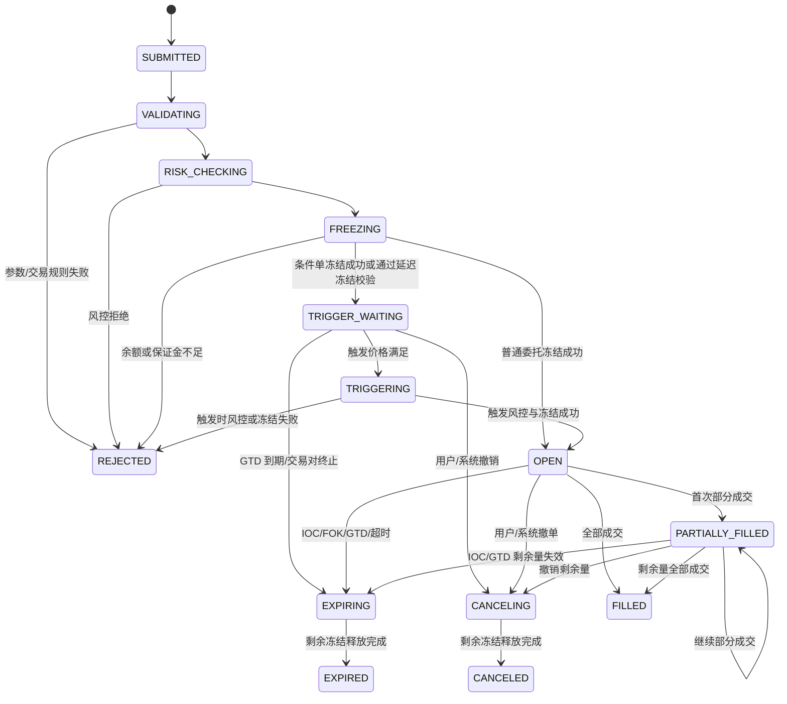

### 2.2 资金预占状态

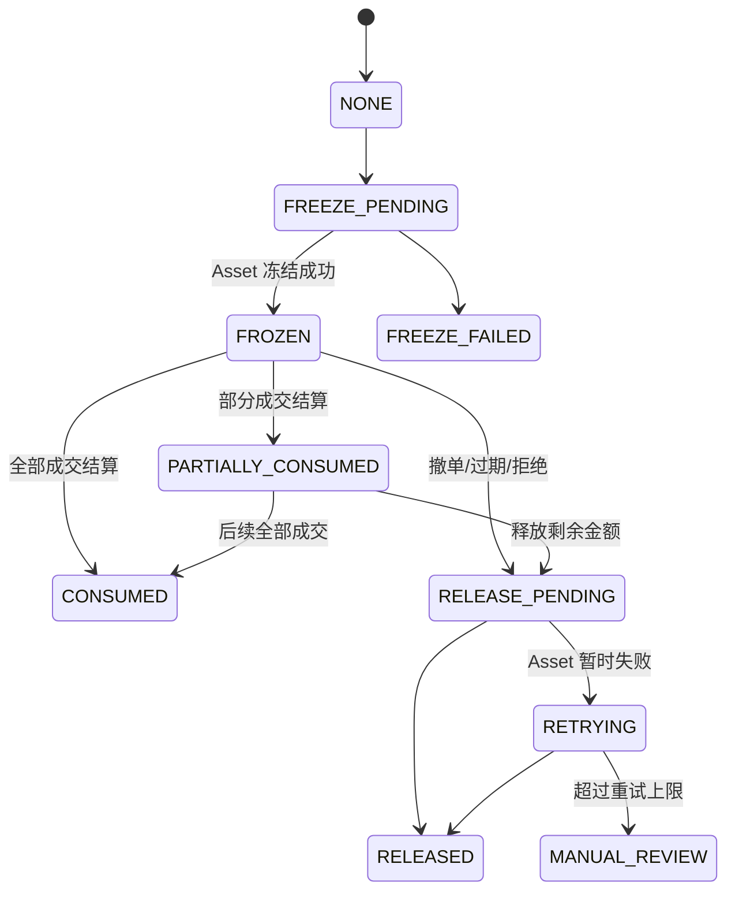

### 2.3 成交结算状态

每一笔 Fill 独立结算，使用 `fill_id` 作为全局幂等键。订单状态更新、Fill 和 Outbox 必须在 Matcher 的同一事务中提交。

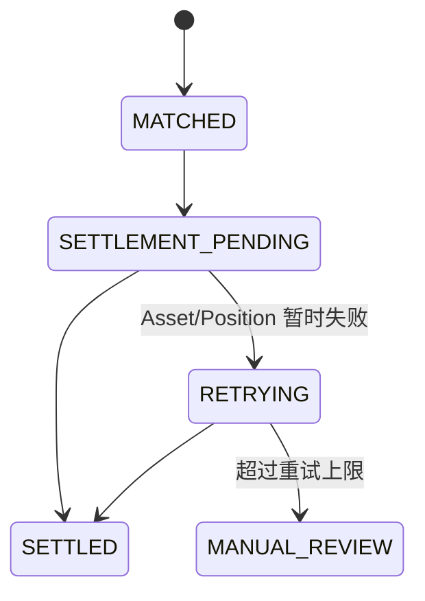

订单到达 `FILLED` 只表示撮合完成；资金全部完成后由结算状态表达，不应回滚已产生的成交。

### 2.4 持仓状态

持仓与委托独立。订单成交后，通过 `fill_id + position_id + action` 幂等更新持仓。

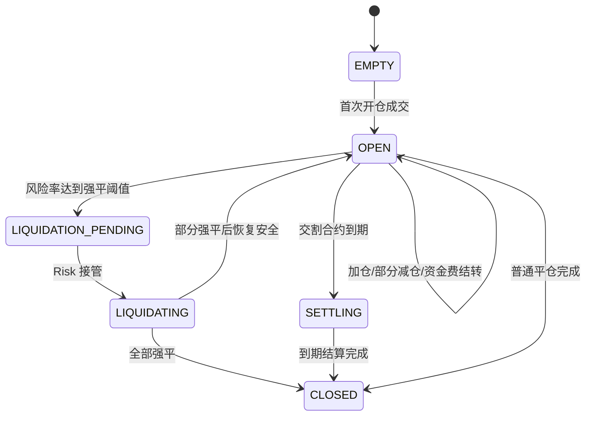

仓位必须至少保存：方向、仓位模式、保证金模式、数量、可平数量、冻结可平数量、开仓均价、标记价、未实现/已实现盈亏、仓位保证金、维持保证金、强平价和版本号。

## 3. 通用下单与实时撮合流程

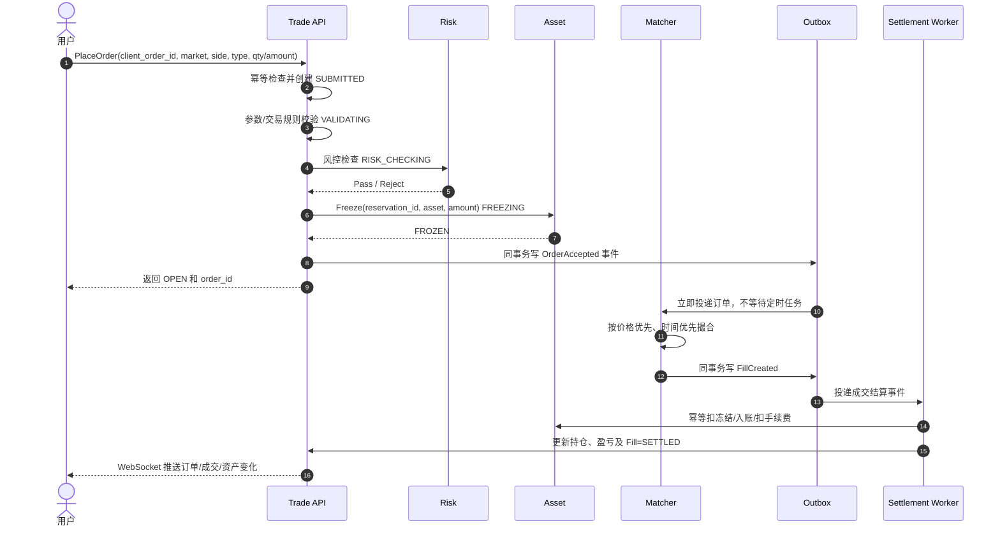

实时成交指冻结成功后立即投递专用撮合引擎。定时任务只做补偿扫描，不作为主撮合入口。

### 3.1 通用委托规则

活动委托支持以下有效方式：

| `time_in_force` | 规则 |
| --- | --- |
| `GTC` | 一直有效，直到全部成交、撤销或交易对终止 |
| `IOC` | 立即成交可成交部分，剩余量进入 `EXPIRING` |
| `FOK` | 必须立即全部成交，否则零成交并进入 `EXPIRING` |
| `POST_ONLY` | 只能作为 Maker；若入簿时会立即成交，按产品配置拒绝或取消，禁止转为 Taker |
| `GTD` | 有效至 `expire_at`，到期后停止撮合并释放剩余预占 |

FOK 的“深度检查、锁定对手委托、生成全部 Fill”必须在同一交易对的撮合串行区内原子完成，不允许出现 `PARTIALLY_FILLED → EXPIRED`。

条件单由 `trigger_kind`、`trigger_price`、`trigger_price_type` 和触发后的执行类型共同定义。触发价类型只能从最新成交价、标记价、指数价中选择。条件单等待期间不得进入订单簿；触发后重新执行交易权限、价格保护、余额/保证金和可平数量检查。止盈止损、普通条件单及 OCO 绑定关系必须分别记录，触发或成交后按配置撤销关联委托。

下单校验至少包括：交易权限、交易对状态、交易时段、买卖方向开关、精度、步长、数量、名义价值、价格保护、频率限制、自成交保护、仓位/保证金限制和客户端幂等键。

## 4. 现货限价单

### 4.1 限价买入

- 用户指定 `price` 和 `qty`。
- 冻结计价币：`price × qty + 最大预估手续费`。
- 只有卖价小于等于买入限价时才能成交。
- 成交价遵循订单簿价格优先、时间优先规则，且不得高于买入限价。
- 每笔成交：扣减冻结的计价币，增加基础币，手续费按配置币种扣除。
- 全部成交后为 `FILLED`；部分成交为 `PARTIALLY_FILLED`；撤单时释放未成交部分。
- 以更优价格成交产生的 Quote 余量，以及最终无法覆盖最小成交单位的 dust，在订单结束时统一释放。

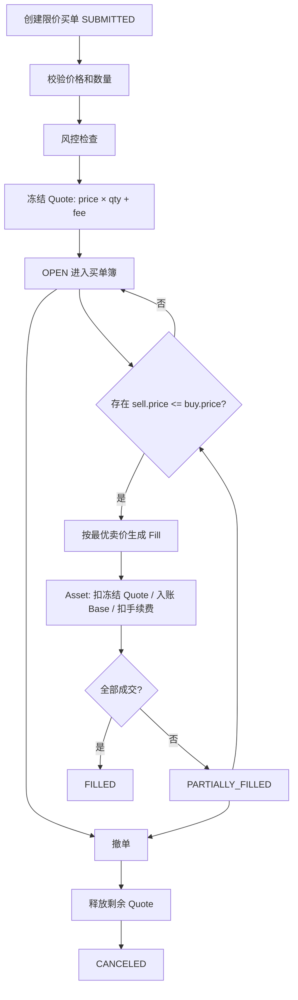

### 4.2 限价卖出

- 冻结基础币：`qty + 基础币手续费预留`（若手续费从成交所得扣，可不额外冻结）。
- 只有买价大于等于卖出限价时成交。
- 成交价不得低于卖出限价。
- 每笔成交：扣减冻结的基础币，增加计价币并扣手续费。
- Maker/Taker 身份以订单进入订单簿的先后关系判定；手续费币种、费率、平台币抵扣和不足时的回退规则由产品配置决定。

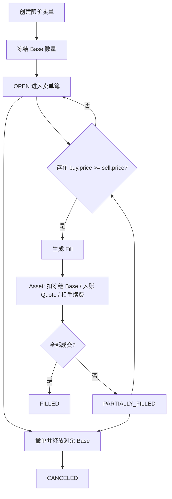

## 5. 现货市价单

市价单不使用外部行情作为成交价，真实成交价来自订单簿对手方限价单。

### 5.1 市价买入

- 推荐请求使用 `quote_amount` 表示最多花多少计价币。
- 冻结 `quote_amount + 最大预估手续费`。
- 从最低卖价开始逐档吃单，直到金额耗尽或无可成交深度。
- 默认 IOC：能成交的立即成交，剩余冻结自动释放。
- 应设置滑点保护，如最高可接受价或最大滑点百分比。
- `quote_amount` 表示最大可消费金额；因数量精度、手续费或最小成交单位留下的余额不视为未完成，使用 `completion_reason` 记录 `AMOUNT_EXHAUSTED/DUST/NO_LIQUIDITY/PRICE_PROTECTION`。

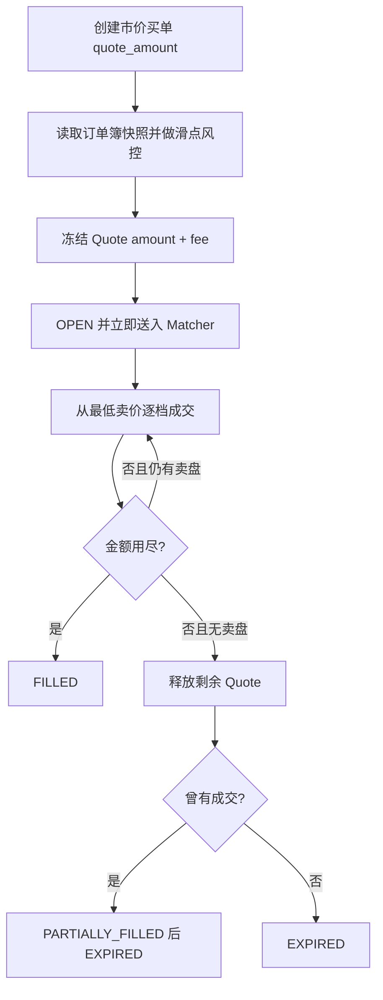

### 5.2 市价卖出

- 请求使用 `base_qty`。
- 冻结对应基础币数量。
- 从最高买价开始逐档成交。
- 默认 IOC，并使用最低可接受价/最大滑点保护。

市价单禁止进入订单簿成为 Maker。订单簿深度不足或触发价格保护时，已成交部分保留，剩余部分进入 `EXPIRING`；产品若配置“全量成交”，应使用 FOK 语义而不是回滚已产生的 Fill。

### 5.3 现货异常与市场状态

- `ENABLED`：允许下单和撤单。
- `CLOSE_ONLY`：现货不接受新委托，只允许撤销已有委托；合约只允许 reduce-only 委托。
- `DISABLED`：停止撮合，系统原子撤销所有活动委托并释放剩余冻结。
- 自成交保护至少支持取消 Taker、取消 Maker 或同时取消双方，结果使用明确的取消原因。
- 管理员撤单、风控撤单、交易对下架和用户撤单共用 Matcher 撤单协议，但必须记录不同的 `cancel_source/reason`。

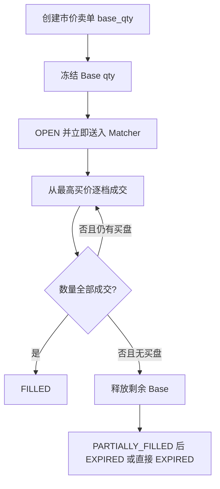

## 6. 秒合约

秒合约不是订单簿买卖。本文约定：

- 秒合约不使用订单簿的 `BUY/SELL`，主订单 `side=0`。
- 独立字段 `seconds_direction`：`1=UP（看涨）`、`2=DOWN（看跌）`。
- 用户提交本金 `stake_amount` 和到期周期。
- 接单时锁定起始价，必须记录行情来源、价格和时间戳。
- 到期时锁定结算价；按产品规则判断赢、输、平局并结算。

秒合约使用独立的流程状态和结果字段，不能把输赢结果当作资金结算完成状态：

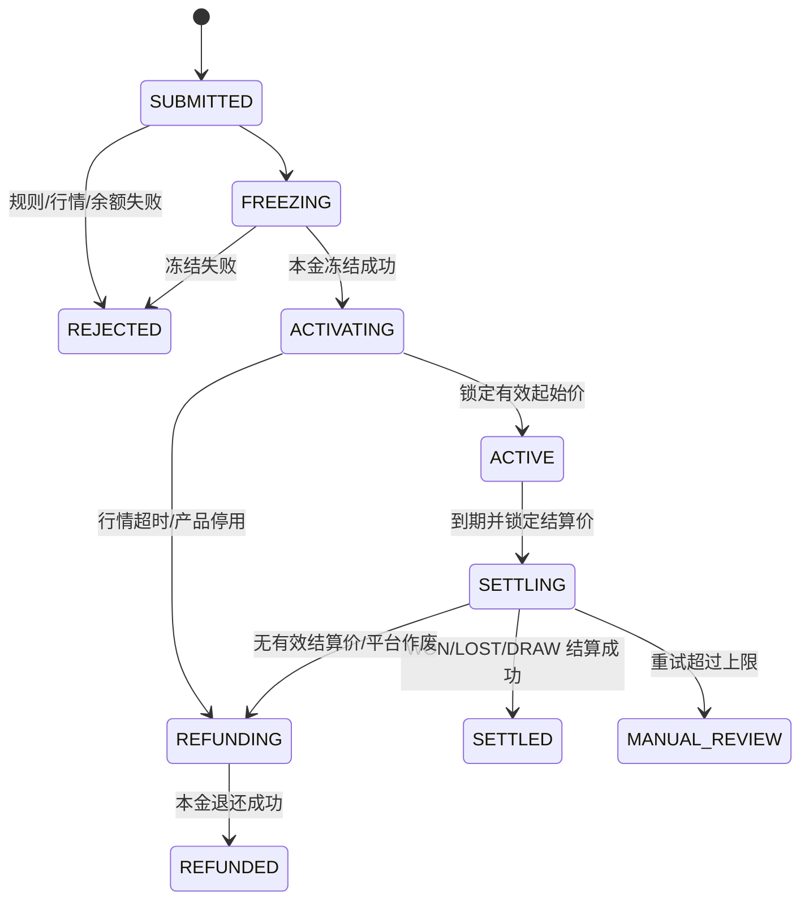

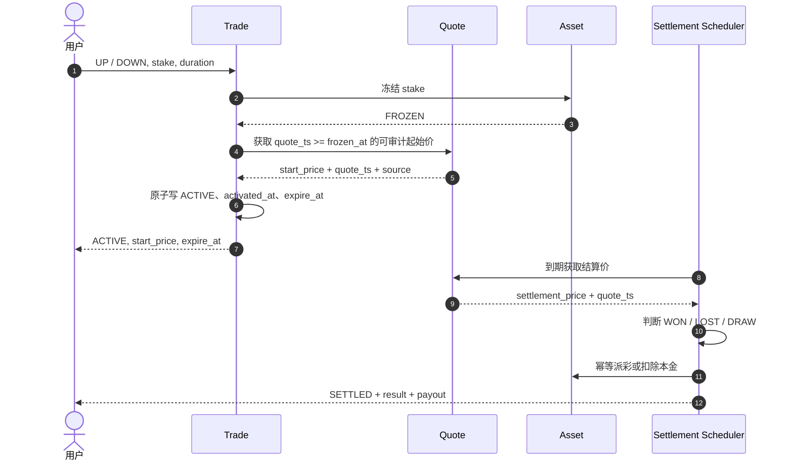

秒合约到期前通常不允许普通撤单；若平台允许提前退出，需要单独定义提前赎回价格和费用，不能复用订单簿撤单。

秒合约必须配置并固化到订单快照：周期、最小/最大本金、派彩率、手续费、起始价/结算价来源、行情最大延迟、价格精度、平局规则和平台敞口上限。

- `activated_at` 以起始价被原子锁定的时间为准，`expire_at = activated_at + duration`。
- 起始价必须满足 `quote_ts >= frozen_at` 且未超过最大行情延迟；不满足时释放本金并作废，不能沿用旧价格。
- 到期价按配置的时间窗口和采样算法获取，必须保存原始样本、来源和算法版本。
- `result=WON/LOST/DRAW/VOID` 与 `lifecycle_status` 分开保存。
- `payout_amount` 必须明确是否包含本金；推荐分别保存 `stake_amount`、`profit_amount`、`fee_amount`、`return_amount`。
- 平局依据归一化精度后的价格或明确的容差区间判断，不能直接比较未归一化浮点值。
- 行情中断、错误报价、产品临时停用时进入 `REFUNDING`；任何人工改判必须保留原结果、原因、审批人与冲正流水。
- 激活和结算任务分别使用 `seconds_order_id + action` 幂等；重复调度不得重复冻结、派彩或退款。

## 7. U 本位合约

U 本位以 USDT/USDC 等稳定币作为保证金和盈亏结算币。

### 7.1 买入与卖出语义

| 指令 | 单向持仓模式 | 双向持仓模式 |
| --- | --- | --- |
| BUY | 减少空仓后增加多仓 | `position_side=LONG` 开/加多；`SHORT + reduce_only` 平空 |
| SELL | 减少多仓后增加空仓 | `position_side=SHORT` 开/加空；`LONG + reduce_only` 平多 |

不能仅凭 BUY/SELL 判断开仓或平仓，必须结合 `position_side`、`position_mode` 和 `reduce_only`。

### 7.2 下单到成交

- 限价和市价的撮合规则与现货一致。
- 开仓预占：`初始保证金 + 预估手续费`。
- 线性合约名义价值：`qty × contract_size × price`。
- 初始保证金：`notional / leverage`。
- 平仓单由 Position/Risk 预占可平数量；Asset 只管理资金保证金，不把“仓位数量”当作余额冻结。reduce-only 委托占用量不得超过当前可平数量。
- 成交后更新仓位数量、开仓均价、已实现盈亏、保证金和强平价。

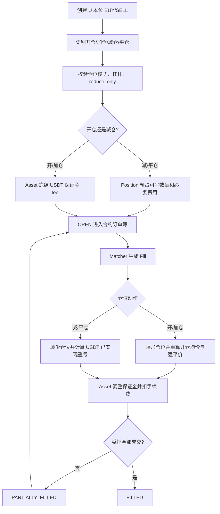

## 8. 币本位合约

币本位以基础币作为保证金和盈亏结算币，例如 BTCUSD 合约使用 BTC。

### 8.1 买卖语义

开多、开空、平多、平空的方向规则与 U 本位一致，但冻结资产和盈亏公式不同。

- 保证金币种：交易对配置的基础币/结算币，不能默认取 Quote。
- 反向合约名义价值通常以 USD 合约面值表达。
- 示例初始保证金：`qty × contract_value / (entry_price × leverage)`。
- 多仓已实现盈亏示例：`qty × contract_value × (1/entry_price - 1/exit_price)`。
- 空仓方向相反。最终公式必须由合约配置指定，禁止在业务代码中写死。

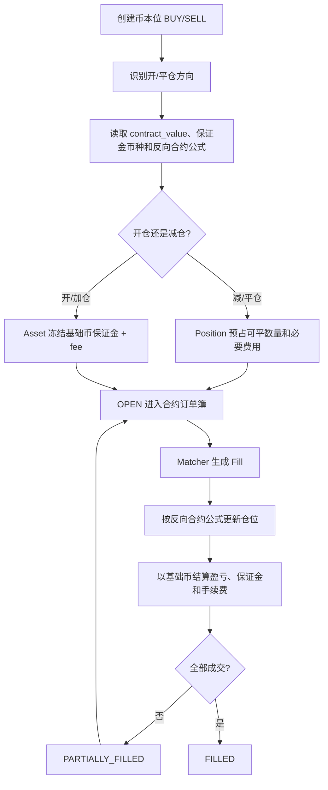

## 9. 合约期限、保证金与风险流程

### 9.1 合约保证金与仓位规则

合约必须同时支持并区分：

- `position_mode=ONE_WAY/HEDGE`：单向净持仓或双向多空持仓。
- `margin_mode=CROSS/ISOLATED`：全仓共享保证金或逐仓独立保证金。
- `reduce_only=true`：成交只能减少指定方向仓位，任何可能增加或反向开仓的剩余量必须取消。
- `close_position=true`：触发时按当时全部可平数量生成平仓委托，不能在创建条件单时固化旧数量。

全仓模式按账户风险单元计算权益、可用保证金和维持保证金；逐仓模式按单个仓位隔离。逐仓追加/减少保证金必须使用独立流水，减少后不得使风险率越过强平阈值。

挂单预占按交易规则指定的风险价格计算，至少考虑委托价格、标记价格、杠杆、风险档位、预估 Taker 手续费和已有同方向/反方向挂单。部分成交、撤单、价格改善、杠杆或风险档位变化后必须重算并释放多余预占。

在单向模式中，反向成交先减少现有仓位；只有非 reduce-only 的剩余成交量才允许反向开仓。在双向模式中必须显式指定 `position_side`。多个 reduce-only 委托共享可平数量时，按 Matcher 确认的成交/撤单顺序原子调整，禁止超平。

### 9.2 永续合约资金费

永续合约不交割，通过资金费使合约价格锚定指数价格。每个交易对必须配置资金费周期、费率算法、上限、下限和结算币种。

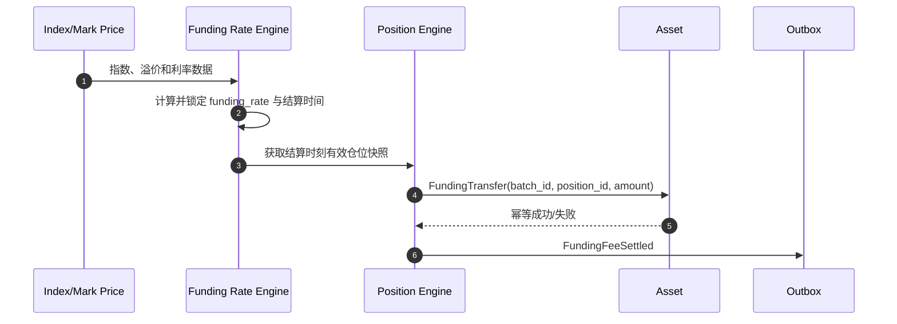

- 仅资金费结算时刻持有的有效仓位参与；活动委托不参与。
- `funding_batch_id + position_id` 是幂等键，保存仓位数量、标记价格、费率和计算公式快照。
- 资金费原则上由多空双方互付，平台只按产品规则处理舍入差额；不得静默创造或销毁资产。
- 扣款不足时按全仓/逐仓风险规则处理，可触发强平，但不得把未扣成功记录为已结算。
- 补跑必须使用原结算时刻的锁定数据，不能用当前价格重算历史资金费。

### 9.3 标记价格、风险率与强平

最新成交价用于成交展示；指数价格用于反映外部现货公允价格；标记价格用于未实现盈亏、保证金风险和强平判断。价格源、异常剔除、平滑算法、最大延迟及降级方案必须配置并版本化。

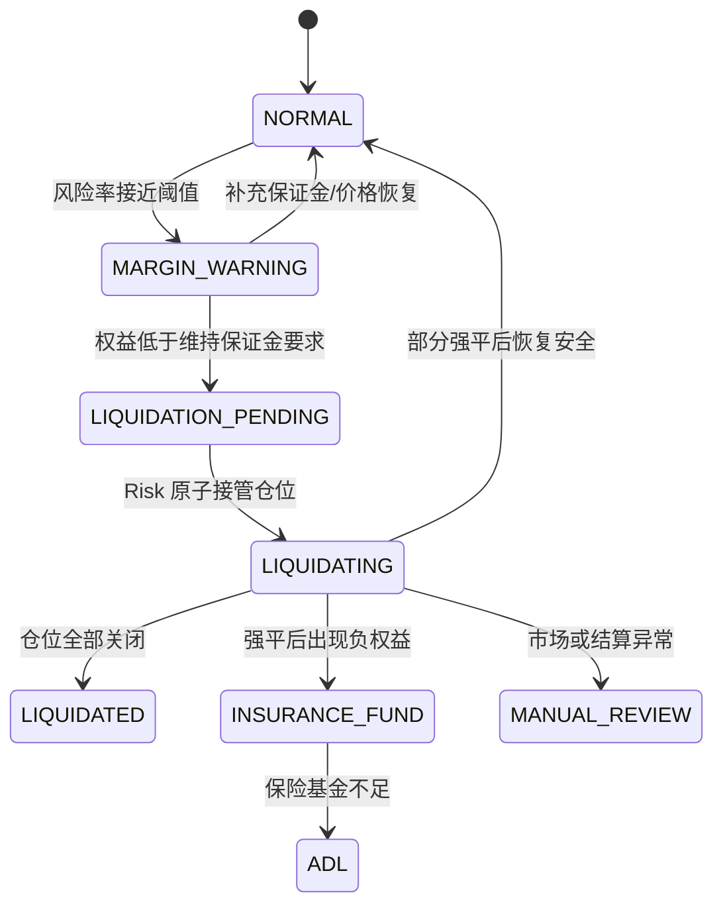

强平流程必须：停止该风险单元新增风险、原子撤销会增加风险的活动委托、释放相应预占、重新计算风险率，再决定部分或全部强平。强平委托使用 `source=SYSTEM`、`position_action=LIQUIDATION` 和独立的强平批次号，不受普通用户撤单影响。强平成交、强平手续费、保险基金补偿和 ADL 必须分别记账并可审计。

### 9.4 交割合约到期

交割合约必须配置交割时间、开仓截止时间、停止撮合时间、最终结算价算法、结算币种和交割手续费。

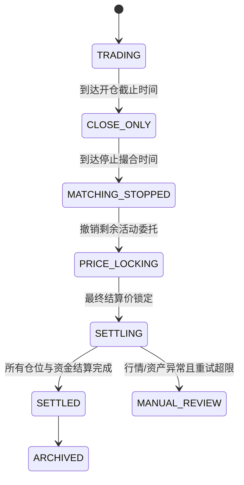

- `CLOSE_ONLY` 阶段只接受 reduce-only 委托。
- 停止撮合后由 Matcher 原子撤销所有剩余委托，并完成保证金/可平量释放后再锁定结算快照。
- 最终结算价使用配置的采样窗口与算法，保存全部原始样本、剔除理由和算法版本；行情无效时延期或人工复核，禁止直接使用最后成交价兜底。
- 每个仓位使用 `delivery_batch_id + position_id` 幂等结算已实现盈亏、手续费和保证金释放，最终仓位动作记录为 `SETTLEMENT`。
- 线性和反向合约分别使用配置公式；币本位反向合约不得复用 U 本位线性公式。
- 所有仓位完成并通过资产对账后，交易对才进入 `SETTLED/ARCHIVED`，不能仅把 Symbol 改为禁用就视为交割完成。

### 9.5 合约异常与管理操作

- `ENABLED`：正常开平仓。
- `CLOSE_ONLY`：禁止增加风险，只允许 reduce-only、强平和交割动作。
- `DISABLED`：禁止用户委托；已有委托和仓位按停牌/下架方案处理，不能默认直接关闭仓位。
- 调整杠杆、保证金模式、仓位模式前必须校验已有仓位和活动委托；不满足条件时拒绝，不得隐式改变已有风险。
- 管理员调整仓位或资金只能产生 `MANUAL_ADJUST` 及对应资产冲正流水，并要求审批、原因和审计记录。

## 10. 各市场冻结与结算矩阵

| 市场/方向 | 下单输入 | 冻结资产 | 成交后核心动作 |
| --- | --- | --- | --- |
| 现货限价买 | price + qty | Quote | 扣 Quote，入 Base |
| 现货限价卖 | price + qty | Base | 扣 Base，入 Quote |
| 现货市价买 | quote_amount | Quote | 逐档买入 Base，退剩余 Quote |
| 现货市价卖 | base_qty | Base | 逐档卖出，入 Quote，退剩余 Base |
| 秒合约 UP | stake + duration | 产品结算币 | 到期看涨判定并派彩 |
| 秒合约 DOWN | stake + duration | 产品结算币 | 到期看跌判定并派彩 |
| U 本位开仓 | qty/amount + leverage | USDT/USDC | 更新合约仓位，稳定币结算 |
| U 本位平仓 | position qty | Position 预占可平数量；Asset 预占必要费用 | 释放保证金，稳定币实现盈亏 |
| 币本位开仓 | qty + leverage | 基础币 | 更新反向合约仓位 |
| 币本位平仓 | position qty | Position 预占可平数量；Asset 预占必要费用 | 以基础币实现盈亏 |

上表中的 U/币本位均可再与永续/交割组合。永续额外处理资金费；交割额外处理到期结算。保证金释放金额必须由成交后的账户/仓位风险重算得出，不能简单按委托数量等比例计算。

## 11. 撤单、拒绝与过期

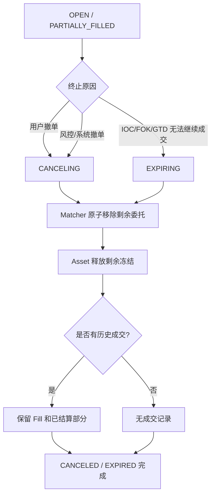

已成交部分不可因撤单回滚。撤单只影响剩余未成交数量。

Matcher 是“最终可成交数量”和撤单结果的唯一裁决者。撤单请求成功仅表示进入 `CANCELING`，不表示已经撤销；Matcher 确认移除前仍可能发生合法成交。撤单确认必须携带最终 `filled_qty`、`canceled_qty` 和订单版本，Asset 只能按确认的剩余量释放。

重复撤单、撤销已完成订单和客户端超时重试必须幂等返回最终状态。用户、管理员、风控、交易对停用、强平和交割产生的撤单应记录不同的来源与原因。若释放失败，订单保持 `CANCELING/EXPIRING`，进入重试或人工处理，不能提前显示 `CANCELED/EXPIRED`。

## 12. 一致性与可靠性要求

1. `client_order_id + tenant_id + user_id + product_type` 唯一，重复请求参数完全一致时返回原订单；参数不一致时返回幂等冲突。
2. 资金冻结使用 `reservation_id/order_id` 幂等。
3. 每笔成交使用全局唯一 `fill_id`；订单数量/状态更新、买卖双方 Fill 和 Outbox 在 Matcher 同一事务提交。
4. Asset 结算以 `fill_id + settlement_action` 幂等。
5. 订单、资金、Fill、持仓分别维护状态和单调递增版本；禁止终态回到开放态。
6. Matcher 对同一交易对单线程或分区串行，保证价格时间优先。
7. WebSocket 推送允许重复，客户端按 `event_id/version` 去重和排序。
8. 定时任务只负责补偿：卡在 `FREEZING`、`TRIGGERING`、`SETTLEMENT_PENDING`、`CANCELING`、`EXPIRING` 的记录。
9. 行情价格必须带 `source`、`quote_ts` 和最大允许延迟；秒合约尤其需要可审计快照。
10. 任何资金失败不得伪造为成交失败；成交已生成时必须进入重试或人工处理队列。
11. Position 以 `fill_id + position_id + action` 幂等；资金费和交割分别以批次号加仓位 ID 幂等。
12. Asset 成功、Position 失败或相反时，通过持久化 Saga 步骤恢复；重复执行已成功步骤必须安全，禁止删除或回滚 Fill。
13. 买卖双方结算、手续费、返佣、平台收入、保险基金和冲正均产生不可变复式流水；修正错误只能追加反向分录。
14. 每日按订单、Fill、资产流水、持仓流水、手续费和结算批次对账；差异进入告警和人工处理队列。
15. 所有状态变更使用数据库条件更新或版本号 CAS；过期任务、撤单、撮合、触发和强平并发时只能有一个合法转移成功。
16. Asset 请求超时不能直接判定冻结失败；Trade 必须按 `reservation_id` 查询最终结果。迟到的冻结成功若订单已拒绝，必须通过幂等释放流程归还。

## 13. 推荐事件

| 事件 | 生产者 | 主要消费者 |
| --- | --- | --- |
| `OrderSubmitted` | Trade API | Risk/审计 |
| `OrderAccepted` | Trade API | Matcher/推送 |
| `OrderRejected` | Trade API | 推送/审计 |
| `FillCreated` | Matcher | Settlement/持仓/推送 |
| `OrderPartiallyFilled` | Matcher | 推送 |
| `OrderFilled` | Matcher | 推送 |
| `OrderCancelRequested` | Trade API | Matcher |
| `OrderCanceled` | Matcher | Asset/推送 |
| `OrderExpired` | Matcher | Asset/推送 |
| `TriggerOrderActivated` | Trigger Engine | Matcher/推送 |
| `TriggerOrderRejected` | Trigger Engine | 推送/审计 |
| `FillSettled` | Settlement | 推送/对账 |
| `PositionChanged` | Position Engine | Risk/推送 |
| `LiquidationStarted` | Risk | Matcher/Asset/推送 |
| `LiquidationCompleted` | Position Engine | Asset/保险基金/推送 |
| `FundingRateLocked` | Funding Engine | Position/推送 |
| `FundingFeeSettled` | Settlement | Asset/推送/对账 |
| `DeliveryPriceLocked` | Delivery Engine | Position/审计 |
| `DeliveryPositionSettled` | Settlement | Asset/推送/对账 |
| `SecondsContractActivated` | Trade | 到期调度器 |
| `SecondsContractSettled` | Settlement | Asset/推送/审计 |
| `SecondsContractRefunded` | Settlement | Asset/推送/审计 |

## 14. 核心验收场景

上线前至少覆盖以下自动化验收场景：

1. 现货限价、市价在零成交、部分成交、全部成交、价格改善和 dust 下的资产守恒。
2. IOC 部分成交后过期；FOK 全成或零成；Post Only 不产生 Taker Fill。
3. 撮合与撤单并发时 `filled_qty + canceled_qty = original_qty`，且冻结资产只消费或释放一次。
4. 条件单重复触发、触发时余额不足、OCO 并发触发和触发后撤单。
5. 秒合约激活行情超时退款、赢/输/平/作废、重复到期任务和人工冲正。
6. U 本位与币本位分别验证开仓、加仓、部分减仓、反向开仓、手续费和盈亏公式。
7. 全仓/逐仓、单向/双向及多个 reduce-only 委托并发时不超平、不超用保证金。
8. 永续资金费补跑、余额不足和多空资金守恒。
9. 部分强平、全部强平、保险基金和 ADL 的仓位及资产守恒。
10. 交割合约从 `CLOSE_ONLY` 到 `ARCHIVED`，包括撤单、价格锁定、批量结算、失败重试和对账。
11. Asset、Position、Outbox 任一步骤超时或重复消费后，最终状态一致且不存在重复入账。
