# 交易订单全生命周期设计

> 本文是目标业务设计，不描述或约束于当前代码实现。
>
> 本文将“现价单”理解为“限价单”。如产品定义中的“现价”另有所指，需要单独补充订单类型。

## 1. 设计边界

### 1.1 服务职责

| 服务 | 职责 |
| --- | --- |
| Trade | 接单、交易规则校验、风控编排、订单状态机、撮合、成交、持仓与盈亏计算 |
| Asset | 余额校验、资金冻结、解冻、扣减、入账、保证金账户记账 |
| Market/Quote | 最新价、标记价、指数价、订单簿行情 |
| Risk | 交易权限、价格保护、数量/名义价值限制、仓位与保证金风险 |
| Event/Outbox | 保证订单、成交、资产结算事件可靠投递和幂等消费 |

Trade 不直接修改用户余额；Asset 不决定成交价格。行情服务不修改订单。

## 2. 核心状态机

订单、资金、成交结算和持仓必须使用独立状态，不能用一个订单状态表达所有过程。

### 2.1 订单状态

| 状态 | 含义 |
| --- | --- |
| `SUBMITTED` | 已收到请求，尚未完成校验 |
| `VALIDATING` | 参数、交易对、交易时段和幂等性校验中 |
| `RISK_CHECKING` | 风控检查中 |
| `FREEZING` | 请求 Asset 预占资金/保证金 |
| `OPEN` | 已进入撮合队列，尚未成交 |
| `PARTIALLY_FILLED` | 部分成交，剩余量仍有效 |
| `FILLED` | 委托数量已全部成交 |
| `CANCELING` | 正在撤单并释放剩余资金 |
| `CANCELED` | 已撤销 |
| `REJECTED` | 校验、风控或冻结失败，订单未生效 |
| `EXPIRED` | IOC/FOK、交易时段或秒合约期限导致失效 |

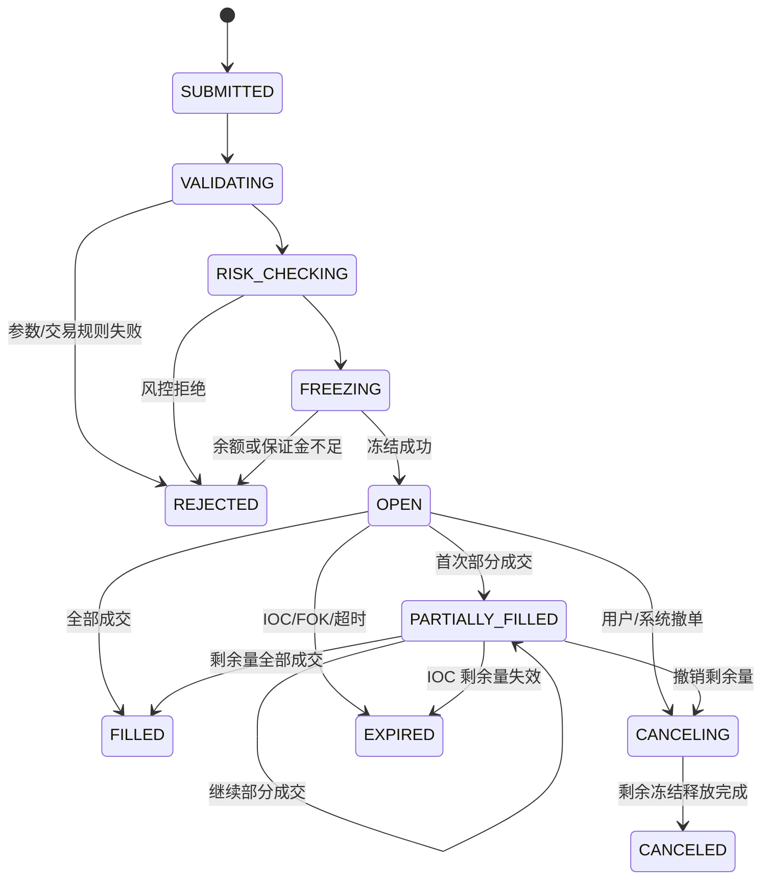

### 2.2 资金预占状态

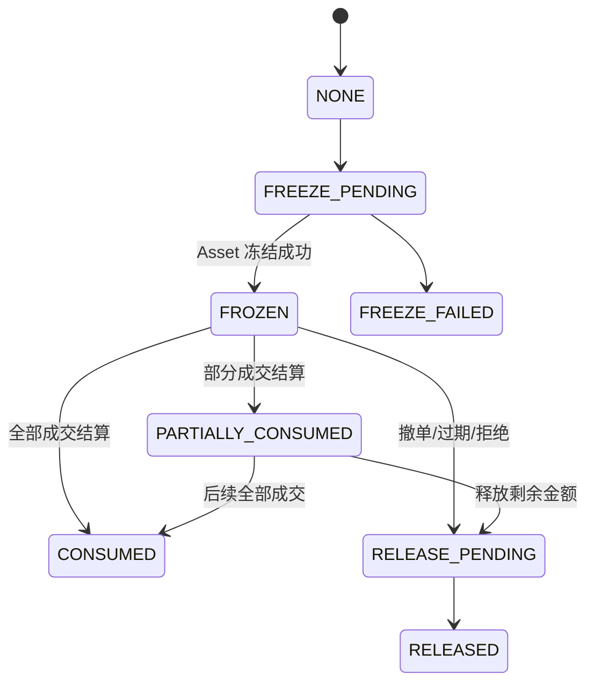

### 2.3 成交结算状态

每一笔 Fill 独立结算，使用 `fill_id` 作为全局幂等键。

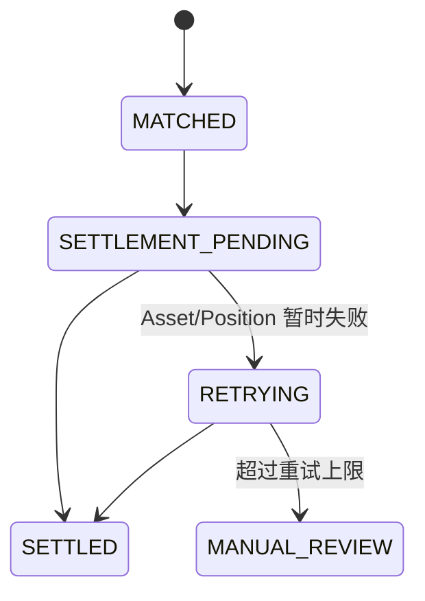

订单到达 `FILLED` 只表示撮合完成；资金全部完成后由结算状态表达，不应回滚已产生的成交。

## 3. 通用下单与实时撮合流程

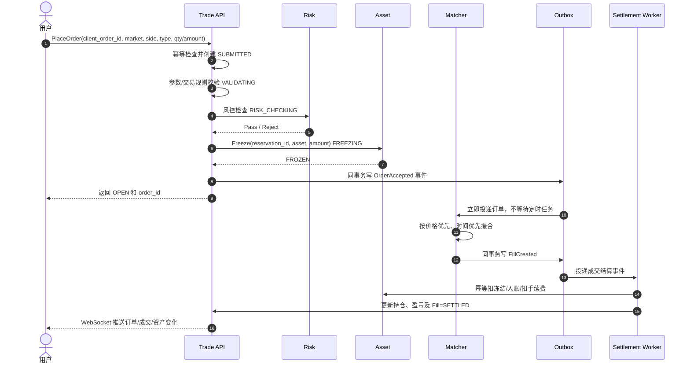

实时成交指冻结成功后立即投递专用撮合引擎。定时任务只做补偿扫描，不作为主撮合入口。

## 4. 现货限价单

### 4.1 限价买入

- 用户指定 `price` 和 `qty`。
- 冻结计价币：`price × qty + 最大预估手续费`。
- 只有卖价小于等于买入限价时才能成交。
- 成交价遵循订单簿价格优先、时间优先规则，且不得高于买入限价。
- 每笔成交：扣减冻结的计价币，增加基础币，手续费按配置币种扣除。
- 全部成交后为 `FILLED`；部分成交为 `PARTIALLY_FILLED`；撤单时释放未成交部分。

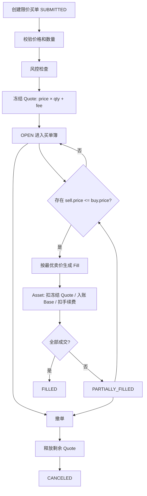

### 4.2 限价卖出

- 冻结基础币：`qty + 基础币手续费预留`（若手续费从成交所得扣，可不额外冻结）。
- 只有买价大于等于卖出限价时成交。
- 成交价不得低于卖出限价。
- 每笔成交：扣减冻结的基础币，增加计价币并扣手续费。

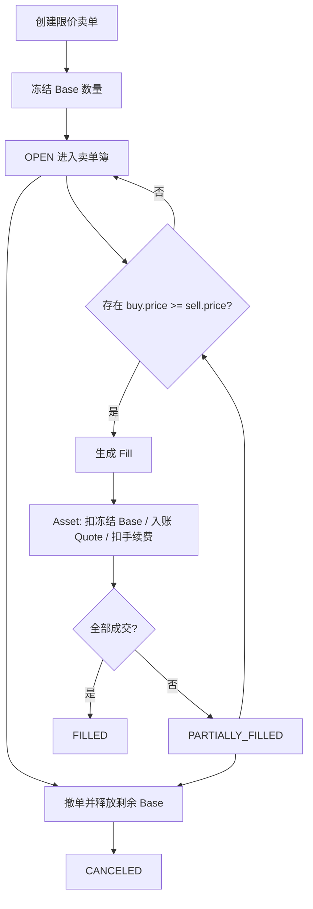

## 5. 现货市价单

市价单不使用外部行情作为成交价，真实成交价来自订单簿对手方限价单。

### 5.1 市价买入

- 推荐请求使用 `quote_amount` 表示最多花多少计价币。
- 冻结 `quote_amount + 最大预估手续费`。
- 从最低卖价开始逐档吃单，直到金额耗尽或无可成交深度。
- 默认 IOC：能成交的立即成交，剩余冻结自动释放。
- 应设置滑点保护，如最高可接受价或最大滑点百分比。

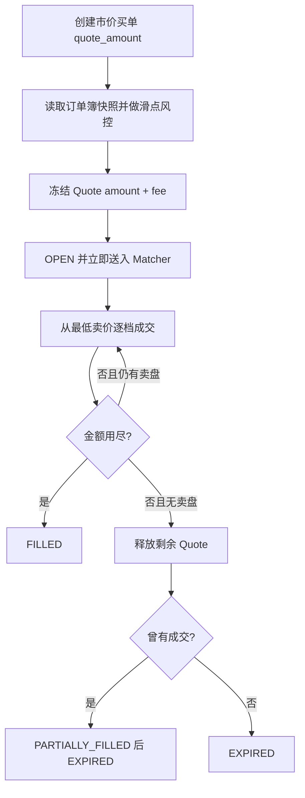

### 5.2 市价卖出

- 请求使用 `base_qty`。
- 冻结对应基础币数量。
- 从最高买价开始逐档成交。
- 默认 IOC，并使用最低可接受价/最大滑点保护。

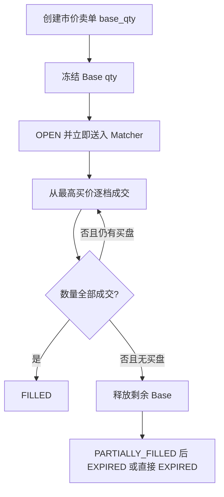

## 6. 秒合约

秒合约不是订单簿买卖。本文约定：

- 秒合约不使用订单簿的 `BUY/SELL`，主订单 `side=0`。
- 独立字段 `seconds_direction`：`1=UP（看涨）`、`2=DOWN（看跌）`。
- 用户提交本金 `stake_amount` 和到期周期。
- 接单时锁定起始价，必须记录行情来源、价格和时间戳。
- 到期时锁定结算价；按产品规则判断赢、输、平局并结算。

秒合约建议使用独立状态：

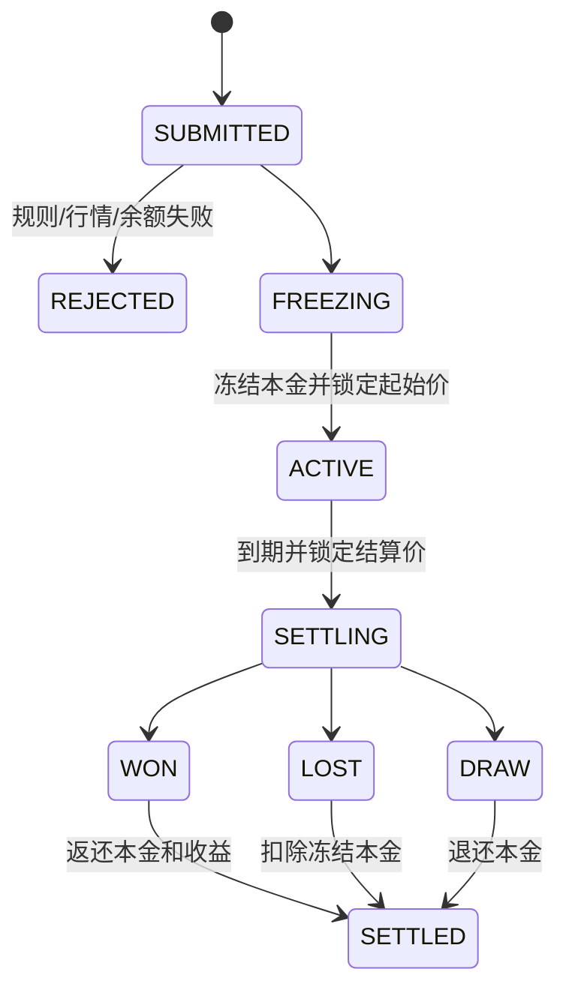

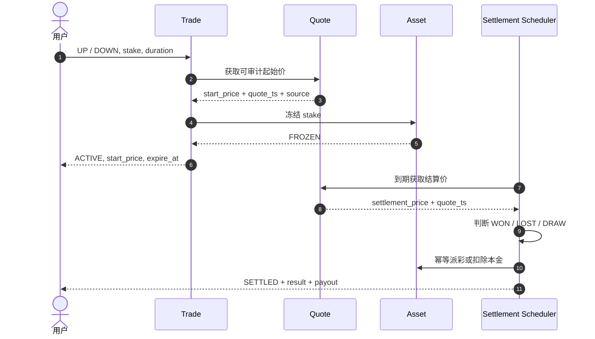

秒合约到期前通常不允许普通撤单；若平台允许提前退出，需要单独定义提前赎回价格和费用，不能复用订单簿撤单。

## 7. U 本位合约

U 本位以 USDT/USDC 等稳定币作为保证金和盈亏结算币。

### 7.1 买入与卖出语义

| 指令 | 单向持仓模式 | 双向持仓模式 |
| --- | --- | --- |
| BUY | 减少空仓后增加多仓 | `position_side=LONG` 开/加多；`SHORT + reduce_only` 平空 |
| SELL | 减少多仓后增加空仓 | `position_side=SHORT` 开/加空；`LONG + reduce_only` 平多 |

不能仅凭 BUY/SELL 判断开仓或平仓，必须结合 `position_side`、`position_mode` 和 `reduce_only`。

### 7.2 下单到成交

- 限价和市价的撮合规则与现货一致。
- 开仓预占：`初始保证金 + 预估手续费`。
- 线性合约名义价值：`qty × contract_size × price`。
- 初始保证金：`notional / leverage`。
- 平仓单冻结对应可平仓数量，不重复收取完整开仓保证金。
- 成交后更新仓位数量、开仓均价、已实现盈亏、保证金和强平价。

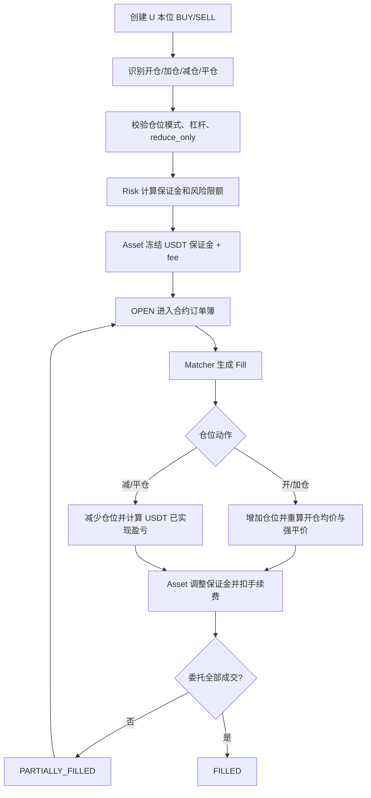

## 8. 币本位合约

币本位以基础币作为保证金和盈亏结算币，例如 BTCUSD 合约使用 BTC。

### 8.1 买卖语义

开多、开空、平多、平空的方向规则与 U 本位一致，但冻结资产和盈亏公式不同。

- 保证金币种：交易对配置的基础币/结算币，不能默认取 Quote。
- 反向合约名义价值通常以 USD 合约面值表达。
- 示例初始保证金：`qty × contract_value / (entry_price × leverage)`。
- 多仓已实现盈亏示例：`qty × contract_value × (1/entry_price - 1/exit_price)`。
- 空仓方向相反。最终公式必须由合约配置指定，禁止在业务代码中写死。

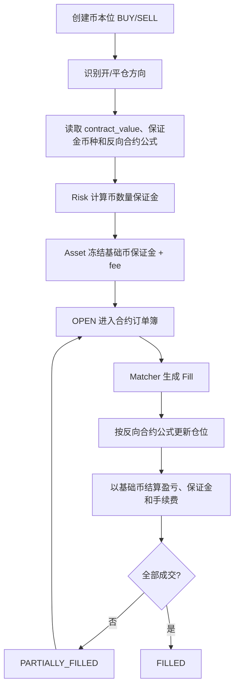

## 9. 各市场冻结与结算矩阵

| 市场/方向 | 下单输入 | 冻结资产 | 成交后核心动作 |
| --- | --- | --- | --- |
| 现货限价买 | price + qty | Quote | 扣 Quote，入 Base |
| 现货限价卖 | price + qty | Base | 扣 Base，入 Quote |
| 现货市价买 | quote_amount | Quote | 逐档买入 Base，退剩余 Quote |
| 现货市价卖 | base_qty | Base | 逐档卖出，入 Quote，退剩余 Base |
| 秒合约 UP | stake + duration | 产品结算币 | 到期看涨判定并派彩 |
| 秒合约 DOWN | stake + duration | 产品结算币 | 到期看跌判定并派彩 |
| U 本位开仓 | qty/amount + leverage | USDT/USDC | 更新合约仓位，稳定币结算 |
| U 本位平仓 | position qty | 可平仓数量/必要保证金 | 释放保证金，稳定币实现盈亏 |
| 币本位开仓 | qty + leverage | 基础币 | 更新反向合约仓位 |
| 币本位平仓 | position qty | 可平仓数量/必要保证金 | 以基础币实现盈亏 |

## 10. 撤单、拒绝与过期

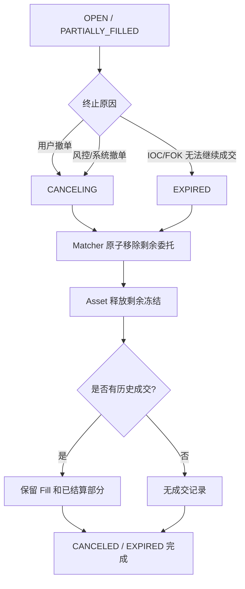

已成交部分不可因撤单回滚。撤单只影响剩余未成交数量。

## 11. 一致性与可靠性要求

1. `client_order_id + tenant_id + user_id` 唯一，重复请求返回原订单。
2. 资金冻结使用 `reservation_id/order_id` 幂等。
3. 每笔成交使用全局唯一 `fill_id`；撮合和 Outbox 在同一事务提交。
4. Asset 结算以 `fill_id + settlement_action` 幂等。
5. 订单状态只能按状态机前进，禁止终态回到开放态。
6. Matcher 对同一交易对单线程或分区串行，保证价格时间优先。
7. WebSocket 推送允许重复，客户端按 `event_id/version` 去重和排序。
8. 定时任务只负责补偿：卡在 `FREEZING`、`SETTLEMENT_PENDING`、`CANCELING` 的记录。
9. 行情价格必须带 `source`、`quote_ts` 和最大允许延迟；秒合约尤其需要可审计快照。
10. 任何资金失败不得伪造为成交失败；成交已生成时必须进入重试或人工处理队列。

## 12. 推荐事件

| 事件 | 生产者 | 主要消费者 |
| --- | --- | --- |
| `OrderSubmitted` | Trade API | Risk/审计 |
| `OrderAccepted` | Trade API | Matcher/推送 |
| `OrderRejected` | Trade API | 推送/审计 |
| `FillCreated` | Matcher | Settlement/持仓/推送 |
| `OrderPartiallyFilled` | Matcher | 推送 |
| `OrderFilled` | Matcher | 推送 |
| `OrderCancelRequested` | Trade API | Matcher |
| `OrderCanceled` | Matcher | Asset/推送 |
| `FillSettled` | Settlement | 推送/对账 |
| `PositionChanged` | Position Engine | Risk/推送 |
| `SecondsContractActivated` | Trade | 到期调度器 |
| `SecondsContractSettled` | Settlement | Asset/推送/审计 |
