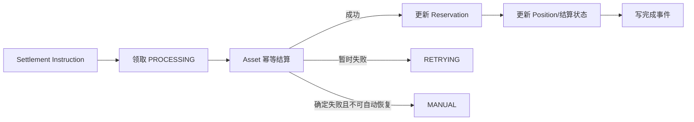

# 交易成交与结算实施方案

> 本文基于《[交易订单全生命周期设计](./order-lifecycle-design.md)》审计当前 Trade 实现，说明已有能力、缺失能力、目标架构、开发顺序和验收标准。
>
> 本文用于指导后续开发和验收，不替代订单生命周期业务设计。
>
> **2026-07-20 复审结论：** 3.1～3.6、3.11 已具备核心闭环；3.7～3.10 已有模型、任务、幂等指令和后台审计入口，但权威行情快照、资金费历史时点、保险基金账户鉴权、ADL 资金/仓位原子性等仍存在 P0 缺口。3.7～3.10 当前只能用于开发和联调，**不得启用秒合约真实派彩、生产资金费、自动交割资金结算、自动强平、保险基金赔付或 ADL**。
>
> **2026-07-20 修复进展：** iTick WebSocket 已保留行情源原始十进制价格并发布带来源身份的不可变历史 Quote，同时写入 `t_itick_authoritative_snapshot` 永久档案；Trade 通过 iTick RPC 按目标业务时刻查询 MySQL 档案，Redis 仅保留加速副本。资金费批次创建已在事务内锁定参与仓位并保存 `position_version`，仓位落账使用 `FOR UPDATE`，不守恒批次会在创建事务内拒绝。上述改动关闭了“Trade 自行确认普通 Quote”“历史周期读取执行时最新价”“Quote 只有 TTL 缓存”“资金费仓位无锁覆盖”四个直接缺陷，但 Authority 注册、独立 Price Engine 公式快照、平台差额账户和跨服务 Saga 尚未完成，**所有原生产门禁继续生效**。

### 文档状态说明

本文中的状态统一采用：

- `已完成`：代码闭环、并发和失败恢复已通过对应验收；
- `主体已实现，验收未通过`：主流程存在，但仍有 P0/P1 缺口；
- `未实现`：只有数据结构、事件或任务入口；
- `禁止生产`：可能造成真实资金、仓位或审计数据不一致。

## 1. 范围与目标

本文覆盖：

- 现货限价和市价成交；
- 秒合约激活、到期判定及资金结算；
- 永续、交割合约成交；
- U 本位线性合约和币本位反向合约；
- Fill、订单状态、资金预占、Asset 结算、Position、Outbox；
- 部分成交、撤单、过期、资金费、交割、强平及失败补偿。

目标是形成以下可靠闭环：

```text
OrderAccepted
  -> Matcher
  -> Fill + Order + SettlementInstruction + Outbox（同一事务）
  -> Asset / Position 幂等结算
  -> Reservation 消费或释放
  -> Order/Position 最终状态
  -> 对账、重试或人工处理
```

基本边界：

- Trade 决定成交价格、成交数量、手续费、保证金和盈亏计算；
- Asset 负责冻结、消费冻结、解冻、扣款和入账，不决定成交价格；
- Position 负责仓位数量、均价、可平数量、保证金、盈亏和风险状态；
- 每个外部操作必须具有稳定幂等键；
- Fill 一旦落库不得删除或业务回滚，后续失败通过 Saga 重试恢复。

## 2. 当前实现盘点

### 2.1 已有能力

| 模块 | 当前能力 | 结论 |
| --- | --- | --- |
| 订单簿撮合 | 支持买卖盘、限价、市价、价格优先和部分成交 | 基础可用 |
| IOC/FOK | 支持全量检查和剩余订单过期 | 基础可用 |
| Fill | 买卖双方分别生成 Fill，共享 `match_no`，并按 `fill_no` 幂等 | 已补齐通用事务 |
| 订单累计 | 更新成交数量、成交金额、均价、手续费及订单状态 | 基础可用 |
| Maker/Taker | 能区分流动性并读取产品费率 | 基础可用 |
| 条件单 | 能由 `TRIGGER_WAITING` 转为可撮合状态 | 基础可用 |
| 下单冻结恢复 | `FREEZING` 订单按原 `order_no/biz_no` 幂等重试 Asset | 已有 |
| 成交后续指令 | Fill 同事务创建 Settlement Instruction、Outbox；合约创建 `POSITION_FILL_REQUIRED` | 已补齐指令生产 |
| Position 扫描 | 能读取缓存行情、更新风险字段并触发逐仓强平 | 主体已实现，权威 Mark Price 未验收 |
| 永续资金费 | 已有历史时点 Quote、Batch、仓位锁/版本快照、守恒拒绝、Asset 幂等及后台查询 | 主体已实现，Price Engine、差额账户和 Saga 未通过 |
| 交割到期 | 已有停开仓、撤单、Batch、资金和仓位结算 | 主体已实现，历史窗口取价和恢复未通过 |
| 秒合约 | 已有激活、判定、派彩、退款和价格审计 | 主体已实现，快照权威性未通过 |
| 保险基金 | 已有租户配置、部分赔付、流水和冲正接口 | 主体已实现，Asset 账户身份鉴权未通过 |
| ADL | 已有候选排序、金额计算和仓位历史 | 禁止生产：资金/仓位原子性和公式仍有 P0 |

当前主要实现位置：

- `internal/logic/processordermatchinglogic.go`
- `internal/logic/recordorderfilllogic.go`
- `internal/logic/processtradeeventslogic.go`
- `internal/logic/processpositionslogic.go`
- `internal/logic/processcontractsettlementslogic.go`

### 2.2 当前成交路径

目前成交主链路采用实时事件驱动，定时任务仅用于恢复：

```text
订单接受/条件单触发
  -> 事务内写入 ORDER_ACCEPTED Outbox
  -> 提交后发布实时事件
  -> 按 tenant + product + symbol 串行撮合
  -> 成交事务提交后发布 FILL_CREATED
  -> 现货按 Fill 实时执行 Settlement Instruction
```

单次撮合事务为：

```text
锁定买卖订单
  -> 重新计算可成交数量
  -> 生成共享 Match 编号
  -> 生成买方 Fill
  -> 生成卖方 Fill
  -> 更新双方订单 filled_qty / filled_amount / avg_price / status
  -> 创建双方 Settlement Instruction
  -> 创建 Fill/Order Outbox
  -> 合约 Fill 创建 POSITION_FILL_REQUIRED
  -> 提交事务
```

上述记录已经位于同一数据库事务。现货 Settlement Instruction 已有实时消费者并可推进 Asset、Fill 和 Reservation 状态；合约 `POSITION_FILL_REQUIRED` 已有 Position 消费逻辑，可处理开仓、加仓、减仓、平仓、反向及预占推进；定时任务用于恢复未完成指令和未确认 Outbox。订单数量撮合完成后先进入 `SETTLEMENT_PENDING`，只有对应 Asset/Position 投影完成后才进入 `FILLED`，最终结算状态仍须以 Fill、Settlement Instruction、Position History 和 Asset 流水共同验收。

## 3. 缺口清单

### 3.1 通用成交事务（P0，已补齐指令生产）

Matcher 必须在同一数据库事务中完成：

1. 锁定并校验订单版本；
2. 生成 Match 编号；
3. 写入买卖双方 Fill；
4. 更新双方订单；
5. 创建 Settlement Instruction；
6. 创建 Position Instruction 或等价的待处理记录；
7. 创建 `OrderPartFilled/OrderFilled/FillCreated` Outbox；
8. 记录资金预占预计消费量。

当前实现已经完成以上事务写入。其中合约 Position Instruction 采用 `POSITION_FILL_REQUIRED` Outbox 作为持久化待处理记录，并已有 Position 消费逻辑；仍须通过 7.3 的产品、公式、并发和 Asset 流水组合验收，不能只以事件投递成功判定仓位结算完成。

### 3.2 现货资金结算（P0，核心闭环已实现，待完整验收）

现货买方每笔 Fill 应执行：

```text
消费冻结 Quote
  -> 入账 Base
  -> 扣除手续费
  -> 价格改善时释放多余 Quote
```

现货卖方每笔 Fill 应执行：

```text
消费冻结 Base
  -> 入账 Quote
  -> 扣除手续费
```

必须覆盖：

- 限价买卖；
- 市价买按 `quote_amount` 逐档消费；
- 市价卖按 `base_qty` 逐档消费；
- 部分成交；
- Maker/Taker 手续费；
- 手续费币种和舍入规则；
- IOC/FOK 剩余释放；
- dust 处理；
- Asset 重复调用幂等；
- 资金守恒及对账。

当前实现：

- `ProcessTradeEvents` 调用现货 Settlement Worker；
- Worker 按 Fill 的 `step_no` 顺序领取并执行待处理指令；
- `CONSUME_FROZEN` 使用订单冻结业务号扣减冻结资产；
- `CREDIT_AVAILABLE` 将成交所得资产计入用户可用余额；
- 买方手续费从下单冻结中扣减，卖方手续费从成交所得中扣减；
- Trade 与 Asset 统一使用自然 Decimal 金额，不再写死两位小数或乘以 100；
- 订单全部成交且所有成交扣减完成后，自动创建价格改善/多余冻结释放指令；
- Instruction、Fill 和 Reservation 分别推进 `PROCESSING/SUCCESS/FAILED/MANUAL_REVIEW`、`PENDING/PROCESSING/SETTLED/FAILED` 和 `FROZEN/PART_CONSUMED/CONSUMED/RELEASED`；
- Asset 成功但 Trade 本地提交失败时，使用相同 `instruction_no` 重试；
- 本地成功确认会锁定 Settlement Instruction 和 Reservation，租约重入不会重复累计消费/释放金额；
- `PROCESSING` 指令超过租约时间后可以重新领取；
- 连续失败达到上限后进入人工处理；
- Fill 全部指令完成后，同事务写入 `SPOT_FILL_SETTLED` Outbox。

Asset 的 `AddAvailable`、`SubAvailable`、`DeductFrozenAsset` 和 `UnfreezeAsset` 已使用 `biz_no` 幂等，重复消费不会重复扣款、入账或解冻。

### 3.3 合约仓位结算（P0，仓位投影已实现，待完整验收）

合约 Fill 后必须根据成交动作更新 Position：

- 开仓；
- 同方向加仓；
- 部分减仓；
- 全部平仓；
- 超量反向开仓（若产品允许）；
- `NET/LONG/SHORT` 模式；
- `ISOLATED` 保证金模式已进入成交与结算链路；`CROSS` 仅保留模型和配置，账户级权益投影、标记价格驱动的风险重算及强平闭环完成前，下单接口必须拒绝全仓订单；
- Reduce Only 限制。

同一仓位事务至少更新：

- `qty`；
- `avail_qty`；
- `frozen_qty`；
- `open_avg_price`；
- `position_margin`；
- `maintenance_margin`；
- `realized_pnl`；
- `unrealized_pnl`；
- `liquidation_price`；
- `bankruptcy_price`；
- `risk_rate`；
- `status` 和 `version`；
- Position History 和 Outbox。

Reduce Only 成交时必须消费对应的 `reserved_close_qty`；订单撤销或过期时必须释放剩余预占。

当前实现已经补齐：

- 撮合事务产生 `POSITION_FILL_REQUIRED` 后实时发布，Outbox 定时扫描负责丢失消息恢复；
- 每个 Fill 在数据库事务内锁定对应仓位，更新 Position、写入 Position History 和 `POSITION_UPDATED` Outbox；
- `action_key = fill_no + position_side + action` 提供仓位投影幂等；
- 支持 LONG/SHORT 开仓、同向加仓、部分减仓和全部平仓；
- NET 委托按成交方向先平反向仓位，剩余数量再反向开仓；
- 已支持 ISOLATED 维度隔离，Reduce Only 不允许反向开仓；CROSS 在账户级风控闭环完成前由下单入口拒绝；
- 平仓成交消费 `reserved_close_qty`，非 Reduce Only 的 LONG/SHORT 平仓单也在下单阶段预占可平数量；
- Fill 级仓位投影先检查已提交的 Position History，事件重放不会再次消费 `reserved_close_qty`；
- 线性合约采用数量加权均价及价差盈亏，反向合约采用调和均价及倒数价格盈亏；
- 更新仓位保证金、维持保证金、未实现/已实现盈亏、风险率、强平价、破产价、状态和版本。
- 平仓投影同事务追加保证金释放和已实现盈亏 Asset 指令，盈利入账、亏损扣款及手续费均使用独立稳定幂等键。

本节完成的是 Trade 内部仓位事实投影。成交保证金、手续费、已实现盈亏与 Asset 账本之间的最终资金结算，仍由 Settlement Instruction 链路处理，不应以 Position 更新成功代替 Asset 结算成功。

### 3.4 合约公式（P0，成交基础公式已实现，待矩阵验收）

不能使用统一的 `price * qty` 处理所有合约。

线性合约基础公式：

```text
notional_quote = qty * contract_size * fill_price
fee_settle     = notional_quote * fee_rate
```

反向合约基础公式：

```text
contract_value_quote = qty * contract_size
fee_base              = contract_value_quote / fill_price * fee_rate
```

还必须分别定义：

- 多头和空头已实现盈亏；
- 开仓和减仓保证金变化；
- U 本位稳定币结算；
- 币本位基础币结算；
- Maker/Taker 费率；
- 价格、数量、金额和手续费的舍入方向。

永续与交割合约成交公式可以共用，但资金费和到期交割必须独立处理。

当前实现已经统一到 `contract_math.go`：

- 线性合约的 Quote 名义价值和 Settlement 名义价值均为 `qty * contract_size * price`；
- 反向合约的 Quote 名义价值为 `qty * contract_size`，Settlement/Base 名义价值为 `quote_notional / price`；
- 下单保证金、撮合 Fill Amount、Maker/Taker Fee、成交保证金指令和仓位维持保证金使用同一公式入口；
- U 本位手续费和保证金使用稳定币口径，币本位手续费、保证金及盈亏使用基础币口径；
- 线性仓位使用数量加权开仓均价，反向仓位使用调和均价；
- 线性与反向多空已实现/未实现盈亏分别计算；
- 强平价使用 `equity(liquidation_price) = maintenance_margin(liquidation_price)` 求解，不使用当前 Mark Price 的维持保证金倒推；
- 维持保证金采用成交命中的风险档位费率和 `maintenance_amount`；全仓不得套用逐仓强平公式，在账户级权益快照闭环前不生成误导性的单仓强平价；
- 委托价格和数量必须符合 `price_tick/qty_step`；保证金及手续费等扣款按 18 位小数向上取整，盈亏和入账按 18 位小数向零截断；
- 永续和交割共用成交公式，但 Funding 和 Delivery 仍走各自独立结算流程。

### 3.5 Reservation 状态（P0，核心闭环已实现，待完整验收）

资金预占应随 Fill 推进：

```text
FROZEN
  -> PART_CONSUMED
  -> CONSUMED
```

撤单、过期或价格改善释放应推进：

```text
FROZEN/PART_CONSUMED
  -> RELEASING
  -> RELEASED
```

不得在本地状态没有记录的情况下直接调用 Asset 后结束流程。每次消费和释放都应有 Settlement Instruction、幂等键、重试次数和错误信息。

当前实现已经补齐：

- 现货与合约 Fill 共用资金结算 Worker，按 `step_no` 顺序消费 Settlement Instruction；
- 现货 `CONSUME_FROZEN`、买方冻结手续费以及合约 `ADJUST_MARGIN/DEDUCT_FEE` 成功后累计 `consumed_amount`；
- 第一次部分消费后进入 `PART_CONSUMED`，全部由成交消耗时进入 `CONSUMED`；
- 价格改善、订单全部成交后的剩余预占、撤单、过期和撮合残余均先创建 `RELEASE_FROZEN` 指令，再进入 `RELEASING`；
- 释放完成后累计 `released_amount`，当 `consumed_amount + released_amount = reserved_amount` 时进入 `RELEASED`；
- 撤单和过期路径不再绕过本地状态直接调用 Asset；
- 指令使用 `instruction_no` 作为 Asset 幂等业务号，Asset 成功但 Trade 提交失败时可安全重试；
- 指令失败同步记录 Reservation 的 `retry_count/next_retry_at/last_error_msg`，达到上限后 Reservation 进入 `FAILED`、指令进入 `MANUAL_REVIEW`；
- `PROCESSING` 租约超时、普通失败和进程中断均可由定时扫描恢复；
- Settlement Instruction 成功和 Reservation 金额/状态变更位于同一 Trade 数据库事务。
- 订单剩余资金仅使用 `order_no + RELEASE` 唯一指令，多个最终 Fill 并发不会产生不同幂等键的重复解冻。

### 3.6 撤单和成交并发（P0，核心闭环已实现，待故障注入验收）

当前撤单过早进入 `CANCELED`，标准流程应调整为：

```text
OPEN/PARTIALLY_FILLED
  -> CANCELING
  -> Matcher 原子确认最终成交量和撤销量
  -> 创建资金/仓位释放指令
  -> Asset/Position 释放成功
  -> CANCELED
```

过期订单使用对应流程：

```text
OPEN/PARTIALLY_FILLED
  -> EXPIRING
  -> Matcher 停止撮合并确认最终剩余量
  -> 释放资金和仓位预占
  -> EXPIRED
```

需要补充或真正使用 `CANCELING`、`EXPIRING`、`SETTLEMENT_PENDING` 等中间状态。

当前实现已经补齐：

- 新增并实际使用 `CANCELING`、`EXPIRING`、`SETTLEMENT_PENDING`；
- 撤单、过期和撮合均锁定 `t_trade_order` 行后校验状态，先获得行锁的一方决定最终成交量；
- `CANCELING/EXPIRING` 不属于可撮合状态，Redis 订单簿尚未删除时 Matcher 的数据库二次校验仍会拒绝成交；
- 撤单或过期在行锁事务内固化 `canceled_qty = qty - filled_qty`，之后才创建资产释放指令；
- 如果已有 Fill 资金指令尚未完成，剩余冻结资产释放必须等待成交消费完成后再计算，避免先解冻再扣减；
- 资产 Reservation 和合约 `reserved_close_qty` 全部释放成功后，订单才进入 `CANCELED/EXPIRED`；
- 数量全部成交后先进入 `SETTLEMENT_PENDING`，所有 Fill 的 Asset 指令和合约 Position 投影成功后才进入 `FILLED`；
- 每次成交和中间态/终态切换都会推进订单 `version`；
- 最终写入 `ORDER_CANCELED/ORDER_EXPIRED/ORDER_SETTLED` Outbox；
- 定时任务扫描 `CANCELING/EXPIRING/SETTLEMENT_PENDING`，可恢复释放指令遗漏或终态提交前进程退出；
- 管理后台已增加三种中间状态的筛选项、中英文翻译和标签显示。

### 3.7 秒合约执行（主体已实现，验收未通过）

秒合约不进入订单簿，其“成交”是冻结成功后锁定有效起始价并激活：

```text
FREEZING
  -> ACTIVATING
  -> RUNNING
  -> SETTLING
  -> SETTLED / REFUNDED / MANUAL
```

目标完整能力包括：

- `ProcessSecondsActivations`；
- `ProcessSecondsSettlements`；
- `ProcessSecondsRefunds`；
- 起始价格和结算价格多源快照；
- 行情最大延迟校验；
- 结算窗口和算法版本；
- UP/DOWN/WIN/LOSE/DRAW/VOID；
- 平局容差及退款规则；
- 平台敞口上限；
- 派彩、扣除本金和退款；
- `seconds_order_id + action` 幂等。

行情无效或无法取得可信结算价时，不得直接判输，应进入退款或人工处理流程。

当前已经实现：

- 秒合约冻结后进入 `ACTIVATING`，由结算任务从 `common/market` 锁定起始价并进入 `ACTIVE`；
- 支持以逗号、分号或 `|` 配置多个 `category:market:symbol` 行情源，过滤陈旧及未来时间戳后取中位数；所有候选价和最终选中价均落审计快照；
- 到期窗口、算法版本、方向、容差、平局退款/判输、WIN/LOSE/DRAW/VOID 已接入；
- 本金扣除、胜出派彩和退款使用稳定 Asset 幂等号，失败可由任务恢复；
- 平台敞口检查使用 Symbol 级 Redis 锁，避免并发下单突破上限。

仍未通过的验收项：

- 秒合约已改为通过 iTick RPC 读取 MySQL 永久归档的历史 `FINAL_QUOTE`，且 WebSocket 源价格保留原始十进制文本；但该档案仍是原始 Quote，不是专用 Price Engine 结算价；
- 只有 iTick WebSocket 路径保留原始十进制文本，REST 预热和断线补行情尚未统一定点数与 Authority 规则；
- 起始价和到期价仍是原始 Quote 中位数，不是版本化的异常剔除、成分加权或专用秒合约结算价算法；
- 任务错过结算窗口时会退款，虽不会直接判输，但仍需明确运营补偿、批量对账和异常率告警标准。

### 3.8 永续资金费（主体已实现，存在 P0）

目标完整能力包括：

- Funding Batch；
- 资金费率、标记价格、仓位数量和算法快照；
- 多空应付应收计算；
- Asset 幂等扣款和入账；
- 余额不足策略；
- Funding Settlement 明细；
- `funding_batch_id + position_id` 唯一幂等；
- `last_funding_time` 更新；
- 失败重试、人工处理和批次对账。

当前已经实现 Funding Batch、标记价/指数价/费率/公式记录、逐仓仓位明细、先扣付款方再给收款方、Asset 幂等、失败退避和人工状态、`last_funding_time` 更新及批次完成统计。资金费率采用 `premium-v1=(mark-index)/index` 并应用配置上下限。

本轮已修复：

- Batch 按 `settlement_time` 查询不晚于目标时刻且位于允许回看窗口内的 iTick 历史 Quote，不再用任务执行时的最新 Quote 补算历史周期；
- 创建 Batch 和 Settlement 的同一事务内按持仓 ID 顺序 `FOR UPDATE` 锁定正常仓位，保存数量及 `position_version`；
- 完成资金费投影时按 `position_id FOR UPDATE` 锁定仓位，避免与成交投影相互覆盖；
- 创建批次时按结算资产校验全部明细的 `fee_amount` 合计严格为零，不守恒批次整体回滚，不允许先执行 Asset 后再发现差额；
- 增加 `20260720_funding_position_version.sql` 迁移和守恒测试。

当前 P0：

- iTick 已新增 MySQL 永久档案和历史查询 RPC，Trade 不再把 Redis TTL 数据作为结算事实来源；仍缺档案备份、分区归档和灾备恢复演练；
- Trade 查询固定要求 `authority=itick-ws`，REST 预热、断线修复和未来其他权威源尚未纳入统一来源注册与修订规则；
- 当前归档的是 iTick 最终 Quote，不是独立 Price Engine 生成的 Mark Price、Index Price 和 Funding Rate 快照；成分、权重、异常剔除、平滑及公式版本仍未闭环；
- 严格零和校验能够阻止资金凭空产生，但尚无平台差额账户承接合法的持仓不平衡和逐笔舍入尾差，这类批次目前会被安全拒绝；
- Asset 扣款/入账仍不是持久化逐步骤 Settlement Instruction；外部成功而 Trade 本地提交失败时依赖 Asset `biz_no` 幂等重试，缺少可查询、可补偿的跨服务 Saga；
- `position_version` 已入库，但后台 Proto/API 尚未展示该审计字段，资金费对账报表和故障注入仍未验收。

在以上问题修复前，资金费任务仅允许测试环境运行。

### 3.9 交割合约（主体已实现，存在 P0/P1）

停用 Symbol 不等于完成交割，完整流程应为：

```text
到达 open_cutoff_time
  -> CLOSE_ONLY
到达 matching_stop_time
  -> 停止撮合
  -> 撤销活动订单并释放预占
  -> 锁定最终结算价
  -> 创建 Delivery Batch
  -> 逐仓计算盈亏和交割手续费
  -> Asset 结算并释放保证金
  -> 关闭仓位
  -> 对账完成
  -> SETTLED / ARCHIVED
```

必须使用稳定幂等键 `delivery_batch_id + position_id`，保存最终价格来源、采样窗口和算法版本。

当前已经实现 CLOSE_ONLY、停止撮合后的系统撤单与预占释放等待、Delivery Batch/明细、保证金/盈亏/交割费幂等结算、仓位结算历史、关闭仓位及批次统计；存在未完成订单时不会提前锁价交割。

当前缺口：

- P0：已能按交割时刻查询 iTick MySQL 永久归档 Quote，但仍未冻结完整候选样本集合；
- P0：缺少多样本算法、异常剔除摘要及按原样本集合重放的能力；
- P1：无论配置何种 `settlement_price_algorithm`，当前实际只取一个历史 Quote，却会把配置的算法名称写入批次；
- P1：已关闭或并发变化仓位会进入 `MANUAL_REVIEW`，不再永久重试；但 Asset 已执行后才发现仓位变化的路径仍需 Saga 对账和补偿；
- P1：缺少交割批次资金守恒和 Asset 流水对账完成条件，当前仅按已结算明细数量完成批次。

### 3.10 强平、保险基金与 ADL（主体已实现，禁止生产）

目标完整能力包括：

- 风险单元锁定；
- 原子撤销增加风险的活动订单；
- 资金和仓位预占释放；
- 部分或全部强平单；
- 强平手续费；
- 保险基金；
- 穿仓处理；
- ADL；
- Liquidation Batch/明细；
- 强平事件、重试、审计和人工处理。

当前已经实现逐仓风险单元状态、撤销增险订单、强平接管入口、保险基金配置、Asset 全额/部分赔付和冲正、ADL 候选排序、仓位历史、完成事件及人工处理状态。

当前 P0：

- ADL 已调整为锁定候选仓位并校验版本后调用幂等 Asset 入账，且只选择 `NORMAL` 仓位；但外部 RPC 仍位于数据库事务期间，没有持久化 PREPARED/ASSET_DONE/POSITION_DONE Saga，超时和提交失败恢复边界仍不充分；
- `position_margin` 与 `isolated_margin` 已分别按比例扣减，ADL 累计数量也已限制为不超过被接管仓位剩余数量；但尚无持久化仓位预留，无法跨进程证明数量边界；
- Asset 的 `CoverInsuranceDeficit` 信任调用方传入的 `fund_user_id/wallet_type/coin`，Asset 本身没有验证该账户确为保险基金，内部调用方可能误扣普通用户账户；
- 保险基金赔付、ADL 分配和最终关闭被强平仓位之间没有持久化 Saga/执行明细，无法证明每一步的资金和仓位边界；
- 当前 Mark Price 快照由 Trade 对普通 Quote 自行确认，不是独立 Mark Price Engine 发布的权威快照。

当前 P1：

- 已冲正的保险基金赔付使用新的 `reversal_no` 再次调用时仍返回成功，响应业务号可能与真实冲正流水不一致；
- 保险基金幂等重放已补充钱包类型和强平 ID 校验，并限制为合约钱包；但基金账户身份仍未由 Asset 自主解析和验证；
- 缺少保险基金余额、赔付、冲正和 ADL 执行的日终对账与差异告警。

在上述 P0 全部关闭前，必须关闭自动强平资金结算、保险基金真实扣款和 ADL 开关；风险扫描只能生成待人工处理记录。

### 3.10.1 统一行情快照当前状态

已经具备：

- Quote/Tick 缓存拒绝旧时间戳覆盖新数据；
- iTick WebSocket 解码时保留源报文原始十进制价格文本，结算快照不再从 `float64` 反向格式化；
- iTick 以 `authority=itick-ws` 发布不可变 `FINAL_QUOTE`，按品类、市场、Symbol 和来源时间建立历史索引；
- iTick 将快照幂等写入 `t_itick_authoritative_snapshot`，Redis 只作为 365 天加速副本；
- iTick App 提供按 Authority、产品、业务目标时刻和最大回看窗口查询永久档案的 RPC；Trade 只通过该 RPC 获取结算输入；
- 快照包含内容哈希 ID、用途、来源时间、接收时间、修订号和公式版本；
- Trade 使用的快照持久化到 `t_trade_market_snapshot`；
- 秒合约、资金费、交割和强平记录能够保存快照 ID。

尚不能称为“权威行情快照”：

- 当前只有 iTick WebSocket Quote 由生产方确认；REST 预热、断线补数据及其他行情源没有统一 Authority 注册、确认和修订协议；
- MySQL 永久档案已建立，但尚未完成按时间分区、冷备、跨地域灾备和恢复演练；
- Mark Price、Index Price 的成分、权重、异常剔除和平滑公式没有统一版本化实现；
- Funding Rate 没有由独立 Price Engine 发布最终快照，仍由 Trade 根据两个 Quote 计算；
- `t_trade_market_snapshot` 只保存被 Trade 使用过的快照，不是行情全量权威档案；
- 来源查询当前写死 `itick-ws`，尚不支持配置化的 Authority 白名单、优先级、修订替换和撤销。

目标边界保持不变：itick 或独立 Price Engine 负责生产并永久归档 Mark/Index/Funding/Delivery Candidate 快照，Trade 只能按业务时刻和用途读取已经确认的快照，不得自行把普通 Quote 升格为权威快照。当前永久归档只覆盖 `FINAL_QUOTE`，仍不能替代版本化 Price Engine。

### 3.11 Event/Outbox（P0，已完成核心可靠投递）

Outbox 必须具备：

- 事务内写入；
- 待投递记录领取；
- 消费者标识和稳定事件编号；
- 成功确认；
- 指数退避重试；
- 最大重试次数；
- 死信和人工重试；
- 消费者幂等；
- 事件 Payload 版本。

当前实现已经补齐：

- Outbox 与订单、Fill、Settlement Instruction、Position History 等业务事实同事务写入，`tenant_id + event_no` 唯一；
- 所有 Outbox 类型均会扫描投递；`PENDING/FAILED/租约过期的 PROCESSING` 记录通过条件更新原子领取，多实例不会同时取得有效投递权；
- Outbox 保存 `consumer`、`payload_version`、`claimed_by/claimed_at` 和 `delivered_at`；
- 发布成功不直接视为业务成功，只有消费者完成业务处理和 Inbox 确认后才将 Outbox 更新为 `SUCCESS`；
- 消费端使用 `consumer + tenant_id + event_no` 唯一 Inbox，并以领取时间作为 fencing token；过期 Worker 无法确认新租约，Redis Pub/Sub 多实例广播不会重复产生业务影响；
- 失败按 1 秒起步进行指数退避，最大退避约 512 秒，达到 `max_retry_count` 后进入 `DEAD_LETTER`；
- 管理后台仅允许对 `FAILED/DEAD_LETTER` 事件进行人工重试，人工重试清理领取信息并重新获得完整重试预算；
- 当前内部事件只接受 Payload V1，未知版本和未知事件类型会失败并进入统一重试/死信流程；
- 定时任务只作为未投递、失败到期和领取租约超时的恢复入口，不再把失败记录简单重置为 `PENDING`。

该链路提供至少一次投递；业务消费者仍必须保持幂等。Inbox 负责阻止并发重复执行，业务表唯一键和 Asset 幂等业务号负责覆盖“外部副作用成功但 Inbox 完成前进程退出”的重放窗口。

### 3.12 复审问题清单与上线门禁

截至 2026-07-20，必须按以下顺序关闭问题：

| 优先级 | 问题 | 修复完成标准 | 当前门禁 |
| --- | --- | --- | --- |
| P0 | 权威行情已永久归档 Quote，尚缺 Price Engine | MySQL 永久档案和历史 RPC 已完成；仍须由 Price Engine 发布版本化 Mark/Index/Funding/Delivery 快照，并支持 Authority 注册、修订和撤销 | 禁止秒合约真实派彩、资金费、交割和自动强平 |
| P0 | 资金费缺少差额账户和持久化 Saga | 当前已按历史时点取 Quote、事务锁仓并拒绝不守恒批次；仍须增加平台差额账户、逐步骤指令、对账和故障恢复 | 禁止生产资金费任务 |
| P0 | ADL 缺少持久化 Saga | 已改为锁仓校验后幂等入账；仍须持久化仓位预留及 PREPARED/ASSET_DONE/POSITION_DONE，冲突可查询、可补偿且不重复入账 | 禁止 ADL |
| P0 | ADL 数量和保证金已局部修复，跨进程边界未验收 | 当前已限制总量、分桶扣减保证金且只选正常仓位；仍须以 Saga、并发和故障注入证明边界 | 禁止 ADL |
| P0 | 保险基金账户身份由 Trade 参数指定 | Asset 根据租户和账户类型自行解析并校验基金账户，不接受普通用户账户冒充；赔付和冲正参数全量幂等校验 | 禁止保险基金真实扣款 |
| P1 | 交割算法、历史样本和恢复状态不完整 | 固化样本集合及算法；延迟任务可重放；零仓位/已关闭仓位明确终态；Asset 对账后完成 Batch | 禁止自动归档交割合约 |
| P1 | 秒合约精度、错过窗口后的运营闭环不足 | 价格全链路定点数；退款、人工补偿、批量对账和异常率告警通过验收 | 仅测试环境运行 |
| P1 | 保险基金冲正响应和日终对账不足 | 重放返回原真实流水；基金余额、赔付、冲正、ADL 每日自动对账和告警 | 不得标记风险闭环完成 |

门禁解除必须同时满足：代码修复、迁移脚本、Proto/API、后台审计入口、自动化测试、故障注入和资金/仓位守恒对账全部通过。仅有模型、任务入口、单元测试或手工成功样例，不能将状态改为“已完成”。

## 4. 目标架构

### 4.1 同步撮合事务


同步事务不得直接串行完成所有 Asset 入账，否则 Asset 延迟会阻塞订单簿。同步事务只确定不可逆的成交事实及可靠后续指令。

### 4.2 异步结算 Saga



每个步骤必须记录：

- 幂等键；
- 请求参数快照；
- 当前状态；
- 重试次数；
- 下次重试时间；
- 最后错误；
- 外部流水号；
- 完成时间。

### 4.3 推荐幂等键

| 场景 | 幂等键 |
| --- | --- |
| 下单冻结 | `order_no` 或 `reservation_no` |
| Fill | `match_no + order_id` 或全局唯一 `fill_no` |
| Fill 资产结算 | `fill_no + settlement_action` |
| Position 更新 | `fill_no + position_id + position_action` |
| 订单剩余释放 | `order_no + release_version` |
| 秒合约激活 | `seconds_order_id + ACTIVATE` |
| 秒合约结算 | `seconds_order_id + SETTLE` |
| 秒合约退款 | `seconds_order_id + REFUND` |
| 永续资金费 | `funding_batch_id + position_id` |
| 交割合约 | `delivery_batch_id + position_id` |
| 强平 | `liquidation_batch_id + position_id + action` |

## 5. 分阶段实施计划

### 阶段一：通用成交核心（P0，核心实现已完成）

开发内容：

1. 定义 Match 编号和双方 Fill 关联关系；
2. 重构撮合事务；
3. Fill、订单、Settlement Instruction、Outbox 同事务；
4. 完善 Instruction 状态机和领取锁；
5. 建立 Fill/Instruction/Event 唯一索引；
6. 支持任务重复执行和进程中断恢复。

完成情况：双方 Fill、订单、Settlement Instruction、Fill/Order Outbox 和合约 Position 待处理事件已经同事务写入；`fill_no`、`match_no + order_id`、`instruction_no` 和 `event_no` 提供数据库幂等约束，结算 Worker 和 Position 消费逻辑已经接入。

### 阶段二：现货 Asset 结算（P0，核心实现已完成，待完整验收）

开发内容：

1. 实现现货买卖双方结算指令；
2. 接入 Asset 消费冻结、入账、手续费和释放接口；
3. 更新 Reservation 消费和释放状态；
4. 处理市价买、价格改善、部分成交和 dust；
5. 增加资产守恒对账。

完成情况：现货 Fill 已生成并执行冻结消费、成交资产入账、手续费和剩余冻结释放指令；每个步骤使用稳定 `instruction_no` 关联 Asset 幂等流水，重复执行不会重复扣款或入账。后续仍需在阶段八补充跨服务自动对账报表和故障注入集成测试。

### 阶段三：合约 Position Engine（P0，主体已实现）

开发内容：

1. 统一线性/反向合约公式；
2. 实现开仓、加仓、减仓、平仓和反向；
3. 更新保证金、均价、盈亏和强平价格；
4. 消费和释放 Reduce Only 预占；
5. 写 Position History、结算指令和事件；
6. 实现乐观锁冲突重算。

当前情况：U 本位、币本位的永续和交割合约已有统一公式、Position 投影、历史记录及乐观锁重算；仍须完成 7.3 全矩阵和故障注入验收后才能标记“已完成”。

### 阶段四：撤单、过期及剩余预占（P0，已完成核心并发闭环）

开发内容：

1. 引入 `CANCELING/EXPIRING`；
2. Matcher 原子确认最终成交与剩余量；
3. 创建 Asset/Position 释放指令；
4. 释放成功后进入终态；
5. 修复取消、撮合、任务并发。

完成情况：已引入中间态、终态前释放指令、订单版本推进和恢复扫描；仍需持续以并发和故障注入测试证明成交量加撤销量不超过订单总量，资金和可平仓数量不多释放、不少释放。

### 阶段五：秒合约（主体已实现，P0 门禁未解除）

开发内容：激活、行情快照、到期判定、派彩、退款、敞口控制及人工处理。

当前情况：业务状态和资金动作主体已实现；须先接入权威、定点数行情快照，并完成错过窗口后的退款对账和告警，才能进行真实资金验收。

### 阶段六：永续资金费和交割（主体已实现，存在 P0/P1）

开发内容：Funding Batch/Settlement、Delivery Batch/Settlement、价格快照、逐仓结算、保证金释放及对账。

当前情况：Batch 已按历史业务时点读取 iTick Quote，仓位参与集合在事务内加锁并保存版本，不守恒批次会安全回滚；但永久权威档案、Price Engine 公式快照、平台差额账户、逐步骤 Asset Saga、后台版本审计及交割恢复仍未通过，生产任务保持关闭。

### 阶段七：强平和风险闭环（主体已实现，存在 P0，禁止生产）

开发内容：强平批次、撤单、风险重算、强平委托、保险基金、穿仓和 ADL。

当前情况：风险扫描、保险基金和 ADL 主体代码已存在，但 3.10、3.12 的资金/仓位原子性、数量上限、基金账户鉴权和持久化 Saga 尚未关闭。

### 阶段八：对账和故障演练（P0，贯穿各阶段）

开发内容：

- Order/Fill 对账；
- Fill/Settlement Instruction 对账；
- Reservation/Asset Freeze 对账；
- Position/Fill 对账；
- Funding/Delivery/Seconds 批次对账；
- 超时、重复消息、乱序、数据库死锁、进程崩溃和 Asset 部分成功故障注入。

## 6. 数据模型与接口建议

### 6.1 Fill

建议确认或补充：

- `match_no`；
- `settlement_status`；
- `position_action`；
- `notional`；
- `settlement_amount`；
- `realized_pnl`；
- `margin_delta`；
- `fee_rate`、`fee_amount`、`fee_asset`；
- `formula_version`；
- 唯一索引 `tenant_id + fill_no`。

### 6.2 Settlement Instruction

建议至少表达：

- Fill、Order、Position、Reservation 关联；
- 结算动作；
- 资产、金额和方向；
- 幂等业务编号；
- 前置步骤；
- 状态、重试和错误；
- Asset 外部流水号；
- 请求和结果快照。

### 6.3 Asset 接口

应确认或增加以下幂等能力：

- 消费指定冻结；
- 部分消费冻结；
- 释放指定冻结剩余；
- 原子扣款并入账；
- 扣手续费；
- 查询业务编号最终状态；
- 批量结算或事务组；
- 返回稳定外部流水号。

如果 Asset 无法在一个事务组内同时处理双方资产，则 Trade 必须持久化每一个 Saga 步骤，不能仅依赖内存补偿。

## 7. 验收方案

### 7.1 通用验收

- 相同 Fill 重复执行不会重复更新订单、资金或仓位；
- 任一步骤失败后可从持久化状态恢复；
- Fill 数量和订单累计数量一致；
- 订单进入 `FILLED` 后必须存在完整结算指令；
- 结算最终成功后 Reservation 不存在异常冻结余额；
- Outbox 不丢失、不重复产生不可幂等影响。

### 7.2 现货验收

- 限价买卖零成交、部分成交和全部成交；
- 市价买深度充足及不足；
- 市价卖深度充足及不足；
- 价格改善；
- Maker/Taker 手续费；
- IOC/FOK；
- dust；
- 资产守恒。

### 7.3 合约验收矩阵

以下维度必须组合覆盖：

| 维度 | 场景 |
| --- | --- |
| 期限 | 永续、交割 |
| 价值 | 线性、反向 |
| 本位 | U 本位、币本位 |
| 保证金 | 逐仓；全仓暂不纳入上线验收 |
| 持仓 | NET、LONG、SHORT |
| 动作 | 开仓、加仓、减仓、全平、反向 |
| 委托 | 限价、市价、条件单、Reduce Only |
| 成交 | 部分成交、全部成交、价格改善 |

验收结果必须核对：订单、Fill、Position、Position History、Reservation、Settlement Instruction、Asset 流水和 Outbox。

### 7.4 秒合约验收

- 起始行情超时退款；
- UP/DOWN；
- WIN/LOSE/DRAW/VOID；
- 结算行情异常；
- 重复激活和重复结算；
- 人工冲正；
- 平台敞口限制；
- 资金守恒。

### 7.5 专项验收

- 永续资金费补跑、余额不足和多空资金守恒；
- 交割从 `CLOSE_ONLY` 到最终归档；
- 强平部分成交、保险基金不足和 ADL；
- Asset 成功但 Trade 超时；
- Trade 提交事务后进程立即退出；
- Position 乐观锁冲突；
- Outbox 重复投递和消费者重复消费。

## 8. 推荐开发顺序

基于本次复审，后续严格按以下顺序实施：

1. 在已完成 iTick Quote 永久归档和历史 RPC 的基础上，实现 Authority 注册，并由 Price Engine 生产版本化 Mark/Index/Funding/Delivery 快照；
2. 在已完成历史取价、仓位事务锁和守恒拒绝的基础上，补齐资金费平台差额账户、逐步骤 Asset Saga、后台审计和故障恢复；
3. 修复 ADL 的仓位预留、数量上限、保证金扣减及 Asset/Position 持久化 Saga；
4. 将保险基金账户解析和身份校验收口到 Asset，并强化赔付/冲正幂等参数校验；
5. 补齐交割历史样本重放、算法一致性、恢复终态和 Asset 对账；
6. 补齐秒合约定点数精度、退款补偿、批量对账和告警；
7. 完成现货及合约全矩阵回归、并发测试和跨服务故障注入；
8. 逐项解除 3.12 门禁，小流量启用并持续核对资金、仓位和流水。

前四项 P0 未全部完成前，不得通过配置、人工触发或定时任务绕过门禁。P0 关闭后仍需完成 P1 和验收方案，才能宣称秒合约、永续、交割及风险处置业务完整。

## 9. 当前结论

当前系统已经具备下单、预占、订单簿撮合、双方 Fill、结算指令、Outbox、现货 Asset 结算和合约 Position 投影的核心链路：

```text
下单
  -> 资金/仓位预占
  -> 进入订单簿
  -> 撮合
  -> 生成 Fill
  -> 更新订单成交状态
```

现货已经形成：

```text
Fill
  -> Asset 资金结算
  -> Reservation 消费/释放
  -> Fill 结算状态推进
  -> Outbox 重投和定时扫描恢复
```

当前不能作出“所有 P0 已完成”或“可以按真实资金上线”的结论：

- 3.1～3.6、3.11 已具备核心实现，其中合约矩阵及跨服务故障注入仍需持续验收；
- 3.7～3.10 只有主体实现，权威价格、历史时点结算、保险基金账户安全和 ADL 原子性尚未闭环；
- 历史时点 Quote 查询、iTick 原始十进制价格、资金费仓位锁/版本快照和零和拒绝已实现，但它们只是关闭直接资金风险的过渡能力，不等于永久权威快照、差额账户或 Saga 已完成；
- 秒合约真实派彩、生产资金费、自动交割归档、自动强平、保险基金真实扣款和 ADL 必须保持关闭；
- 下一开发优先级以 3.12 的 P0 顺序为准，不再是重复建设 Position Engine。

因此，本文件目前可用于指导开发、联调和验收，但不能作为生产上线通过证明。只有 3.12 门禁全部解除、7 节验收通过并完成资金/仓位/流水对账后，业务才可判定完整。
