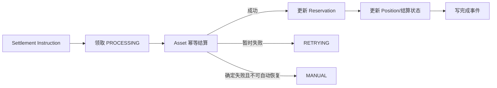

# 交易成交与结算实施方案

> 本文基于《[交易订单全生命周期设计](./order-lifecycle-design.md)》审计当前 Trade 实现，说明已有能力、缺失能力、目标架构、开发顺序和验收标准。
>
> 本文用于指导后续开发和验收，不替代订单生命周期业务设计。当前结论是：下单主流程已经具备基础闭环，但成交后的资金、仓位和结算流程尚未完整。

## 1. 范围与目标

本文覆盖：

- 现货限价和市价成交；
- 秒合约激活、到期判定及资金结算；
- 永续、交割合约成交；
- U 本位线性合约和币本位反向合约；
- Fill、订单状态、资金预占、Asset 结算、Position、Outbox；
- 部分成交、撤单、过期、资金费、交割、强平及失败补偿。

目标是形成以下可靠闭环：

```text
OrderAccepted
  -> Matcher
  -> Fill + Order + SettlementInstruction + Outbox（同一事务）
  -> Asset / Position 幂等结算
  -> Reservation 消费或释放
  -> Order/Position 最终状态
  -> 对账、重试或人工处理
```

基本边界：

- Trade 决定成交价格、成交数量、手续费、保证金和盈亏计算；
- Asset 负责冻结、消费冻结、解冻、扣款和入账，不决定成交价格；
- Position 负责仓位数量、均价、可平数量、保证金、盈亏和风险状态；
- 每个外部操作必须具有稳定幂等键；
- Fill 一旦落库不得删除或业务回滚，后续失败通过 Saga 重试恢复。

## 2. 当前实现盘点

### 2.1 已有能力

| 模块 | 当前能力 | 结论 |
| --- | --- | --- |
| 订单簿撮合 | 支持买卖盘、限价、市价、价格优先和部分成交 | 基础可用 |
| IOC/FOK | 支持全量检查和剩余订单过期 | 基础可用 |
| Fill | 买卖双方分别生成 Fill，共享 `match_no`，并按 `fill_no` 幂等 | 已补齐通用事务 |
| 订单累计 | 更新成交数量、成交金额、均价、手续费及订单状态 | 基础可用 |
| Maker/Taker | 能区分流动性并读取产品费率 | 基础可用 |
| 条件单 | 能由 `TRIGGER_WAITING` 转为可撮合状态 | 基础可用 |
| 下单冻结恢复 | `FREEZING` 订单按原 `order_no/biz_no` 幂等重试 Asset | 已有 |
| 成交后续指令 | Fill 同事务创建 Settlement Instruction、Outbox；合约创建 `POSITION_FILL_REQUIRED` | 已补齐指令生产 |
| Position 扫描 | 能扫描标记价格、强平条件和待关闭仓位 | 只有任务入口 |
| 永续资金费 | 能按周期生成资金费结算事件 | 只有任务入口 |
| 交割到期 | 能发现到期合约并停用 Symbol | 不构成交割闭环 |
| 秒合约 | 已有订单、配置和价格快照数据结构 | 尚无执行器 |

当前主要实现位置：

- `internal/logic/processordermatchinglogic.go`
- `internal/logic/recordorderfilllogic.go`
- `internal/logic/processtradeeventslogic.go`
- `internal/logic/processpositionslogic.go`
- `internal/logic/processcontractsettlementslogic.go`

### 2.2 当前成交路径

目前成交主链路采用实时事件驱动，定时任务仅用于恢复：

```text
订单接受/条件单触发
  -> 事务内写入 ORDER_ACCEPTED Outbox
  -> 提交后发布实时事件
  -> 按 tenant + product + symbol 串行撮合
  -> 成交事务提交后发布 FILL_CREATED
  -> 现货按 Fill 实时执行 Settlement Instruction
```

单次撮合事务为：

```text
锁定买卖订单
  -> 重新计算可成交数量
  -> 生成共享 Match 编号
  -> 生成买方 Fill
  -> 生成卖方 Fill
  -> 更新双方订单 filled_qty / filled_amount / avg_price / status
  -> 创建双方 Settlement Instruction
  -> 创建 Fill/Order Outbox
  -> 合约 Fill 创建 POSITION_FILL_REQUIRED
  -> 提交事务
```

上述记录已经位于同一数据库事务。现货 Settlement Instruction 已有实时消费者并可推进 Asset、Fill 和 Reservation 状态；定时任务会扫描未完成指令和未确认 Outbox 进行恢复。合约 Position 事件仍只是可靠的待执行记录，实际 Position 更新属于后续 3.3 至 3.5 的范围。因此，`FILLED` 只表示撮合数量完成，是否最终结算应以 Fill/Settlement 状态为准。

## 3. 缺口清单

### 3.1 通用成交事务（P0，已补齐指令生产）

Matcher 必须在同一数据库事务中完成：

1. 锁定并校验订单版本；
2. 生成 Match 编号；
3. 写入买卖双方 Fill；
4. 更新双方订单；
5. 创建 Settlement Instruction；
6. 创建 Position Instruction 或等价的待处理记录；
7. 创建 `OrderPartFilled/OrderFilled/FillCreated` Outbox；
8. 记录资金预占预计消费量。

当前实现已经完成以上事务写入。其中合约 Position Instruction 采用 `POSITION_FILL_REQUIRED` Outbox 作为等价的持久化待处理记录；实际消费者、Asset 结算和 Position Engine 在后续阶段实现。

### 3.2 现货资金结算（P0，已完成）

现货买方每笔 Fill 应执行：

```text
消费冻结 Quote
  -> 入账 Base
  -> 扣除手续费
  -> 价格改善时释放多余 Quote
```

现货卖方每笔 Fill 应执行：

```text
消费冻结 Base
  -> 入账 Quote
  -> 扣除手续费
```

必须覆盖：

- 限价买卖；
- 市价买按 `quote_amount` 逐档消费；
- 市价卖按 `base_qty` 逐档消费；
- 部分成交；
- Maker/Taker 手续费；
- 手续费币种和舍入规则；
- IOC/FOK 剩余释放；
- dust 处理；
- Asset 重复调用幂等；
- 资金守恒及对账。

当前实现：

- `ProcessTradeEvents` 调用现货 Settlement Worker；
- Worker 按 Fill 的 `step_no` 顺序领取并执行待处理指令；
- `CONSUME_FROZEN` 使用订单冻结业务号扣减冻结资产；
- `CREDIT_AVAILABLE` 将成交所得资产计入用户可用余额；
- 买方手续费从下单冻结中扣减，卖方手续费从成交所得中扣减；
- Trade 数量在进入 Asset 前统一转换为内部最小金额单位；
- 订单全部成交且所有成交扣减完成后，自动创建价格改善/多余冻结释放指令；
- Instruction、Fill 和 Reservation 分别推进 `PROCESSING/SUCCESS/FAILED/MANUAL_REVIEW`、`PENDING/PROCESSING/SETTLED/FAILED` 和 `FROZEN/PART_CONSUMED/CONSUMED/RELEASED`；
- Asset 成功但 Trade 本地提交失败时，使用相同 `instruction_no` 重试；
- `PROCESSING` 指令超过租约时间后可以重新领取；
- 连续失败达到上限后进入人工处理；
- Fill 全部指令完成后，同事务写入 `SPOT_FILL_SETTLED` Outbox。

Asset 的 `AddAvailable`、`SubAvailable`、`DeductFrozenAsset` 和 `UnfreezeAsset` 已使用 `biz_no` 幂等，重复消费不会重复扣款、入账或解冻。

### 3.3 合约仓位结算缺口（P0）

合约 Fill 后必须根据成交动作更新 Position：

- 开仓；
- 同方向加仓；
- 部分减仓；
- 全部平仓；
- 超量反向开仓（若产品允许）；
- `NET/LONG/SHORT` 模式；
- `CROSS/ISOLATED` 保证金模式；
- Reduce Only 限制。

同一仓位事务至少更新：

- `qty`；
- `avail_qty`；
- `frozen_qty`；
- `open_avg_price`；
- `position_margin`；
- `maintenance_margin`；
- `realized_pnl`；
- `unrealized_pnl`；
- `liquidation_price`；
- `bankruptcy_price`；
- `risk_rate`；
- `status` 和 `version`；
- Position History 和 Outbox。

Reduce Only 成交时必须消费对应的 `reserved_close_qty`；订单撤销或过期时必须释放剩余预占。

### 3.4 合约公式缺口（P0）

不能使用统一的 `price * qty` 处理所有合约。

线性合约基础公式：

```text
notional_quote = qty * contract_size * fill_price
fee_settle     = notional_quote * fee_rate
```

反向合约基础公式：

```text
contract_value_quote = qty * contract_size
fee_base              = contract_value_quote / fill_price * fee_rate
```

还必须分别定义：

- 多头和空头已实现盈亏；
- 开仓和减仓保证金变化；
- U 本位稳定币结算；
- 币本位基础币结算；
- Maker/Taker 费率；
- 价格、数量、金额和手续费的舍入方向。

永续与交割合约成交公式可以共用，但资金费和到期交割必须独立处理。

### 3.5 Reservation 状态缺口（P0）

资金预占应随 Fill 推进：

```text
FROZEN
  -> PART_CONSUMED
  -> CONSUMED
```

撤单、过期或价格改善释放应推进：

```text
FROZEN/PART_CONSUMED
  -> RELEASING
  -> RELEASED
```

不得在本地状态没有记录的情况下直接调用 Asset 后结束流程。每次消费和释放都应有 Settlement Instruction、幂等键、重试次数和错误信息。

### 3.6 撤单和成交并发缺口（P0）

当前撤单过早进入 `CANCELED`，标准流程应调整为：

```text
OPEN/PARTIALLY_FILLED
  -> CANCELING
  -> Matcher 原子确认最终成交量和撤销量
  -> 创建资金/仓位释放指令
  -> Asset/Position 释放成功
  -> CANCELED
```

过期订单使用对应流程：

```text
OPEN/PARTIALLY_FILLED
  -> EXPIRING
  -> Matcher 停止撮合并确认最终剩余量
  -> 释放资金和仓位预占
  -> EXPIRED
```

需要补充或真正使用 `CANCELING`、`EXPIRING`、`SETTLEMENT_PENDING` 等中间状态。

### 3.7 秒合约执行缺口（P1）

秒合约不进入订单簿，其“成交”是冻结成功后锁定有效起始价并激活：

```text
FREEZING
  -> ACTIVATING
  -> RUNNING
  -> SETTLING
  -> SETTLED / REFUNDED / MANUAL
```

需要实现：

- `ProcessSecondsActivations`；
- `ProcessSecondsSettlements`；
- `ProcessSecondsRefunds`；
- 起始价格和结算价格多源快照；
- 行情最大延迟校验；
- 结算窗口和算法版本；
- UP/DOWN/WIN/LOSE/DRAW/VOID；
- 平局容差及退款规则；
- 平台敞口上限；
- 派彩、扣除本金和退款；
- `seconds_order_id + action` 幂等。

行情无效或无法取得可信结算价时，不得直接判输，应进入退款或人工处理流程。

### 3.8 永续资金费缺口（P1）

目前只生成资金费事件，需要继续实现：

- Funding Batch；
- 资金费率、标记价格、仓位数量和算法快照；
- 多空应付应收计算；
- Asset 幂等扣款和入账；
- 余额不足策略；
- Funding Settlement 明细；
- `funding_batch_id + position_id` 唯一幂等；
- `last_funding_time` 更新；
- 失败重试、人工处理和批次对账。

### 3.9 交割合约缺口（P1）

停用 Symbol 不等于完成交割，完整流程应为：

```text
到达 open_cutoff_time
  -> CLOSE_ONLY
到达 matching_stop_time
  -> 停止撮合
  -> 撤销活动订单并释放预占
  -> 锁定最终结算价
  -> 创建 Delivery Batch
  -> 逐仓计算盈亏和交割手续费
  -> Asset 结算并释放保证金
  -> 关闭仓位
  -> 对账完成
  -> SETTLED / ARCHIVED
```

必须使用稳定幂等键 `delivery_batch_id + position_id`，保存最终价格来源、采样窗口和算法版本。

### 3.10 强平缺口（P1）

当前只有风险扫描和事件入口，后续需要实现：

- 风险单元锁定；
- 原子撤销增加风险的活动订单；
- 资金和仓位预占释放；
- 部分或全部强平单；
- 强平手续费；
- 保险基金；
- 穿仓处理；
- ADL；
- Liquidation Batch/明细；
- 强平事件、重试、审计和人工处理。

### 3.11 Event/Outbox 缺口（P0）

Outbox 必须具备：

- 事务内写入；
- 待投递记录领取；
- 消费者标识和稳定事件编号；
- 成功确认；
- 指数退避重试；
- 最大重试次数；
- 死信和人工重试；
- 消费者幂等；
- 事件 Payload 版本。

仅将失败事件重新设置成 `PENDING`，不能视为完成可靠投递。

## 4. 目标架构

### 4.1 同步撮合事务


同步事务不得直接串行完成所有 Asset 入账，否则 Asset 延迟会阻塞订单簿。同步事务只确定不可逆的成交事实及可靠后续指令。

### 4.2 异步结算 Saga



每个步骤必须记录：

- 幂等键；
- 请求参数快照；
- 当前状态；
- 重试次数；
- 下次重试时间；
- 最后错误；
- 外部流水号；
- 完成时间。

### 4.3 推荐幂等键

| 场景 | 幂等键 |
| --- | --- |
| 下单冻结 | `order_no` 或 `reservation_no` |
| Fill | `match_no + order_id` 或全局唯一 `fill_no` |
| Fill 资产结算 | `fill_no + settlement_action` |
| Position 更新 | `fill_no + position_id + position_action` |
| 订单剩余释放 | `order_no + release_version` |
| 秒合约激活 | `seconds_order_id + ACTIVATE` |
| 秒合约结算 | `seconds_order_id + SETTLE` |
| 秒合约退款 | `seconds_order_id + REFUND` |
| 永续资金费 | `funding_batch_id + position_id` |
| 交割合约 | `delivery_batch_id + position_id` |
| 强平 | `liquidation_batch_id + position_id + action` |

## 5. 分阶段实施计划

### 阶段一：通用成交核心（P0，已完成）

开发内容：

1. 定义 Match 编号和双方 Fill 关联关系；
2. 重构撮合事务；
3. Fill、订单、Settlement Instruction、Outbox 同事务；
4. 完善 Instruction 状态机和领取锁；
5. 建立 Fill/Instruction/Event 唯一索引；
6. 支持任务重复执行和进程中断恢复。

完成情况：双方 Fill、订单、Settlement Instruction、Fill/Order Outbox 和合约 Position 待处理事件已经同事务写入；`fill_no`、`match_no + order_id`、`instruction_no` 和 `event_no` 提供数据库幂等约束。后续需要由结算 Worker 和 Position Engine 消费这些记录。

### 阶段二：现货 Asset 结算（P0，已完成）

开发内容：

1. 实现现货买卖双方结算指令；
2. 接入 Asset 消费冻结、入账、手续费和释放接口；
3. 更新 Reservation 消费和释放状态；
4. 处理市价买、价格改善、部分成交和 dust；
5. 增加资产守恒对账。

完成情况：现货 Fill 已生成并执行冻结消费、成交资产入账、手续费和剩余冻结释放指令；每个步骤使用稳定 `instruction_no` 关联 Asset 幂等流水，重复执行不会重复扣款或入账。后续仍需在阶段八补充跨服务自动对账报表和故障注入集成测试。

### 阶段三：合约 Position Engine（P0）

开发内容：

1. 统一线性/反向合约公式；
2. 实现开仓、加仓、减仓、平仓和反向；
3. 更新保证金、均价、盈亏和强平价格；
4. 消费和释放 Reduce Only 预占；
5. 写 Position History、结算指令和事件；
6. 实现乐观锁冲突重算。

完成标准：U 本位、币本位的永续和交割合约均能正确更新仓位、保证金、盈亏和 Asset 流水。

### 阶段四：撤单、过期及剩余预占（P0）

开发内容：

1. 引入 `CANCELING/EXPIRING`；
2. Matcher 原子确认最终成交与剩余量；
3. 创建 Asset/Position 释放指令；
4. 释放成功后进入终态；
5. 修复取消、撮合、任务并发。

完成标准：任何并发顺序下，成交量加撤销量不超过订单总量，资金和可平仓数量不多释放、不少释放。

### 阶段五：秒合约（P1）

开发内容：激活、行情快照、到期判定、派彩、退款、敞口控制及人工处理。

完成标准：赢、输、平、作废、行情超时和重复任务均能得到唯一结算结果及唯一 Asset 流水。

### 阶段六：永续资金费和交割（P1）

开发内容：Funding Batch/Settlement、Delivery Batch/Settlement、价格快照、逐仓结算、保证金释放及对账。

完成标准：资金费和交割任务可重跑；同一仓位同一批次只结算一次；交割合约仅在全部仓位及资产对账完成后归档。

### 阶段七：强平和风险闭环（P1）

开发内容：强平批次、撤单、风险重算、强平委托、保险基金、穿仓和 ADL。

完成标准：强平全过程可审计、可恢复，不产生负数量、重复结算或无来源资产变更。

### 阶段八：对账和故障演练（P0，贯穿各阶段）

开发内容：

- Order/Fill 对账；
- Fill/Settlement Instruction 对账；
- Reservation/Asset Freeze 对账；
- Position/Fill 对账；
- Funding/Delivery/Seconds 批次对账；
- 超时、重复消息、乱序、数据库死锁、进程崩溃和 Asset 部分成功故障注入。

## 6. 数据模型与接口建议

### 6.1 Fill

建议确认或补充：

- `match_no`；
- `settlement_status`；
- `position_action`；
- `notional`；
- `settlement_amount`；
- `realized_pnl`；
- `margin_delta`；
- `fee_rate`、`fee_amount`、`fee_asset`；
- `formula_version`；
- 唯一索引 `tenant_id + fill_no`。

### 6.2 Settlement Instruction

建议至少表达：

- Fill、Order、Position、Reservation 关联；
- 结算动作；
- 资产、金额和方向；
- 幂等业务编号；
- 前置步骤；
- 状态、重试和错误；
- Asset 外部流水号；
- 请求和结果快照。

### 6.3 Asset 接口

应确认或增加以下幂等能力：

- 消费指定冻结；
- 部分消费冻结；
- 释放指定冻结剩余；
- 原子扣款并入账；
- 扣手续费；
- 查询业务编号最终状态；
- 批量结算或事务组；
- 返回稳定外部流水号。

如果 Asset 无法在一个事务组内同时处理双方资产，则 Trade 必须持久化每一个 Saga 步骤，不能仅依赖内存补偿。

## 7. 验收方案

### 7.1 通用验收

- 相同 Fill 重复执行不会重复更新订单、资金或仓位；
- 任一步骤失败后可从持久化状态恢复；
- Fill 数量和订单累计数量一致；
- 订单进入 `FILLED` 后必须存在完整结算指令；
- 结算最终成功后 Reservation 不存在异常冻结余额；
- Outbox 不丢失、不重复产生不可幂等影响。

### 7.2 现货验收

- 限价买卖零成交、部分成交和全部成交；
- 市价买深度充足及不足；
- 市价卖深度充足及不足；
- 价格改善；
- Maker/Taker 手续费；
- IOC/FOK；
- dust；
- 资产守恒。

### 7.3 合约验收矩阵

以下维度必须组合覆盖：

| 维度 | 场景 |
| --- | --- |
| 期限 | 永续、交割 |
| 价值 | 线性、反向 |
| 本位 | U 本位、币本位 |
| 保证金 | 全仓、逐仓 |
| 持仓 | NET、LONG、SHORT |
| 动作 | 开仓、加仓、减仓、全平、反向 |
| 委托 | 限价、市价、条件单、Reduce Only |
| 成交 | 部分成交、全部成交、价格改善 |

验收结果必须核对：订单、Fill、Position、Position History、Reservation、Settlement Instruction、Asset 流水和 Outbox。

### 7.4 秒合约验收

- 起始行情超时退款；
- UP/DOWN；
- WIN/LOSE/DRAW/VOID；
- 结算行情异常；
- 重复激活和重复结算；
- 人工冲正；
- 平台敞口限制；
- 资金守恒。

### 7.5 专项验收

- 永续资金费补跑、余额不足和多空资金守恒；
- 交割从 `CLOSE_ONLY` 到最终归档；
- 强平部分成交、保险基金不足和 ADL；
- Asset 成功但 Trade 超时；
- Trade 提交事务后进程立即退出；
- Position 乐观锁冲突；
- Outbox 重复投递和消费者重复消费。

## 8. 推荐开发顺序

建议严格按以下顺序实施：

1. Fill、Settlement Instruction 和 Outbox 同事务；
2. 现货 Asset 成交结算；
3. 合约公式与 Position Engine；
4. 合约保证金、盈亏和手续费结算；
5. 撤单、过期、部分成交的预占释放；
6. 秒合约激活与到期结算；
7. 永续资金费；
8. 交割合约到期交割；
9. 强平、保险基金和 ADL；
10. 全链路对账及故障注入测试。

前五项完成后，才能认为现货和普通合约的“下单—撮合—成交—结算—撤单”核心链路基本完整。第六至第九项完成后，才能认为秒合约、永续、交割和风险处置业务完整。

## 9. 当前结论

当前系统已经具备：

```text
下单
  -> 资金/仓位预占
  -> 进入订单簿
  -> 撮合
  -> 生成 Fill
  -> 更新订单成交状态
```

现货已经形成：

```text
Fill
  -> Asset 资金结算
  -> Reservation 消费/释放
  -> Fill 结算状态推进
  -> Outbox 重投和定时扫描恢复
```

尚未形成的核心链路是合约 Position 更新、保证金/盈亏结算，以及秒合约、永续资金费、交割、强平和全链路对账。因此当前可认为“通用成交事务和现货资金结算已具备主链路与恢复链路”，但不能认为所有产品的成交结算业务已经完整；下一优先级仍是合约 Position Engine。
